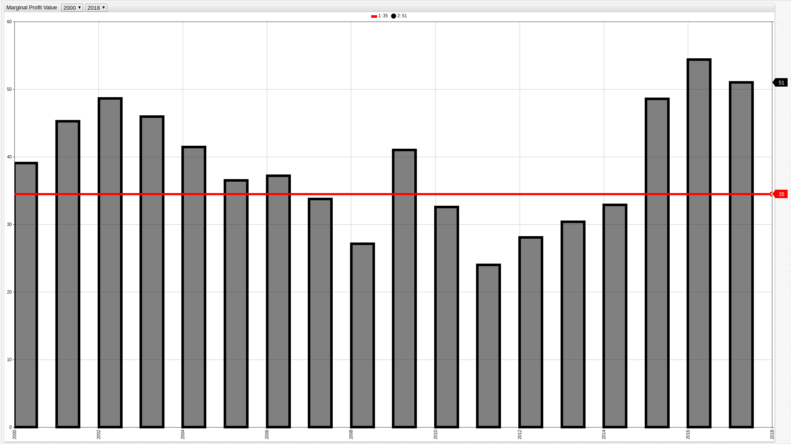
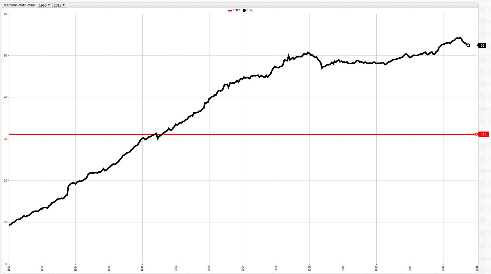
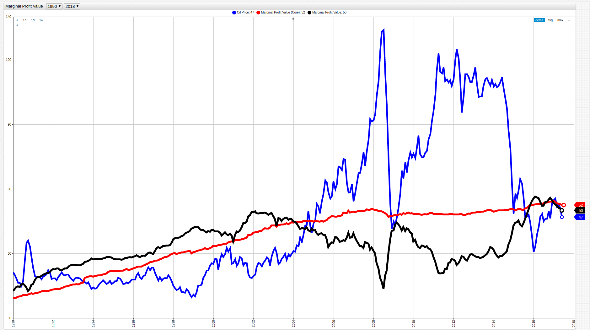
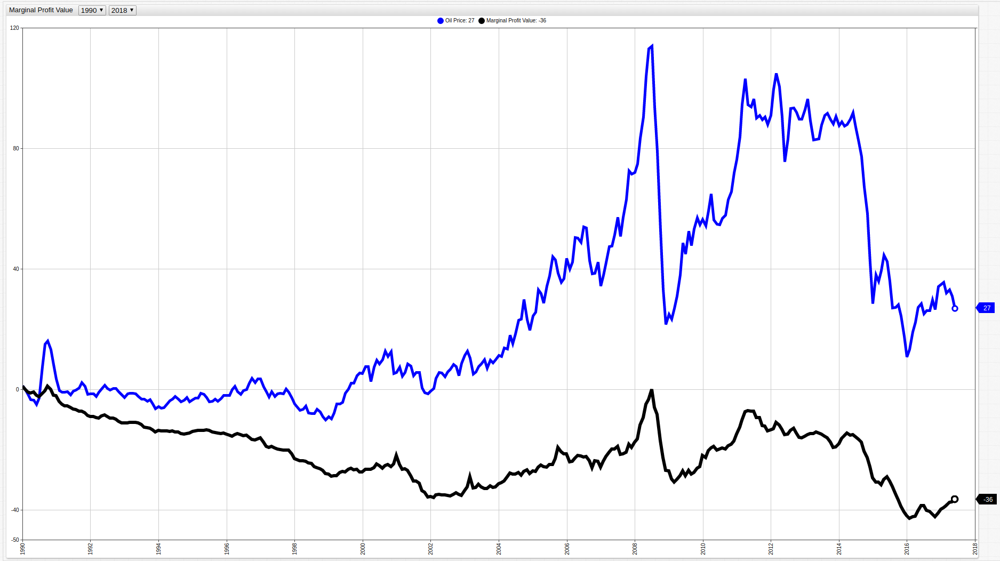
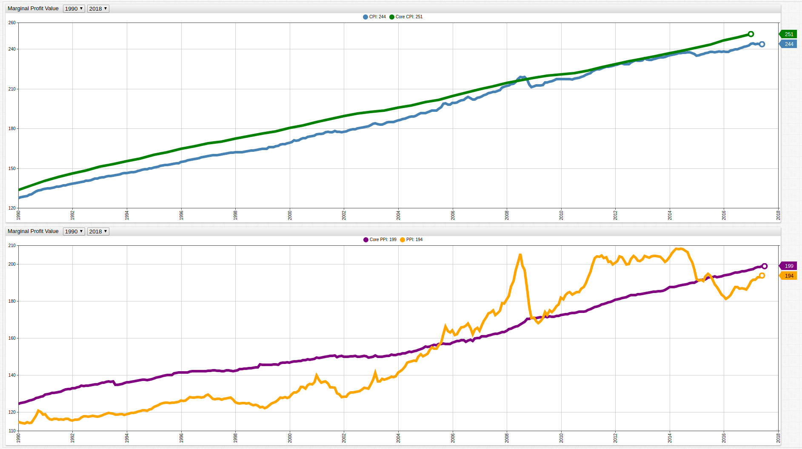

Producers are Spending Less While Consumers are Paying More
==

### Introduction

The Consumer Price Index (CPI) is a metric that is most commonly associated with inflation. It tracks the average cost of goods,
and by doing so, demonstrates the changing prices that consumers are paying for a typical basket of goods. Think about your
favorite grandparent telling you about how much the movies cost when they were your age. To learn more about the effect of
the CPI see the following [analysis](../../CBI_CPI/README.md) that track how CPI affected the value of the Israeli Shekel over several
decades.

The Producer Price Index (PPI) is a complementary metric which tracks the amount of capital that producers are using to create
a final product. Both are shown below from 1990 to 2017:

**Figure 1**: United States CPI (blue) and PPI (orange)


[](https://apps.axibase.com/chartlab/0b791490/#fullscreen)

> Open any ChartLab visualization to navigate through time using the dropdown menus at the top of the screen.

_Sources_: [Federal Reserve Economic Data (CPI)](https://fred.stlouisfed.org/series/CPIAUCSL), [Federal Reserve Economic Data (PPI)](https://fred.stlouisfed.org/series/PPIACO)

Both of the above metrics are indexed using the CPI and PPI value from the year 1982 as a baseline. This choice is somewhat
arbitrary as such a decision simply sets that year's value at 100 and all other data points represent some proportion of that
value. A value of 50 would indicate proportionally half of the 1982 value, while a value of 150 would indicate a value
1.5 times greater than the 1982 value. Because CPI and PPI have been converted to unitless values, they can be directly compared.

### Recent Data

By modifying the observation period of the above data to begin in 2007, which is usually considered to be the first year
of the Great Recession, substantial producer losses are shown by unequal changes in CPI and PPI values:

**Figure 2**: United States CPI and PPI (2007-Present)


Using [SQL Console](https://github.com/axibase/atsd/blob/master/sql/README.md#overview) in [Axibase Time Series Database](https://axibase.com/products/axibase-time-series-database/),
the underlying data can be explored to calculate producer losses during the worst year of the recession for American producers:

**Query 1**

```sql
SELECT date_format(time, 'MM-yyyy') AS "Date", cpi.value AS "CPI", ppi.value AS "PPI", (cpi.value - ppi.value) AS "Potential Profitability Value"
  FROM cpi AS cpi JOIN ppi AS ppi WHERE YEAR(time) = 2008
```

Marginal Profit is the value retained by a producer after creating and selling one unit. Here it is represented as the value
of the CPI less the value of the PPI.

**Table 1**: Marginal Profit Year 2008

```ls
| Date    | CPI   | PPI   | Potential Profitability Value |
|---------|-------|-------|-----------------------|
| 01-2008 | 212.2 | 181.0 | 31.2                  |
| 02-2008 | 212.7 | 182.7 | 30.0                  |
| 03-2008 | 213.4 | 187.9 | 25.5                  |
| 04-2008 | 213.9 | 190.9 | 23.0                  |
| 05-2008 | 215.2 | 196.6 | 18.6                  |
| 06-2008 | 217.5 | 200.5 | 17.0                  |
| 07-2008 | 219.0 | 205.5 | 13.5                  |
| 08-2008 | 218.7 | 199.0 | 19.7                  |
| 09-2008 | 218.9 | 196.9 | 22.0                  |
| 10-2008 | 217.0 | 186.4 | 30.6                  |
| 11-2008 | 213.2 | 176.8 | 36.4                  |
| 12-2008 | 211.4 | 170.9 | 40.5                  |
```

In order to effectively contextualize this data, average Potential Profitability Values are shown below by year:

**Query 2**

```sql
SELECT YEAR(time) AS "Date", AVG(cpi.value) AS "Avg CPI", AVG(ppi.value) AS "Avg PPI", AVG(cpi.value - ppi.value) AS "Potential Profitability Value"
  FROM cpi AS cpi JOIN ppi AS ppi
GROUP BY YEAR(time)
```

This query aggregates Potential Profitability Value by year for the entire observed period.

**Table 2**: Average Potential Profitability Value (1990-present)

```ls
| Date | Avg CPI | Avg PPI | Potential Profitability Value |
|------|---------|---------|-----------------------|
| 1990 | 130.7   | 116.3   | 14.4                  |
| 1991 | 136.2   | 116.5   | 19.6                  |
| 1992 | 140.3   | 117.2   | 23.1                  |
| 1993 | 144.5   | 118.9   | 25.6                  |
| 1994 | 148.2   | 120.4   | 27.8                  |
| 1995 | 152.4   | 124.8   | 27.6                  |
| 1996 | 156.9   | 127.7   | 29.2                  |
| 1997 | 160.5   | 127.6   | 32.9                  |
| 1998 | 163.0   | 124.4   | 38.6                  |
| 1999 | 166.6   | 125.5   | 41.1                  |
| 2000 | 172.2   | 132.7   | 39.4                  |
| 2001 | 177.0   | 134.2   | 42.8                  |
| 2002 | 179.9   | 131.1   | 48.8                  |
| 2003 | 184.0   | 138.1   | 45.9                  |
| 2004 | 188.9   | 146.7   | 42.2                  |
| 2005 | 195.3   | 157.4   | 37.9                  |
| 2006 | 201.6   | 164.8   | 36.8                  |
| 2007 | 207.3   | 172.7   | 34.7                  |
| 2008 | 215.3   | 189.6   | 25.7                  |
| 2009 | 214.6   | 172.9   | 41.7                  |
| 2010 | 218.1   | 184.7   | 33.3                  |
| 2011 | 224.9   | 201.0   | 23.9                  |
| 2012 | 229.6   | 202.2   | 27.4                  |
| 2013 | 232.9   | 203.4   | 29.5                  |
| 2014 | 236.7   | 205.3   | 31.4                  |
| 2015 | 237.0   | 190.4   | 46.5                  |
| 2016 | 240.0   | 185.4   | 54.6                  |
| 2017 | 244.0   | 192.2   | 51.8                  |
```

As shown in the table above and figure below, the Potential Profitability Value has been steadily growing since 1990 with number of notable exceptions.

**Figure 3**: Potential Profitability Value (1990-present)


[](https://apps.axibase.com/chartlab/bbd570f0/#fullscreen)

The red line shows the average Potential Profitability Value over the entire observed period.

**Query 3**

```sql
SELECT AVG(cpi.value) AS "Avg CPI", AVG(ppi.value) AS "Avg PPI", AVG(cpi.value - ppi.value) AS "Potential Profitability Value"
  FROM cpi AS cpi JOIN ppi AS ppi
```

**Table 3**: Average CPI, PPI, and MPV (1990-present)

```ls
| Avg CPI | Avg PPI | Potential Profitability Value |
|---------|---------|-----------------------|
| 188.2   | 153.7   | 34.5                  |
```

Using the [moving average](https://github.com/axibase/atsd/blob/master/sql/README.md#aggregation-functions) function to aggregate the
average values in annual increments instead of across the entire observed period smooths the MPV curve and shows the effects
of the recession on producer profits. A detailed use case and syntax explanation of the weighted average function can be found
[here](../../Support/Moving-Avg/README.md).

**Figure 4**: MPV Annual Aggregation



[](https://apps.axibase.com/chartlab/9fe50f95/#fullscreen)

### Analysis

A consistently growing Potential Profitability Value, calculated as a growing difference in CPI and PPI values, indicates that producers are spending less money producing goods but consumers
are continuing to pay more. In recent years, the sharp increase in MPV seen from 2015 to present is most likely explained by corporate
desire to increase profits after significant losses during the recession. Keep in mind that in this case significant losses
mean significant relative losses in overall profit, and not actual negative growth in most cases. In fact,
the Potential Profitability Value only exceeded 30 points for the first time in 1996, with the next year a sub-thirty point value appeared
being more than a decade later in 2008. This comparison makes no statement about overall profits generated by a certain collection
of industries, but rather observes the average marginal profit that producers are generating from products that they do sell.
The recession not only caused a contraction of gross profit and the number of products sold, but also reduced the amount of
profit generated on items that did manage to be sold.

Because CPI and PPI values used in the above visualization include all spheres of production and consumption, occasionally
volatile industries such as energy and food are included as well, potentially skewing the output. There is a second version of these metrics called core CPI and core
PPI, which removes this volatility by excluding energy and food production and consumption.
The calculations shown above can be repeated with core CPI and PPI to account for this fluctuation.

**Figure 5**: Core CPI and Core PPI


[](https://apps.axibase.com/chartlab/f3c7eefe/#fullscreen)

Immediately visible is the lack of fluctuation in both CPI and PPI surrounding the years of the recession. The underlying data
is shown below from 1990 to present:

**Query 4**

```sql
SELECT YEAR(time) AS "Date", AVG(ccpi.value) AS "Avg cCPI", AVG(cppi.value) AS "Avg cPPI", AVG(ccpi.value - cppi.value) AS "Potential Profitability Value"
  FROM ccpi AS ccpi JOIN cppi AS cppi
GROUP BY YEAR(time)
```

**Table 4**

```ls
| Date | Avg cCPI | Avg cPPI | Potential Profitability Value |
|------|----------|----------|-----------------------|
| 1990 | 135.4    | 125.5    | 9.9                   |
| 1991 | 142.2    | 130.2    | 11.9                  |
| 1992 | 147.3    | 133.7    | 13.6                  |
| 1993 | 152.1    | 136.1    | 16.0                  |
| 1994 | 156.5    | 136.8    | 19.7                  |
| 1995 | 161.2    | 139.3    | 21.9                  |
| 1996 | 165.6    | 141.8    | 23.7                  |
| 1997 | 169.5    | 142.3    | 27.2                  |
| 1998 | 173.4    | 143.1    | 30.3                  |
| 1999 | 177.0    | 145.7    | 31.3                  |
| 2000 | 181.3    | 147.4    | 33.9                  |
| 2001 | 186.1    | 150.0    | 36.1                  |
| 2002 | 190.4    | 150.0    | 40.5                  |
| 2003 | 193.2    | 150.1    | 43.2                  |
| 2004 | 196.7    | 151.9    | 44.7                  |
| 2005 | 200.9    | 156.1    | 44.8                  |
| 2006 | 205.9    | 157.8    | 48.1                  |
| 2007 | 210.7    | 161.1    | 49.6                  |
| 2008 | 215.6    | 165.8    | 49.8                  |
| 2009 | 219.2    | 171.1    | 48.1                  |
| 2010 | 221.3    | 173.1    | 48.2                  |
| 2011 | 225.0    | 176.8    | 48.3                  |
| 2012 | 229.8    | 181.8    | 48.0                  |
| 2013 | 233.8    | 184.6    | 49.3                  |
| 2014 | 237.9    | 188.1    | 49.8                  |
| 2015 | 242.2    | 191.8    | 50.4                  |
| 2016 | 247.6    | 194.6    | 53.0                  |
| 2017 | 251.3    | 197.0    | 54.3                  |
```

**Figure 6**: Potential Profitability Value Using cCPI and cPPI (1990-present)



[](https://apps.axibase.com/chartlab/bae30175/#fullscreen)

> Open any ChartLab visualization to navigate through time using the dropdown menus at the top of the screen.

When the data is controlled to exclude volatile metrics such as energy and food production and consumption,
a more accurate representation of the difference between production costs and consumer costs can be seen. To further
lend credence to the instability of the energy market, the per barrel price of oil, one of the largest parts of the energy
sector is shown below alongside the calculated both Potential Profitability Values calculated above:

**Figure 7**: Per Barrel Price of Crude Oil versus Potential Profitability Value



[](https://apps.axibase.com/chartlab/037a04f9/#fullscreen)

In fact, when the energy food sectors are not excluded from CPI and PPI values and compared with the per barrel price of crude
oil they are shown to be intimately tied to one another. Inverting the axes of the black line representing Potential Profitability Value
highlights this relationship further:

**Figure 8**: Per Barrel Price of Crude Oil versus Potential Profitability Value



[](https://apps.axibase.com/chartlab/037a04f9/2/#fullscreen)

Using an ad-hoc modification to align the origin of the two metrics shows the growing gap between oil prices and marginal profit
indicating that while related to one another, high oil prices do not guarantee a high marginal profit. In fact, because of
the reflection across the x-axis, as oil prices increase, the value of marginal profit actually decreases.

### Conclusion

**Figure 9**: Core Potential Profitability Value and Potential Profitability Value


[](https://apps.axibase.com/chartlab/037a04f9/3/#fullscreen)

Despite a significant decrease in marginal profit levels during the late 2000s, when including the energy sector and food
sectors, it appears that businesses have mostly picked up where they left off pre-downturn. Indeed, when these industries are
excluded an overall slowdown is still observed, but even the worst year of the recession shows a significantly smaller, and even
delayed, effect indicating the true power of the oil market over the American economy.

**Figure 10**: Core CPI and CPI (Top), Core PPI and PPI (Bottom)



[](https://apps.axibase.com/chartlab/037a04f9/4/#fullscreen)

Ultimately, the overall cost of various consumer goods in a given basket is heavily impacted by the cost of oil because of
the need to transport a given good to the needed location and with the nature of the globalized goods market, often that means
a great deal of traveling required before a product reaches its consumer base.

Regardless of this condition, there is definitive growth between the difference in CPI and PPI, whether or not the volatile
energy or food sectors are considered, indicating the growing gap between the amount that customers are paying to purchase
something and the amount that producers are paying to create it.
