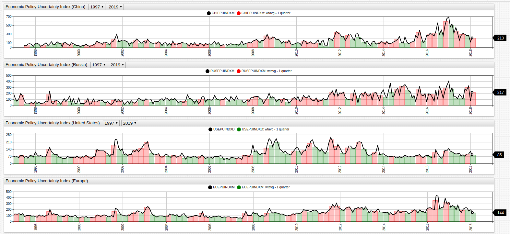

# United States Federal Reserve: The Economic Policy Uncertainty Index

*Fig. 1*: The EPU Index for the United States, China, Russia, and Europe (EuroZone countries), superimposed over the quarterly average of the same value. Quarters where the true EPU value was greater than the quarterly average are shown in red using an [`alert-expression`](https://axibase.com/products/axibase-time-series-database/visualization/widgets/alert-expressions/).

**Source Data**: [FRED Economic Data](https://fred.stlouisfed.org/categories/33201)

**Visualization Tool**: [Axibase ChartLab](https://axibase.com/)

**Structured Query Language (SQL)**: [Axibase SQL Console](https://github.com/axibase/atsd/tree/master/sql#overview)

### Introduction

Published in 2015 by the [National Bureau of Economic Research](http://www.nber.org/) in Cambridge, Massachusetts, a paper entitled [Measuring Economic Policy Uncertainty](http://www.policyuncertainty.com/media/BakerBloomDavis.pdf) seeks to establish a set of clear guidelines for quantifying economic policy uncertainty with the following questions: 

* **Who** is responsible for making economic policy descisions? 
* **What** economic policy will be enacted? 
* What **effects** will that policy have on the local economy?

According to the authors (Baker, Bloom, and Davis), their EPU (Economic Policy Uncertainty) metric is able to accurately
predict economic growth and investment by tracking geopolitical events such as international treaties, public information like
newpapers and policy position releases, and actual actions undertaken by government bodies such as a central bank raising
interest rates.

### Visualization

Tracking the EPU Index for the People's Republic of China alongside more concrete metrics can be used to examine the validity of the EPU index. Shown below, the EPU is placed alongside real PRC Treasury Securities rates for the last decade and a half. Additionally, the quarterly averages are compared in the same environment to smooth the occasionally volitile movement of both indices. Treasury Securities are a good tool for tracking economic prosperity because they show the interest rates that businesses borrowing money are paying to to their lenders. Historically speaking, a lower interest rate usually encourages business to borrow money and expand their operations.

*Fig. 2*: Economic Policy Uncertainty Index and PRC Treasury Securities Rates (2000-2017), bi-annually and quarterly.

Blue boxes surround areas where the EPU follows the trends of Treasury Securites while pink boxes surround those where the two metrics diverge, showing that while the index shadows the movements of the Central Bank's interest rates at times, there are number of areas where the two metrics are not in sync.

### SQL Queries

The United States has held presidential elections every four years since 1978, without exception; although several states who were actively in rebellion failed to nominate electors or cast ballots during the 1864 Presidential Elections which occured against the backdrop of the American Civil War.

Election season is a notoriously uncertain economoic time for the United States, as elections have been known to represent dramatic changes in policy and personnel that reshape the face of American economic policy.

