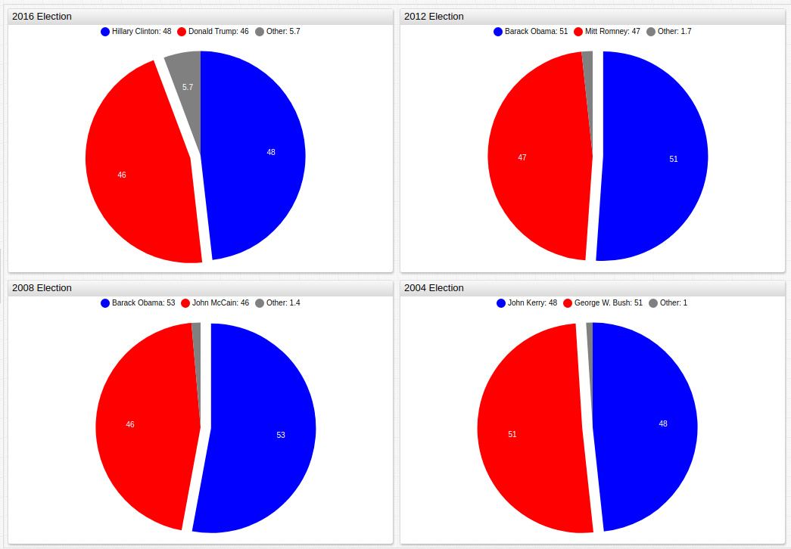

# United States Federal Reserve: The Economic Policy Uncertainty Index


[](https://apps.axibase.com/chartlab/59f36025#fullscreen)

*Fig. 1*: The EPU Index for the United States, China, Russia, and Europe (Eurozone countries), superimposed over the quarterly average of the same value. Quarters where the true EPU value was greater than the quarterly average are shown in red using an [`alert-expression`](https://axibase.com/products/axibase-time-series-database/visualization/widgets/alert-expressions/).

**Source Data**: [FRED Economic Data](https://fred.stlouisfed.org/categories/33201)

**Visualization Tool**: [Axibase ChartLab](https://axibase.com/)

**Structured Query Language (SQL)**: [Axibase SQL Console](https://github.com/axibase/atsd/tree/master/sql#overview)

### Introduction

Published in 2015 by the [National Bureau of Economic Research](http://www.nber.org/) in Cambridge, Massachusetts, a paper entitled [Measuring Economic Policy Uncertainty](http://www.policyuncertainty.com/media/BakerBloomDavis.pdf) seeks to establish a set of clear guidelines for quantifying economic policy uncertainty with the following questions: 

* **Who** is responsible for making economic policy descisions? 
* **What** economic policy will be enacted? 
* What **effects** will that policy have on the local economy?

According to the authors (Baker, Bloom, and Davis), their EPU (Economic Policy Uncertainty) metric is able to accurately
predict economic growth and investment by tracking geopolitical events such as international treaties, public information like newpapers and policy position releases, and actual actions undertaken by government bodies such as a central bank raising
interest rates.

### Visualization

This box chart shows the range of the EPU index for each of the 4 regions. A wider range shows greater variance of index values, and the central box has may be modified to include any [percentile](https://axibase.com/products/axibase-time-series-database/visualization/widgets/box-chart-widget/#tab-id-6) values.


[](https://apps.axibase.com/chartlab/af5d576e/2/#fullscreen)

*Fig 2*: Use the drop-down menus in the ChartLab sandbox to change the date range of the visualization. Open the Editor window to modify percentile range with a `percentile = X%/Y%` expression where `X` and `Y` are the values of the percentile range you would like to display.

Tracking the EPU Index for the People's Republic of China alongside more concrete metrics can be used to examine the validity of the EPU index. Shown below, the EPU is placed alongside real PRC Treasury Securities rates for the last decade and a half. The quarterly and bi-annual averages are compared in the same environment to smooth the occasionally volitile movement of both indices. Treasury Securities are a good tool for tracking economic prosperity because they show the interest rates that businesses borrowing money are paying to to their lenders. Historically speaking, a lower interest rate usually encourages business to borrow money and expand their operations.


[](https://apps.axibase.com/chartlab/73ab0050/2/#fullscreen)

*Fig. 3*: Economic Policy Uncertainty Index and PRC Treasury Securities Rates (2000-2017), bi-annually and quarterly.

The above figure was creating using the [`weighted average`](https://axibase.com/products/axibase-time-series-database/visualization/widgets/configuring-the-widgets/aggregators/) statistical tool. This tool may be used to creating a rolling average value for a specific time period. For more information about using this statistical tool, see the following [walkthrough](https://github.com/axibase/atsd-use-cases/blob/master/Support/Moving-Avg/README.md). 

### SQL Queries

The United States has held presidential elections every four years since 1978, without exception; although several states who were actively in rebellion failed to nominate electors or cast ballots during the 1864 Presidential Elections which occured against the backdrop of the American Civil War.

Election season is a notoriously uncertain economic time period for the United States, as elections have been known to represent dramatic changes in policy and personnel that reshape the face of American policy. Using the following SQL query to track the EPU Index during election years only, and comparing that data to the election results, it is expected that more contested elections should generate a higher EPU Index.

```
SELECT year(time) AS Election, value AS EPU_Index
FROM usepuindxd_ 
WHERE year(time) % 4 = 0 AND month(time) = 1
```

The above query returns the following results:

| Year | EPU Index |
|---|:--:|
|2016|80.38|
|2012|93.05|
|2008|182.06|
|2004|156.17|
|2000|80.38|

Using [public data](https://www.britannica.com/topic/United-States-Presidential-Election-Results-1788863) from [Encyclopaedia Britannica](https://www.britannica.com/) to track election results for the same period of time produces the following visulization.


[](https://apps.axibase.com/chartlab/73ab0050/2/#fullscreen)

*Fig. 4*: Historical election result data from recent U.S. presidential elections, the winning candidate has been separated from the remaining area using the [`expand`](https://axibase.com/products/axibase-time-series-database/visualization/widgets/pie-chart-widget/#tab-id-2) setting. Open the ChartLab sandbox to view the complete figure.

Although the 2016 election was one of the more contentious in recent U.S. history, the EPU index immediately before the election was lower than the previous four elections.

The European debt crisis was a financial debacle that was enflamed by the so called P.I.G.S. countries (Portugal, Ireland, Greece, and Spain) coming dangerously close to defaulting on their outrageously high goverment debts. Tracking the events of the crisos alongside the EPU index reflects the panic and uncertainty of the multi-year crisis, bailout, and recovery process. Using the following 7 events to chronicle the timeline:

1. Jan 1, 2002: Euro banknotes and coins begin circulation.
2. Nov 27, 2008: European Union stimulus package totalling 200 billion Euro is proposed and eventually approved.
3. Feb 9, 2010: The first of three austerity packages are introduced to combat out of control debt growth in Greece.
4. May 2, 2010: European Union announces a 110 billion Euro bailout for Greece.
5. Nov 28, 2010: European Union announces an 85 billion Euro bailout for the Republic of Ireland.
6. Mar 13, 2012: A second bailout for Greece is proposed and approved for and additional 130 billion Euro after further 
inspection of government financial records reveal the depth and severity of the problem is even worse that orginially 
understood.
7. July 1, 2014: The end of the EU bailout policy, and completion of funds distribution.

The following SQL query will return the [average value](https://github.com/axibase/atsd/tree/master/sql#aggregation-functions) of the EPU index for the Eurozone for the period from 2002 until 2018 and will consolidate the information using a [`round` expression](https://github.com/axibase/atsd/tree/master/sql#mathematical-functions).

```
SELECT ROUND(AVG(value), 0) AS "average-epu" FROM EUEPUINDXM_
  WHERE date_format(time, 'yyyy-MM')  >= '2002-01'
```

This query returns the following:

|average-epu|
|:-:|
|152|

The next query will target the months of each of the events above and so we can compare it to the index value from the birth of the Euro to the periods including the crisis, bailout, and eventual recovery.

```SELECT date_format(time, 'yyyy-MM'), ROUND(value,0) FROM EUEPUINDXM_
  WHERE date_format(time, 'yyyy-MM')  = '2002-01'
  OR date_format(time, 'yyyy-MM') = '2008-11'
  OR date_format(time, 'yyyy-MM') = '2010-02'
  OR date_format(time, 'yyyy-MM') = '2010-05'
  OR date_format(time, 'yyyy-MM') = '2010-11'
  OR date_format(time, 'yyyy-MM') = '2012-03'
  OR date_format(time, 'yyyy-MM') = '2014-07'
```

The above query returns the following values for each of the targeted months:

|Event|EPU Index Value|
|---|:-:|
|Euro banknotes begin curculation|106|
|EU stimulus package|157|
|Greek austerity rollout|137|
|Greek bailout #1|203|
|Ireland bailout|173|
|Greek bailout #2|177|
|Bailout period concludes|120|

Further querying the data to show the top seven entries for the period from January 2002 to July 2014 using the following:

```
SELECT datetime, ROUND(value, 0) AS "top-epu" FROM EUEPUINDXM_
  WHERE date_format(time, 'yyyy-MM')  >= '2002-01'
  --AND date_format(time, 'yyyy-MM') <= '2014-07'
  --ORDER BY value desc LIMIT 7
```

This query shows that none of the expected entries appear among the greatest EPU index values during the examined time period in descending order using an [`ORDER BY`](https://github.com/axibase/atsd/tree/master/sql#where-clause) expression in the `WHERE` clause.

|Date|EPU Index Value|
|---|:-:|
|2011-11|305|
|2011-09|280|
|2003-03|251|
|2013-03|245|
|2012-06|245|
|2011-10|242|
|2013-01|240|

Tracking both results on a simple [time series chart](https://axibase.com/products/axibase-time-series-database/visualization/widgets/time-chart/) to compare the expected (purple) versus actual results (blue):


