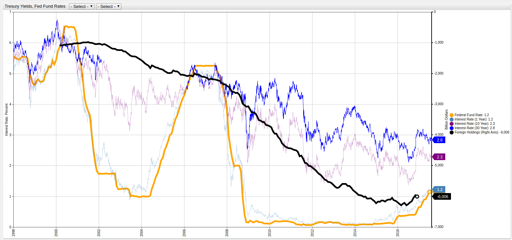
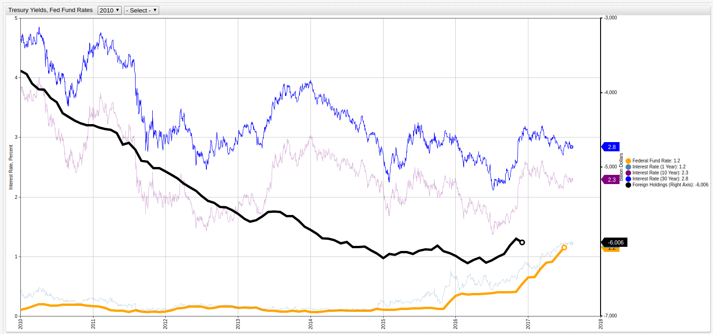

# The Rising Federal Funds Rate in the Current Low Long-Term Interest Rate Environment

Source Document: [FRED Research](https://research.stlouisfed.org/publications/economic-synopses/2017/06/30/the-rising-federal-funds-rate-in-the-current-low-long-term-interest-rate-environment/)

Source Authors: YiLi Chien and Paul Morris

Visualization: [ChartLab](https://apps.axibase.com/chartlab) based on [Axibase Time Series Database](https://axibase.com/docs/atsd/)

## Treasury Yields and the Federal Funds Rate (1998-2017)

> Open the ChartLab visualization above to navigate through time by selecting the desired years in the dropdown menus at the top of screen. Note that debt balances are shown as negative values.

The following visualization tracks the last seven years of data (2010-2017) to highlight post-recession changes:

### From the Source Document

"After keeping the federal funds rate close to zero for seven years, the Federal Open Market Committee (FOMC) increased
its target rate by 25 basis points in December 2015. Additional 25-basis-point hikes followed in December 2016, March 2017,
and June 2017, putting the rate at 1.0 to 1.25 percent. Clearly, the FOMC has initiated a new rate-hike cycle, and it is
likely that the federal funds rate will rise further. According to the latest projections of FOMC participants, one more
rate hike is expected this year, which would lift the federal funds rate by another 25 basis points."

This visualization tracks a number of metrics and displays them together to highlight their relationship to one another.
The metrics shown in the [ChartLab](https://apps.axibase.com/chartlab) visualization above are explained below using analysis from
the original source document:

**Federal Fund Rate**: "The federal funds rate... is the overnight borrowing rate among commercial banks... [and] varied significantly
before the financial crisis, peaking... in 2000 and dropping rapidly... in response to the 2001 recession. The Federal Reserve
started raising the rate in the second quarter of 2004... where it stayed until right before the financial crisis.
After the financial crisis, the federal funds rate remained low until the end of 2015."

**Interest Rate (1 Year)**: "The interest rate differential between the federal funds rate and the 1-year Treasury yield has
been small throughout the period. This is not surprising given that the federal funds rate is a very short-term interest rate.
Overnight interest rates should be more closely related to the short-term Treasury yields than to the long-term yields.
In other words, the influence of the federal funds rate on Treasury yields diminishes with maturity"

**Interest Rate (10 Year)**: The 10-year interest rate is medium-range measurement that is included to give the data context.
It is not so dependent on the Federal Fund Rate set daily, nor is it too wide a lens like the 30-year interest rate making
it a dynamic metric that is included for reference.

**Interest Rate (30 Year)**: "...the 30-year long-term yield declined consistently over the sample period... This slow
decline suggests that the low long-term yield is not a result of the close-to-zero federal funds rate that held from 2009 to 2015.
The increasing foreign demand for U.S. government bonds is likely an important contributing factor to the decline of the
long-term yield."

**Foreign Holdings of United States Treasuries**: This metric measures the amount of United States debt holdings that are
controlled by foreign entities. The current debt holdings by foreign bodies are shown below in **Table 1**. _From the source
document_: "Foreigners have increased their holdings of U.S. Treasury securities sixfold... in 2017. As the foreign demand
for Treasuries increases, the price of Treasury securities goes up and the yield goes down. Thus, the decline in long-term
interest rates likely has more to do with increasing foreign demand for Treasury securities than federal funds rate policy."

**Table 1**: Foreign Holdings of United States Treasuries by Country (Last Updated May 2017)

| Country | Holdings (Billion USD)|
|:-------|:---------------------:|
| Japan | $1111.3 |
| Mainland China | $1102.2 |
| Ireland | $295.8 |
| Brazil | $269.7 |
| Cayman Islands | $266.1 |
| Switzerland | $239.5 |
| United Kingdom | $234.4 |
| Luxembourg | $207.7 |
| Hong Kong | $196.3 |
| Taiwan | $181.2 |
| Saudi Arabia | $134.0 |
| India | $127.3 |
| Russia | $108.7 |
| Singapore| $107.9 |
| Korea | $100.1 |
| Belgium | $98.7 |
| Canada | $80.2 |
| France | $74.4 |
| Germany | $68.3 |
| Thailand | $66.5 |
| Bermuda | $60.9 |
| United Arab Emirates | $60.5 |
| Netherlands | $52.2 |
| Turkey | $49.5 |
| Norway | $48.3 |
| Sweden | $40.8 |
| Mexico | $38.9 |
| Philippines | $38.2 |
| Spain | $38.2 |
| Australia | $37.0 |
| Italy | $35.6 |
| Poland | $35.0 |
| Kuwait | $31.6|
| Israel | $30.9 |
| All Others | $455.7 |
| Total | $6123.6 |

> Source: [United States Treasury](http://ticdata.treasury.gov/Publish/mfh.txt)