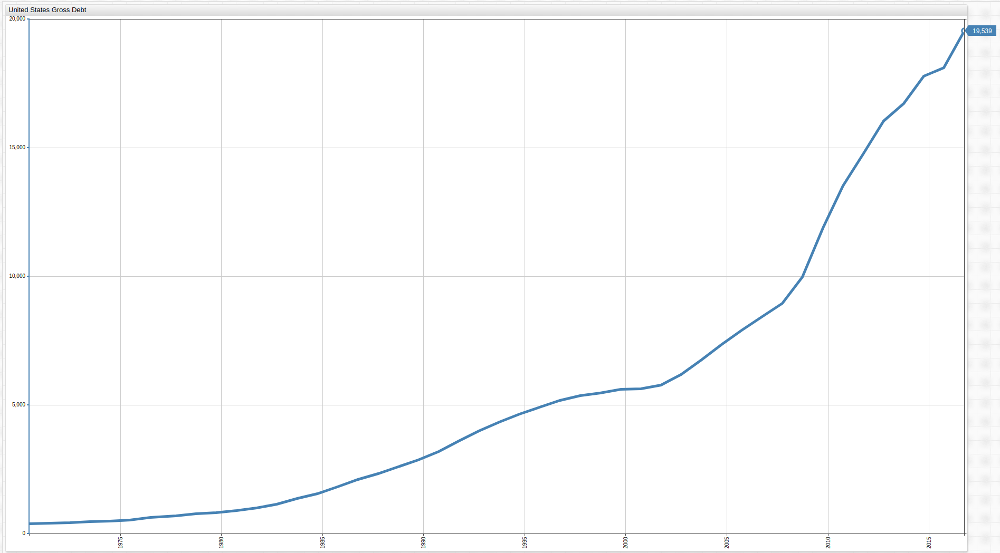
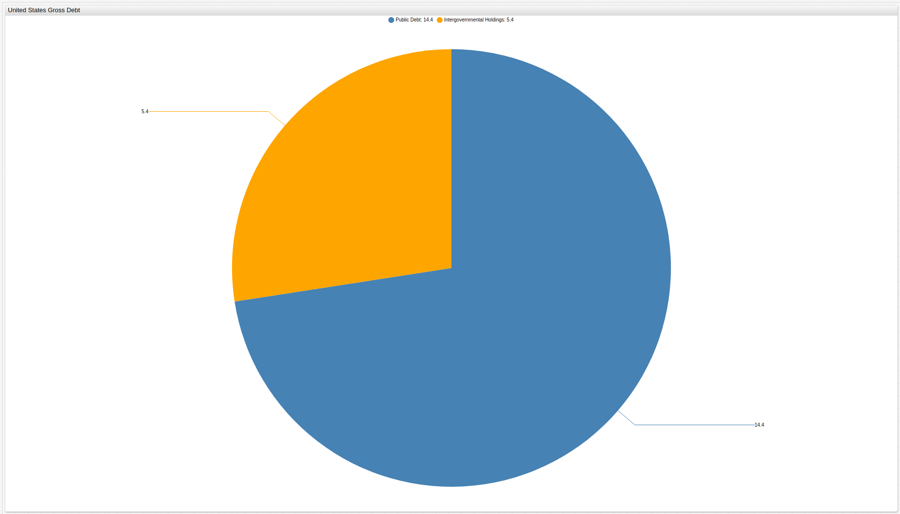
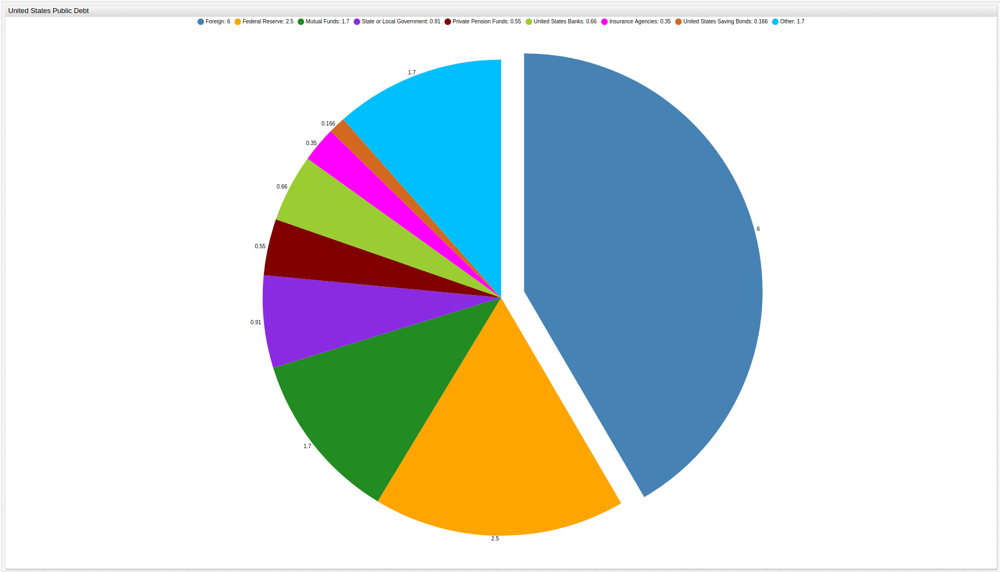
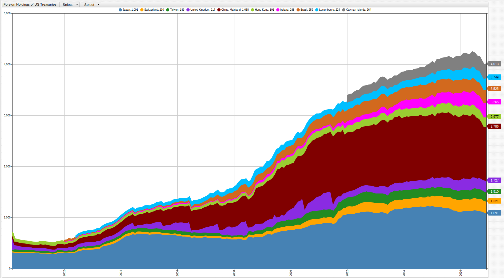
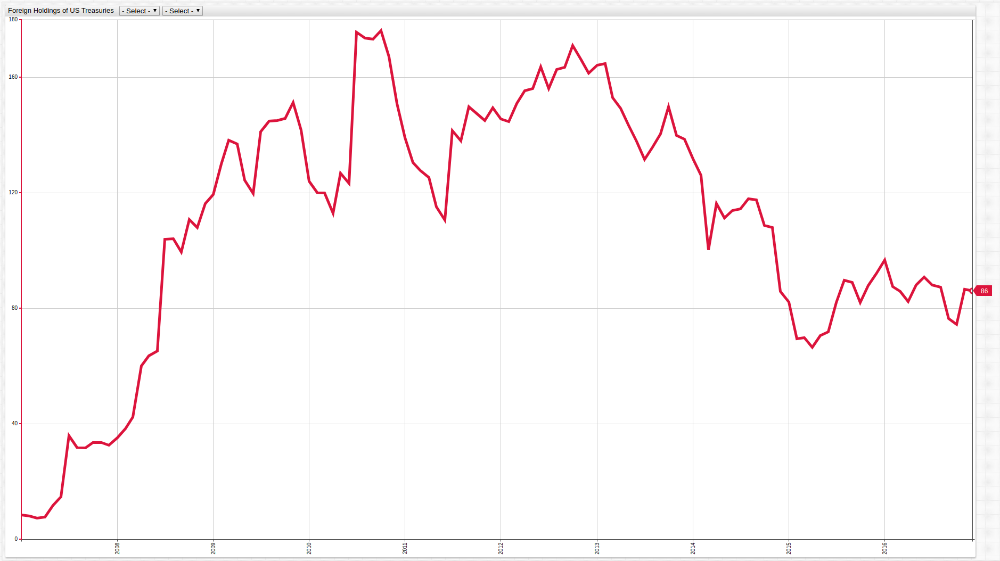
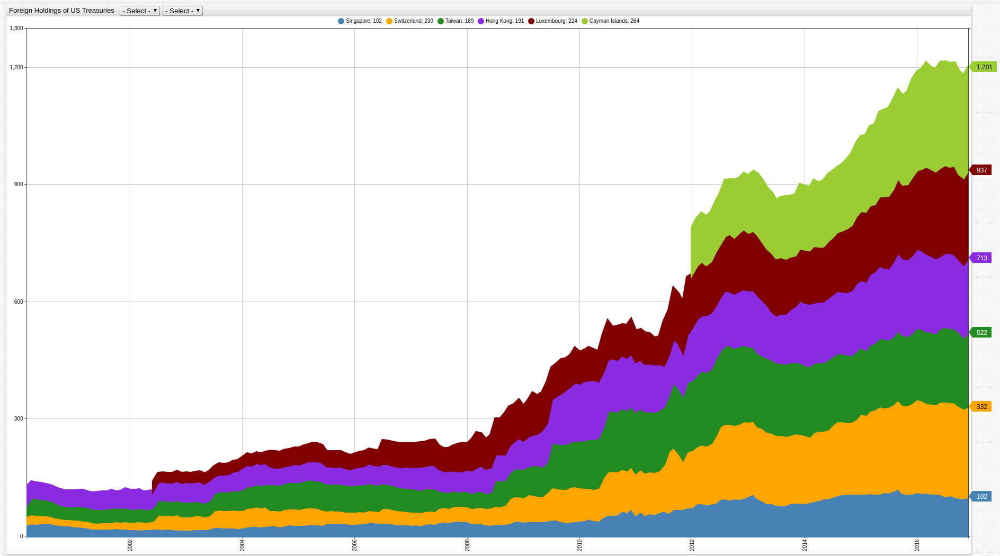
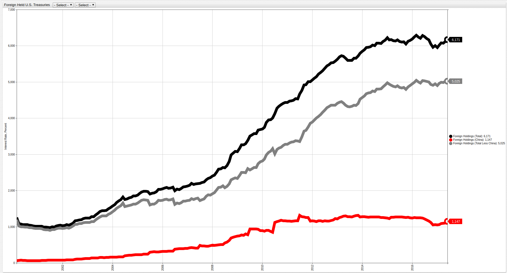
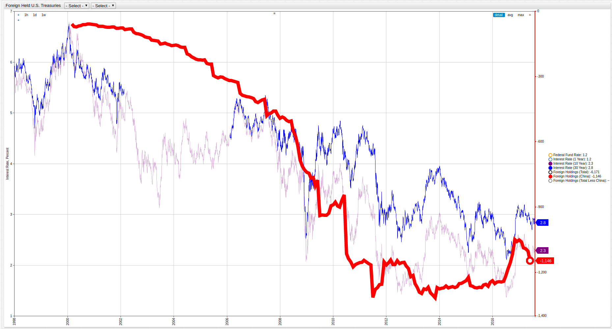
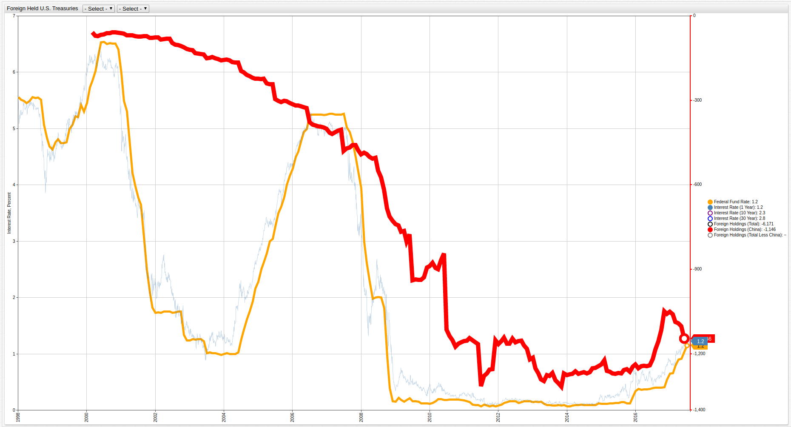

United States Treasuries as International Assets: China's Role in the Federal Fund Rate
===

Analyzing the make-up of foreign-held United States treasuries positions and the effects of large-scale ownership like that
of China and Japan on American financial markets.

### Executive Summary

The United States Government currently bears $19.8 trillion dollars of gross debt, shown in **Figure 1** below:

**Figure 1**: _United States Government Gross Debt_



[](https://apps.axibase.com/chartlab/24f81638/#fullscreen)

> Open any ChartLab visualization and navigate through time with the dropdown menu to observe any desired span of time.

_Source_: [Federal Reserve Economic Data (FRED)](https://fred.stlouisfed.org/series/FYGFD)

The debt is divided into two categories, intergovernmental debt and public debt. Intergovernmental debt holdings are securites
that are held in federal government trusts while public debt can be purchased by virtually anyone:

**Figure 2**: _Ownership of United States Debt_



_Source_: [TreasuryDirect](https://treasurydirect.gov/NP/debt/current)

Public debt holdings have been growing in parallel with gross government debt:

**Figure 3**: _Federal Debt Held by the Public_


[](https://apps.axibase.com/chartlab/24f81638/3/#fullscreen)

_Source_: [Federal Reserve Economic Data (FRED)](https://fred.stlouisfed.org/series/FYGFDPUN)

Owners of public debt securities are detailed below:

**Figure 4**: _Bearers of United States Public Debt Securities_



_Source_: [United States Treasury](https://www.fiscal.treasury.gov/fsreports/rpt/treasBulletin/current.htm)

Almost half of the United States gross public debt is held by foreign governments, shown above.

### Data

The largest bearers of United States public debt are shown below. Worth noting is the fact that of the six trillion dollars
of foreign-held debt, more than two-thirds of that amount is held by the top ten bearers shown in **Table 1**.

> Structured Query Language: [SQL Console](https://github.com/axibase/atsd/tree/master/api/sql) from [Axibase](https://axibase.com)

**Query 1**

```sql
SELECT tags.country AS "Country", last(value) AS "US Debt (Billion USD)"
 FROM ust.foreign.holders WHERE tags.country != 'Grand Total' AND tags.country != 'All Other' AND YEAR(time) = 2016
GROUP BY tags.country
ORDER BY last(value) DESC
 LIMIT 10
```

**Table 1**: _Foreign Bearers of United States Public Debt_

```ls
| Country         | US Debt (Billion USD) | 
|-----------------|-----------------------| 
| Japan           | 1090.8                | 
| China, Mainland | 1058.4                | 
| Ireland         | 288.2                 | 
| Cayman Islands  | 263.7                 | 
| Brazil          | 259.2                 | 
| Switzerland     | 230.0                 | 
| Luxembourg      | 224.3                 | 
| United Kingdom  | 217.2                 | 
| Hong Kong       | 191.4                 | 
| Taiwan          | 189.3                 | 
```

**Figure 6**: _The Largest Foreign Bearers of United States Public Debt_



[](https://apps.axibase.com/chartlab/17d4a3dc/#fullscreen)

> Open any ChartLab visualization and navigate through time with the dropdown menu to observe any desired span of time.

_Source_: [Department of the Treasury](https://www.treasury.gov/resource-center/data-chart-center/tic/Pages/ticsec2.aspx)

Purchase of public debt by foreign governments has a number of effects. In the case of Mainland China, whose debt positions
are detailed below, maintaining a position in United States public debt ensures that the dollar will hold its value relative
to the Yuan, keeping Chinese imports competitive and affordable on U.S. markets.

**Figure 6**: _Chinese Holdings of U.S. Public Debt_


[](https://apps.axibase.com/chartlab/17d4a3dc/2/#fullscreen)

_Source_: [Department of the Treasury](https://www.treasury.gov/resource-center/data-chart-center/tic/Pages/ticsec2.aspx)

Because U.S. Treasuries are considered one of the safest investments in the world, even countries sometimes considered at
odds with United States policy maintain positions in such securities to ensure future returns from the United States
economy. The Russian Federation for example, sold a large number of its securities after the downturn
in oil prices catalyzed devaluation of the rouble. As the economy stabilized and liquid capital become available, Russia 
began to reacquire a great deal of U.S. treasuries, shown below:

**Figure 7**: _Russian Holdings of U.S. Public Debt_



[](https://apps.axibase.com/chartlab/17d4a3dc/3/#fullscreen)

_Source_: [Department of the Treasury](https://www.treasury.gov/resource-center/data-chart-center/tic/Pages/ticsec2.aspx)

There are a number of financial havens in the world that have lax financial regulation or certain non-disclosure laws that
make the true identity of investors impossible to know; examples are Switzerland, the Cayman Islands, Hong Kong, and Luxembourg, all of whom
appear in **Table 1**, they are shown below, alongside Singapore and Taiwan. 

**Figure 8**: _U.S. Treasuries Held in Worldwide Financial Centers_



[](https://apps.axibase.com/chartlab/17d4a3dc/4/#fullscreen)

_Source_: [Department of the Treasury](https://www.treasury.gov/resource-center/data-chart-center/tic/Pages/ticsec2.aspx)

The total treasury holdings by the above sources compared to the People's Republic of China, and Japan, currently the two largest
sole bearers of U.S. treasuries are shown below.

**Figure 9**: _Foreign Bearers of United States Treasuries_


[](https://apps.axibase.com/chartlab/17d4a3dc/7/#fullscreen)

_Source_: [Department of the Treasury](https://www.treasury.gov/resource-center/data-chart-center/tic/Pages/ticsec2.aspx)

Countries which export oil are central to the global economy, and many of them maintain positions in United States treasuries.

**Figure 10**: _Oil-Producing Countries with Positions in U.S. Treasuries_


[](https://apps.axibase.com/chartlab/17d4a3dc/9/#fullscreen)

> Open any ChartLab visualization and navigate through time with the dropdown menu to observe any measured year.

_Source_: [Department of the Treasury](https://www.treasury.gov/resource-center/data-chart-center/tic/Pages/ticsec2.aspx)

### Analysis

One of the most likely effects of a large-scale sell-off of United States treasuries positions is rapid inflation of the
dollar accompanied by increased Federal Reserve interest rates, needed to counteract the sudden influx of such securities
on the public marketplace.

**Figure 11** below tracks Federal Reserve interest rates by 1-year, 10-year, and 30-year averages and includes the daily
Federal Fund rate. For further explanation of these metrics, see the following [analysis](/Analysis/FedFund_FedInterest/README.md).

**Figure 11**: _Federal Reserve Interest Rates_


[](https://apps.axibase.com/chartlab/9183d77b/10/#fullscreen)

_Source_: [Federal Reserve Economic Research (FRED)](https://fred.stlouisfed.org/categories/115)

Matched with high levels of foreign-owned U.S. treasuries, low Fed interest rates are viewed with apprehension for
fear of rapid inflation caused by the sale of those securities. The following figure shows foreign ownership of U.S. treasuries
by China, in total, and less China:

**Figure 12**: _Foreign Ownership of U.S. Treasuries (Total, China, Total Less China)_



[](https://apps.axibase.com/chartlab/c281e549/2/#fullscreen)

Two unique patterns are visible above. Chinese buying and selling of U.S. treasuries remains stable, indicating no change in
position, from 2010 onward. While the second distinct pattern is shown by the black and grey lines and indicates that foreign
governments continue to purchase positions in U.S. treasuries. The grey line, which is total ownership less China, resembles the
black line more closely then it does the red, indicating that China's influence over United States markets may be less
significant than some analysts indicate.

Additionally, when displayed on an inverted axis with data from **Figure 11**, the pattern of Fed-set interest rates much more
closely follow the trends set by the total foreign-held debt line than the China-held debt line:

**Figure 13**: _Fed Interest vs. Foreign-Held Treasuries_


[](https://apps.axibase.com/chartlab/c281e549/2/#fullscreen)

**Figure 14**: _Fed Interest vs. China-Held Treasuries_



[](https://apps.axibase.com/chartlab/c281e549/2/#fullscreen)

Further, when considering the Federal Fund Rate, which is the daily lending rate set by the Federal
Reserve each evening, the relevence of Chinese-held debt movements, which accounts for 5.56% of total U.S. treasuries is shown to be
more reactionary than causal:

**Figure 15**: _Federal Fund Rate vs. China-Held Treasuries_



[](https://apps.axibase.com/chartlab/c281e549/3/#fullscreen)

### Debrief

Although China possesses a significant position in American treasuries, the likelihood that the American economy is beholden
to Chinese financial machinations is an oversimplification of an complex issue. Due to the global nature of the modern world,
it is reasonable that a super-power such as the PRC would have some level of influence over American policymakers because of
their invaluable position in the global supply chain, however the assertion that China is capable of completely devaluing 
U.S. treasuries is shown here to be false. Even upon large-scale sale, or no movement, the total number of U.S. treasury 
positions operates independently of Chinese treasury positions showing once again, the lack of significant influence that
Chinese bankers are able to wield.

Worth noting is the custodial positions mentioned in **Figures 8** and **9**. Together they represent more than the Chinese
position alone, and the bearers of those treasuries are unknown. It is possible that such positions could be held by Chinese
agents or allies and their actions would be covertly dictated from Beijing. For example, when the scale of Cayman-held
treasuries is adjusted to match Chinese levels, the leveling-off of Chinese movement is matched fairly well with a sudden increase
in Cayman positions, shown below:


[](https://apps.axibase.com/chartlab/c281e549/4/#fullscreen)

Despite such hypotheses, the nature of the global economy is such that most countries are inherently reliant on one another
for import or export needs, financial support, or a number of other metrics so true financial downturn would have long-reaching
global effects, as seen during the recent Great Recession where the sub-prime mortgage crisis, which began in America, ultimately
resulted in a global contraction of gross domestic product (GDP).
