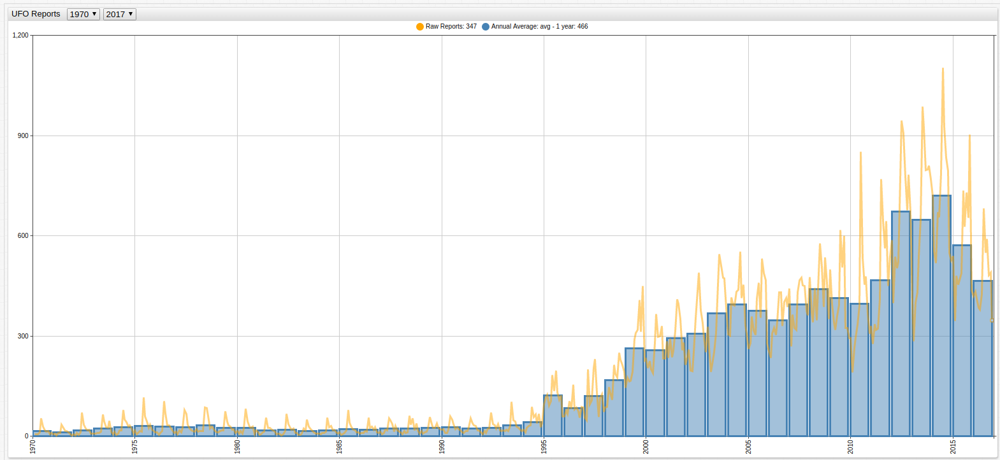

UFO Reports by Date, Location, and Type
==

**Visualization Tools**: [Axibase Time Series Database](https://axibase.com/products/axibase-time-series-database/)

**Figure 1**: Number of Reported Unidentified Flying Objects, 1970 - Present



[](https://apps.axibase.com/chartlab/f21268e5#fullscreen)

> Open the ChartLab visualization above to navigate through time.

The [National Unidentified Flying Object Reporting Center](http://www.nuforc.org/) records the amount of reports received
each month about the number of UFO sightings across the United States and Canada. UFOs have played an interesting role in history: from instigating the oft-forgotten 
[Battle of Los Angeles](https://en.wikipedia.org/wiki/Battle_of_Los_Angeles) during World War II, to the infamous [Roswell Incident](https://en.wikipedia.org/wiki/Roswell_UFO_incident).
Whether true or not, the question of life beyond our planet seems to be permanently fixed in the public
consciousness. **Figure 1** above details the number of reports gathered by NUFORC since 1970, which grew more
frequent until the 1990s when the amount of reports began to contract. The visualizations below detail the type of object spotted (**Figure 2**), and location (**Figure 3**)
and queries performed with [SQL Console](https://github.com/axibase/atsd/tree/master/api/sql) give the data further context.

**Query 1**

````sql
SELECT date_format(time, 'MM-yyyy') AS "Date", value as "Reports"
  FROM "reports" WHERE YEAR(time) = 2017
````

**Table 1**: 2017 UFO Sighting Reports

```ls
| Date    | Reports | 
|---------|---------| 
| 01-2017 | 323     | 
| 02-2017 | 414     | 
| 03-2017 | 337     | 
| 04-2017 | 399     | 
| 05-2017 | 353     | 
| 06-2017 | 392     | 
| 07-2017 | 473     | 
```

**Query 2**

```sql
SELECT MONTH(time) AS "Date", AVG(value) as "Reports"
  FROM "reports" WHERE YEAR(time) > 1990
GROUP BY MONTH(time)
```

**Table 2**: UFO Sightings by Monthly Average

```ls
| Date | Reports | 
|------|---------| 
| 1    | 275     | 
| 2    | 232     | 
| 3    | 262     | 
| 4    | 263     | 
| 5    | 268     | 
| 6    | 348     | 
| 7    | 456     | *
| 8    | 413     | *
| 9    | 386     | *
| 10   | 367     | 
| 11   | 349     | 
| 12   | 284     | 

```

> The three months with the most reported UFOs are tagged with an asterisk (*) above.

July, August, and September the warmer, often-clearer summer months also have the highest number of reported UFO sightings.

**Figure 2**


[](https://apps.axibase.com/chartlab/99b8d4c0/#fullscreen)

The overwhelming majority of UFO reports are described as some kind of light, according to NUFORC data.

**Figure 3**


[](https://apps.axibase.com/chartlab/99b8d4c0/5/#fullscreen)

According to the data, if you are a dedicated believer, the best thing to do is look for odd lights in the California sky 
during summer months.

The existence of extraterrestrial life, and by extension, the idea that they have tried to make contact with humankind has been
considered by some of the planet's greatest minds: [Stephen Hawking](https://www.space.com/29999-stephen-hawking-intelligent-alien-life-danger.html)
has stated that he believes in alien life and during a 1985 Geneva Summit, the topic of worldwide alien invasion came up between
[President Ronald Regan and Soviet Primier Mikhail Gorbachev](http://www.smithsonianmag.com/smart-news/reagan-and-gorbachev-agreed-pause-cold-war-case-alien-invasion-180957402/)
who at the time represented opposing sides of the Cold War.

