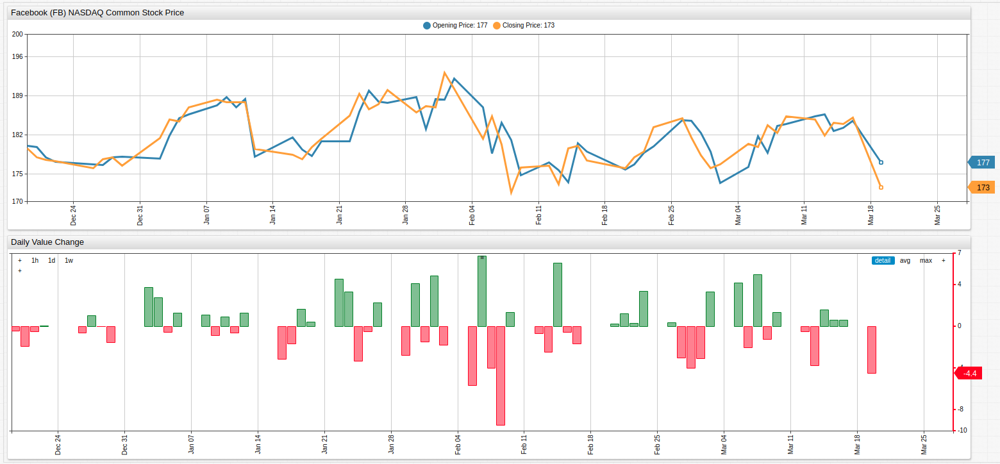
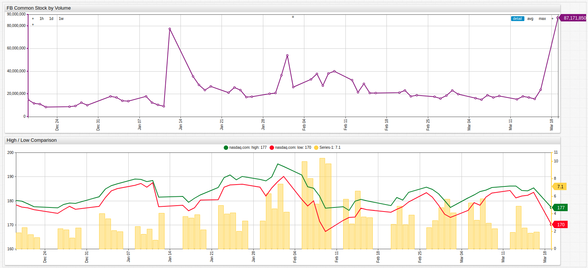

# The Fall of Facebook

>*Fig 1.* The upper graph shows the opening and closing prices for Facebook, Inc. common stock since the end of 2017. The lower graph uses a [`value`](https://axibase.com/products/axibase-time-series-database/visualization/widgets/time-chart/) expression to display the difference between them, and an [`alert-expression`](https://axibase.com/products/axibase-time-series-database/visualization/widgets/time-chart/#tab-id-14) to highlight those days where the company's stock lost value in red.

Since launching its IPO in mid-2012 for $38 a share, and being initially valued at $108 billion (the largest valuation of a company at the time of initial public offering), Facebook, Inc. has run into something of a problem in recent months. Besides the public's general distrust of the massive data-mining enterprise slash social networking site, Facebook has found itself embroiled in scandal after scandal after scandal and the once untouchable tech giant is starting to feel it in the market and not just the papers.

>*Fig. 2* The upper chart tracks USD volume of FB common stock, which is skyrocketing in the present week, amid rumors that Mr. Zuckerburg himself is dumping millions of dollars worth of personal stock as well. The lower graph uses a duel [`axis`](https://axibase.com/products/axibase-time-series-database/visualization/widgets/time-chart/#tab-id-2) expression to group unlike data in one widget without hindering visibility.

As of this writing, FB stock is down almost 15 points within the last 24 hours with little hope that it will rebound soon. Certainly a far cry from the days when Facebook seemed an unstoppable giant, it seems that the company's own machinations are in the process of bringing about its untimely demise as well. 

Ironically, competitor social media platform Twitter is now home to the #DeleteFacebook movement, a protest action that the struggling media corporation can only be too happy to facilitate as their own stock prices soared in recent weeks amid the first reported profits of the company's history since going public in 2014.
