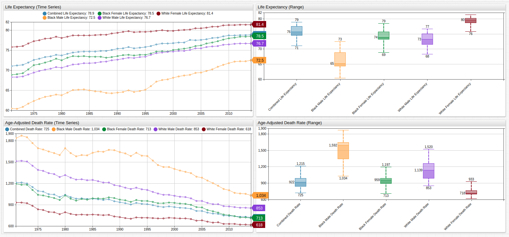
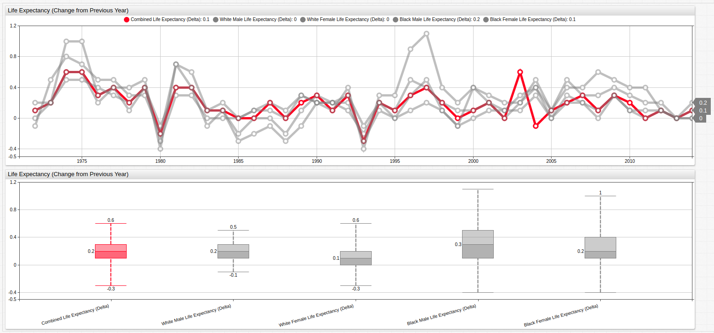
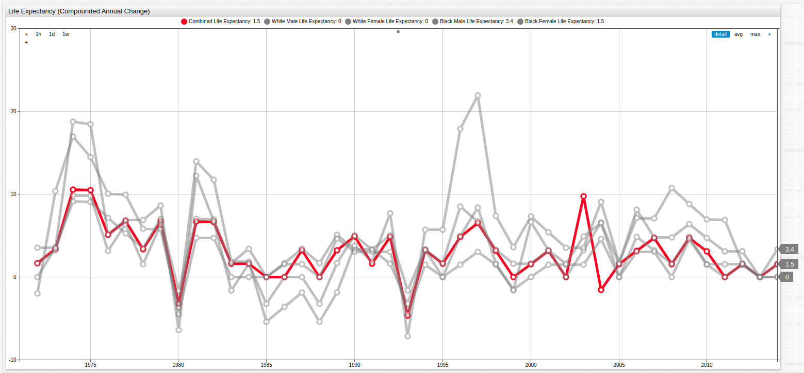
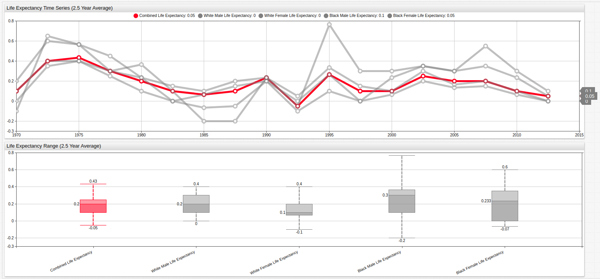

# Slow Growth is Becoming a Human Trend Too


[](https://trends.axibase.com/f57c4e8e#fullscreen)

*Fig 1.* The above chart shows United States life expectancy figures for the last three and a half decades contrasted against the age-adjusted death rate per 100,000 persons.

### Overview

The slowing growth of the American economy is at the forefront of many investors' minds; the United States hasn't seen 3% annual GDP growth for over a decade, which many analysts consider to be a fairly modest goal. Meanwhile, developing countries like China and India have consistently seen twice that amount for more than thirty years now. As [US debt](/../master/Analysis/The_New_Bubble/README.md) remains nearly three times the size of Great Britain's, the country with the second largest public debt in the world, and the Social Security Administraton is [preparing to cope](/../master/aging-america/README.md) with the growing number of would-be applicants, another phenomenon is garnering more and more attention: average life expectancy.

The number of Social Security recipients is growing all the time and those recipients are living for longer each year. At the same time, the number of live births is still on the decline so the number of people paying in to these already over-taxed systems is decreasing. Social Security and other disability-aid systems, often collectively refered to as "entitlements" need to be addressed by the any administration that is truly interested in reversing America's precipitous fall from economic grace. 

### Objectives

Track life expectancy growth using calculated series in [Axibase Times Series Database](https://axibase.com/products/axibase-time-series-database/) with JavaScript [Math.]() objects and statistical functions.

### Data

Data is sourced from the Center for Disease Control and Prevention.

* [NCHS - Death rates and life expectancy at birth](https://catalog.data.gov/dataset/age-adjusted-death-rates-and-life-expectancy-at-birth-all-races-both-sexes-united-sta-1900)

Data is visualized using **TRENDS** service from Axibase, a public data repository with subsets of public data from organizations like the United States Federal Reserve, the Central Bank of Israel, the SEC, FCC, and other government agencies.

### Methodology

1. Visualize Datasets using [TRENDS](https://trends.axibase.com/);
2. Implement Math. objects to derive calculated series;
3. Use built-in [Statistical Functions](https://github.com/axibase/atsd/blob/master/rule-engine/functions.md#statistical-functions) to transform the dataset.

### Visualization

**Change in Age Expectancy by Year**

Open the TRENDS visualization to toggle secondary datasets on and off using the labeled buttons along the top of the visualization. 


[](https://trends.axibase.com/e029d65a#fullscreen)

*Fig 2.* Using a variable `value` expression and a `time-offset` setting, previous-year data may be compared to current-year data to show the dimishing growth of life expectancy from all measured metrics. The [Box Chart](https://axibase.com/products/axibase-time-series-database/visualization/widgets/box-chart-widget/) below the [Time Series](https://axibase.com/products/axibase-time-series-database/visualization/widgets/time-chart/) chart tracks the range of values and shows that the average growth rate of the life expectancy has been roughly achieved for the last several years from all tracked demographics.

The `value` expression using to derive the above series is shown here:

```sql
value = var v = value('x'); var p = value('y'); if(p!=null && v!=null) return v - p
```

To create such a series in a local **TRENDS** instance, use the following syntax as a template:

```sql
 [series]
    display = false
    alias = cle
    [tags]
    race = All Races
    sex = Both Sexes
   
  [series]
      time-offset = 1 year
      display = false
      alias = cleo
      [tags]
      race = All Races
      sex = Both Sexes

  [series]
      color = red
      label = Combined Life Expectancy (Delta)
      style = stroke-width: 5
      value = var v = value('cle'); var p = value('cleo'); if(p!=null && v!=null) return v - p
```

For both series used to calculate the derived series, an `alias` is applied and the `display` setting is `false`. The `time-offset` setting is applied to a second identical dataset and used in the third **[series]** expression as the subtrahend.

**Compunded Annual Rate of Change**

Because changes in life expectancy may change dramtically from year to year, compounding the annual rate of change is useful to smooth such volatility.


[](https://trends.axibase.com/af7905a1#fullscreen)

*Fig 3.* Because compounded rate of change is an additive set of values, the individual points along the line display more variance but the slope of the line is shown to be distinctly negative.

Once again, a `value` expression is used to derive the above series, but here a JavaScript `Math.` method is used to create an exponential argument: 

```sql
value = (Math.pow(( value("x") / previous("x") ), 12) - 1) * 100
```

The underlying configuration is shown here:

```sql
  [series]
    display = false
    alias = cle
    [tags]
    race = All Races
    sex = Both Sexes

  [series]
    color = red
    label = Combined Life Expectancy
    style = stroke-width: 5
    value = (Math.pow(( value("cle") / previous("cle") ), 12) - 1) * 100``sql
```

The `previous` argument is used to select the entry preceeding the current value. The first `previous` argument returns `null` value, making it possible to use as a divisor.

**Moving Average Statistical Function**

While the compounded annual rate of change for this dataset showed the overall downward trend of the growth in life expectancy figure, it failed to smooth the individual points along the trend line and actually exaggerated them in some places.

The moving average [statistical function](https://axibase.com/products/axibase-time-series-database/visualization/widgets/configuring-the-widgets/aggregators/) is a native ATSD aggregator which records a new average value for any desired period of time.


[](https://trends.axibase.com/7082a274#fullscreen)

*Fig 4.* Not only is the general downward slope of the trend line visible but most of the dramatically varied points have been smoothed and moved closer to the median value. Below the Time Series chart above, the Box Chart shows that while the median values for each of the metrics has remained constant, the range has been dramtically reduced.

To create such a series, add an additional **[series]** expression with a derived value using the Statistical Function syntax:

```sql
      value = avg('series', 'time')
```

Where `series` is the `alias` of the series from which the new series will be derived and `time` is the period for which the moving average will be calculated.

The configuration used above may be used a template for user-derived series:

```sql
  [series]
    display = false
    alias = cle
    [tags]
    race = All Races
    sex = Both Sexes
   
  [series]
      time-offset = 1 year
      display = false
      alias = cleo
      [tags]
      race = All Races
      sex = Both Sexes

  [series]
      style = stroke-width: 5
      value = var v = value('cle'); var p = value('cleo'); if(p!=null && v!=null) return v - p
      alias = delta
      display = false
      
   [series]
      label = Combined Life Expectancy
      color = red
      style = stroke-width: 5
      value = avg('delta', '2.5 year')
```

The final derived series' `value` expression's `time` argument may be modified in **TRENDS** to increase or decrease the variance threshold as desired.

### Conclusion

The diminishing increase in United States life expectacy indicates that this may be as good as it gets for mankind. A number of [easily accessible](http://lmgtfy.com/?q=peak+life+expectancy) and recent resources have shown large research organizations coming to the same conclusion. Despite the continuous increase in nutritional, performance-enhancing, and medical / surgical options, man scientists are beginning to believe that man's current life expectancy may not reach much higher than it already has.

### Resources

The following tools may be used to replicate these results in a local ATSD instance:

* Instructional [guide](/../master/how-to/shared/trends.md) for using **TRENDS**;
* [Death rates and life expectancy data](#data)
