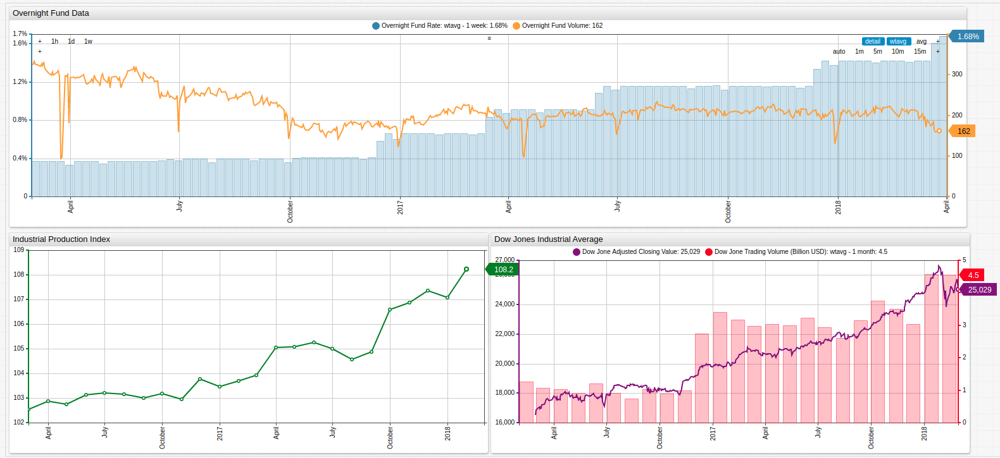

# The Creeping Overnight Fund Rate

The overnight market is the shortest term loan market in world, whereby banks loans money overnight which must be repayed the following morning plus interest. Because of the extreme short term nature of these types of loans, they also have the lowest possible interest rates -- typically reflective of the target interest rate mandated by the United States Federal Reserve.
