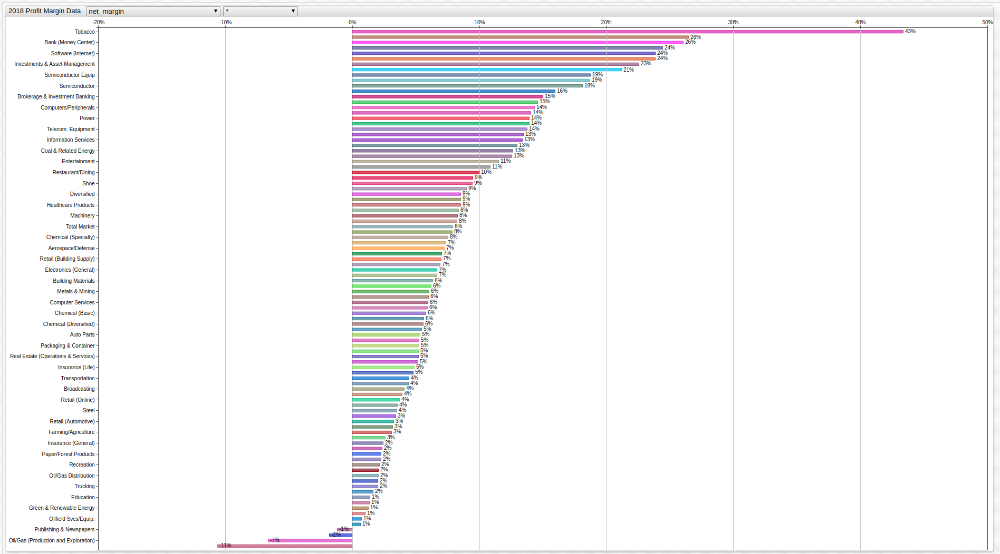

# Average Profit Margin by Industry

The [American Enterprise Institute](http://www.aei.org/) is Washington D.C.-based conservative think tank that is dedicated to researching issues of government, politics, economics, and social welfare.
