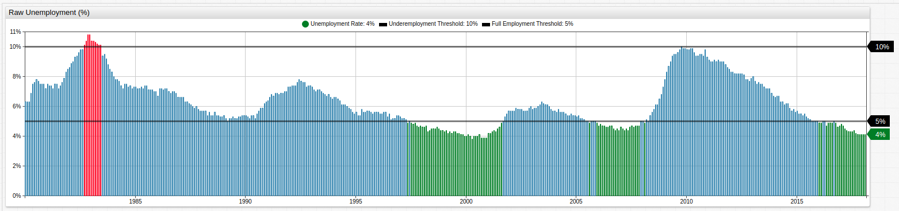
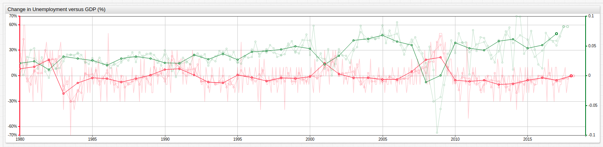

# U.S. Approaching 3-Year Mark for Full Employment

*Fig 1.* The upper chart in the **TRENDS** visualization above tracks U.S. unemployment and GDP, while the lower charts track percent change in unemployment and GDP value, respectively. For configuration information, see the [Configuration](#configuration) section of this article.

### Overview

Since the 1980s, the United States has almost always been on the wrong side of unemployment statistics, only seeing full employment in the country for a handful of years leading up to September 11, 2001 and a few years again preceeding the 2008-2009 stock market crash. The idealists among those in the economic class like to consider "Full Employment" to be somewhere around 1-2%, but the reality is that this is almost never the case. A phenomenon known as frictional unemployment means that most experts tend to consider a country fully employed as long as the unemployment level is [less than roughly 5%](https://www.npr.org/2013/01/03/168508910/what-is-a-good-unemployment-number-really).

### What is Frictional Unemployment?

Fricitional unemployment means that at any given time, some percentage of the population will be unemployed of their own volition. Whether it's because of a personal sabbatical, the desire to find a new job without working during the hunt, or other circumstantial factors, some part of the population will be counted as unemployed when they perhaps shouldn't be counted at all.

### When has the U.S seen full employment?

*Fig 2.* Periods of full employment are highlighted in green and periods of over 10% unemployment are highlighted in red. Full-employment and 10%-unemployment `[threshold]` series are used.

The **TRENDS** chart above tracks periods with full employment using an `alert-expression`. See the [Configuration](#configuration) section of this article for detailed configuration information.

### How Does GDP Correlate to Unemployment?

While correlation alone can never be used to prove causation, common sense tells us that the more unemployed there are in the population, the worse off the GDP will inevitably be. Compare the percent change charts from above for unemployment and GDP when they are overlaid.

*Fig 3.* Series of dramatically different orders of magnitude may be shown on the same visualization using an `axis` setting. See the [Configuration](#configuration) section of this article for detailed configuration information.

Annual average percent change in both GDP and unemployment is the dominant line in the above visualization. Using the two-argument `avg()` function, a series may be averaged according to a user-specified period of time. Because unemployment data is monthly, it has been averaged by month, quarter, half year, and year. Because GDP data is quarterly, it has been average by quarter, half year, and year.
