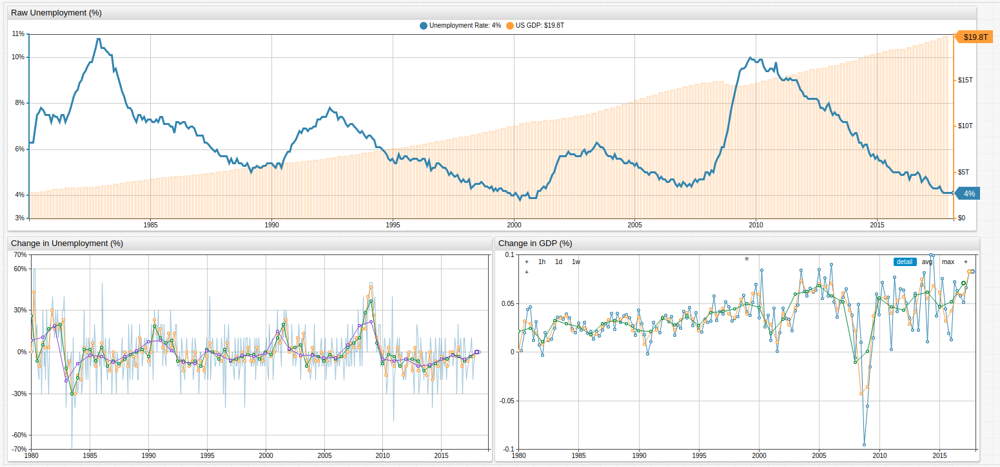

# U.S. Approaching 3-Year Mark of Full Employment

*Fig 1.* The upper chart in the **TRENDS** visualization above tracks U.S. unemployment and GDP, while the lower charts track percent change in unemployment and GDP value, respectively. For configuration information, see the [Configuration](#configuration) section of this article.

### Overview

Since the 1980s, the United States has been on the wrong side of the unemployment Rubicon, so to speak, only seeing full employment in the country for a handful of months leading up to September 11, 2001. The idealists among those in the economic class like to consider "Full Employment" to be somewhere around 1-2%, but the reality is that this is almost never the case. The phenomenon known as frictional unemployment means that most experts tend to consider a country fully employed as long as the unemployment level is less than roughly 5%.

### What is Frictional Unemployment?

Fricitional unemployment means that at any given time, some percentage of the population will be unemployed of their own volition. Whether it's because of a personal sabbatical, the desire to find a new job without working during the hunt, or other circumstantial factors, some part of the population will be counted as unemployed when they perhaps shouldn't be counted at all.

### When has the U.S seen full employment?

