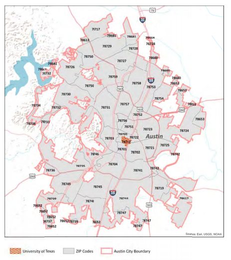
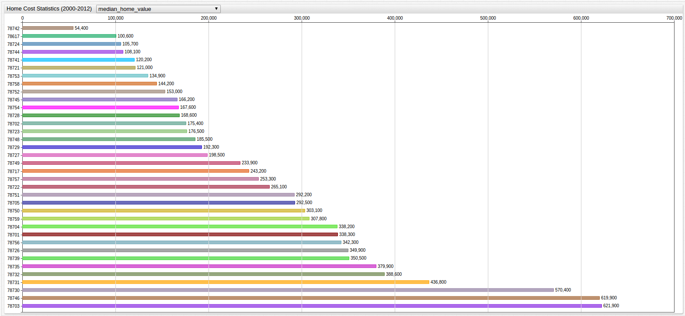
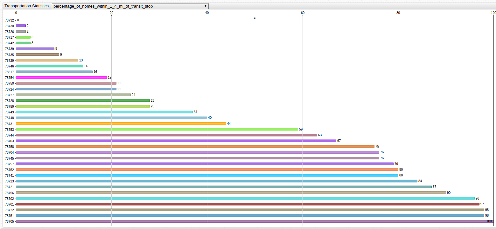
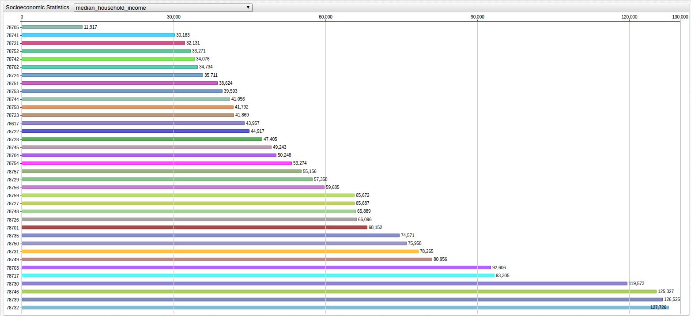
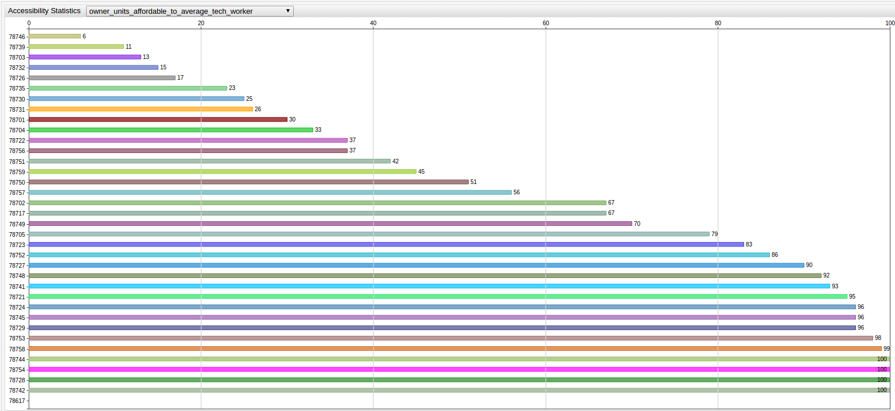
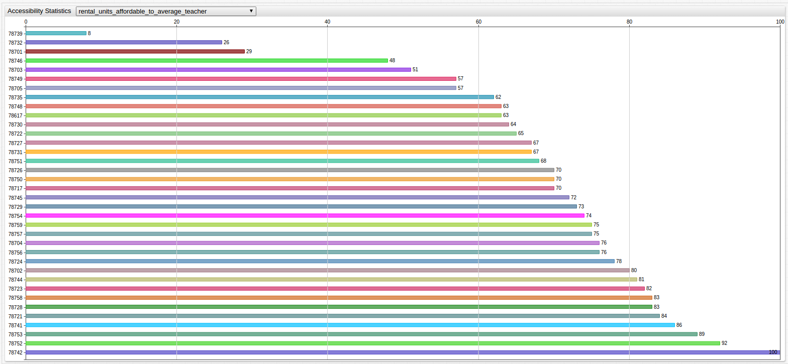
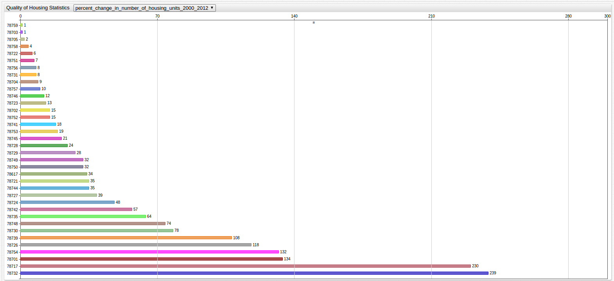

# Comprehensive Housing Market Analysis: City of Austin (2014)

* Source Data: [City of Austin Report](http://www.austintexas.gov/sites/default/files/files/NHCD/2014_Comprehensive_Housing_Market_Analysis_-_Document_reduced_for_web.pdf)

* Structured Query Language: [SQL Console](https://github.com/axibase/atsd/blob/master/sql/README.md) in the[Axibase Time Series Database](https://axibase.com/products/axibase-time-series-database/)

* Visualization: [ChartLab](https://apps.axibase.com/chartlab)

## Index

The following table contains the entire set of included metrics as well as their corresponding visualization figure for easy navigation.
Use the clickable links in the Figure column to jump between visualizations and in ChartLab, use the drop-down menus to toggle
between metrics.

| Metric | Comment | Figure |
|:-------|:-------:|:-------|
| average_monthly_transportation_cost | Dollars/month | [Figure 2.1: Transportation Statistics](#Transportation-Statistics) |
| change_in_median_home_value_2000_2012 | Percent (%) | [Figure 1.1: Home Cost Statistics](#Home-Cost-Statistics) |
| change_in_median_rent_2000_2012 | Percent (%) | [Figure 1.1: Home Cost Statistics](#Home-Cost-Statistics) |
| change_in_percentage_of_population_below_poverty_2000_2012 | Percent (%) | [Figure 3.1: Socioeconomic Statistics](#Socioeconomic-Statistics) |
| homes_affordable_to_people_earning_less_than_50_000 | Percent (%) | [Figure 3.1: Socioeconomic Statistics](#Socioeconomic-Statistics) |
| median_home_value | Dollars | [Figure 1.1: Home Cost Statistics](#Home-Cost-Statistics) |
| median_household_income | Dollars | [Figure 3.1: Socioeconomic Statistics](#Socioeconomic-Statistics) |
| median_rent| Dollars/month | [Figure 1.1: Home Cost Statistics](#Home-Cost-Statistics) |
| owner_units_affordable_to_average_artist| Percent (%) | [Figure 4.1: Accessibility Statistics](#Accessibility-Statistics) |
| owner_units_affordable_to_average_retail_service_worker| Percent (%) | [Figure 4.1: Accessibility Statistics](#Accessibility-Statistics) |
| owner_units_affordable_to_average_teacher | Percent (%) | [Figure 4.1: Accessibility Statistics](#Accessibility-Statistics) |
| owner_units_affordable_to_average_tech_worker | Percent (%) | [Figure 4.1: Accessibility Statistics](#Accessibility-Statistics) |
| percent_change_in_number_of_housing_units_2000_2012 | Percent (%) | [Figure 5.1: Quality of Housing Statistics](#Quality-of-Housing-Statistics) |
| percentage_of_homes_within_1_4_mi_of_transit_stop | Percent (%) | [Figure 2.1: Transportation Statistics](#Transportation-Statistics) |
| percentage_of_rental_units_in_poor_condition | Percent (%) | [Figure 5.1: Quality of Housing Statistics](#Quality-of-Housing-Statistics) |
| population_below_poverty_level | Percent (%) | [Figure 3.1: Socioeconomic Statistics](#Socioeconomic-Statistics) |
| rent_restricted_units | Number of Units | [Figure 5.1: Quality of Housing Statistics](#Quality-of-Housing-Statistics) |
| rental_units_affordable_to_average_artist | Percent (%) | [Figure 4.2: Accessibility Statistics](#Accessibility-Statistics) |
| rental_units_affordable_to_average_retail_service_worker | Percent (%) | [Figure 4.2: Accessibility Statistics](#Accessibility-Statistics) |
| rental_units_affordable_to_average_teacher | Percent (%) | [Figure 4.2: Accessibility Statistics](#Accessibility-Statistics) |
| rental_units_affordable_to_average_tech_worker | Percent (%) | [Figure 4.2: Accessibility Statistics](#Accessibility-Statistics) |
| rentals_affordable_to_people_earning_less_than_25_000 | Percent (%) | [Figure 3.1: Socioeconomic Statistics](#Socioeconomic-Statistics) |
| transportation_related | Metric name shortened for index, percent (%) | [Figure 2.1: Transportation Statistics](#Transportation-Statistics) |
| unemployment | Percent (%) | [Figure 3.1: Socioeconomic Statistics](#Socioeconomic-Statistics) |

## Home Cost Statistics

The following ChartLab visualization displays information related to the changing cost of both owning and renting a home.

Local Metrics:

* change_in_median_home_value_2000_2012
* change_in_median_rent_2000_2012
* median_home_value
* median_rent

> Use the drop-down menu to toggle between metrics

Return to the [Index](#Index)

## Transportation Statistics

The following ChartLab visualization displays information related to transportation cost in the city of Austin.

Local Metrics:

* average_monthly_transportation_cost
* percentage_of_homes_within_1_4_mi_of_transit_stop
* percentage_of_housing_and_transportation_costs_that_is_transportation_related

> Use the dropdown to toggle between metrics

Return to the [Index](#Index)

## Socioeconomic Statistics

The following ChartLab visualization displays information related to the socioeconomic conditions of Austin residents.

Local Metrics:

* change_in_percentage_of_population_below_poverty_2000_2012
* homes_affordable_to_people_earning_less_than_50_000
* median_household_income
* population_below_poverty_level
* rentals_affordable_to_people_earning_less_than_25_000
* unemployment

> Use the dropdown to toggle between metrics

Return to the [Index](#Index)

## Accessibility Statistics

The following ChartLab visualization displays information related to the accessibility of both owning and renting a home
in Austin. **Figure 4.1** deals with ownership statistics, whereas **Figure 4.2** deals with home rental statistics.

Local Metrics:

Figure 4.1

* owner_units_affordable_to_average_artist
* owner_units_affordable_to_average_retail_service_worker
* owner_units_affordable_to_average_teacher
* owner_units_affordable_to_average_tech_worker

Figure 4.2

* rental_units_affordable_to_average_artist
* rental_units_affordable_to_average_retail_service_worker
* rental_units_affordable_to_average_teacher
* rental_units_affordable_to_average_tech_worker

Figure 4.1

> Use the dropdown to toggle between metrics

Figure 4.2

> Use the dropdown to toggle between metrics

Return to the [Index](#Index)

## Quality of Housing Statistics

The following ChartLab visualization displays information related to the quality of housing in the City of Austin.

Local Metrics:

* percent_change_in_number_of_housing_units_2000_2012
* percentage_of_rental_units_in_poor_condition
* rent_restricted_units

Figure 5.1

> Use the dropdown to toggle between metrics

Return to the [Index](#Index)