European Union Debt by Country Per Capita (2005-2016)
==

> Debt Data Source: [EuroStat](http://ec.europa.eu/eurostat/tgm/table.do?tab=table&init=1&language=en&pcode=teina225&plugin=1)

> Population Data Source: [EuroStat](http://ec.europa.eu/eurostat/web/population-demography-migration-projections/population-data)

> Visualization Tool: [ChartLab](https://apps.axibase.com)

> Structured Query Language: [SQL Console](https://github.com/axibase/atsd/tree/master/api/sql) from [Axibase](https://axibase.com)

This entry is an expansion of an earlier entry titled [European Union Debt by Country](/DataShorts/EU_Debt/README.md).

### Year Index:

* [2005](#2005)
* [2006](#2006)
* [2007](#2007)
* [2008](#2008)
* [2009](#2009)
* [2010](#2010)
* [2011](#2011)
* [2012](#2012)
* [2013](#2013)
* [2014](#2014)
* [2015](#2015)
* [2016](#2016)

### 2005

**Figure 1.01**

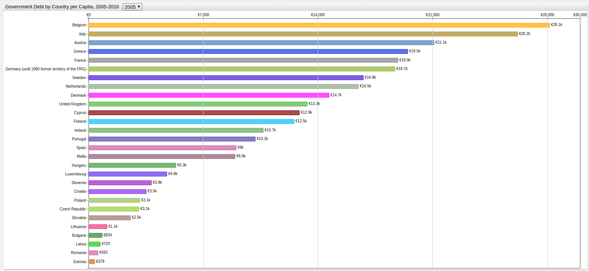

[](https://apps.axibase.com/chartlab/f78f99c7/#fullscreen)

**Query 1.01**

```sql
SELECT debt.tags AS 'Country', (debt.value/pop.value *1000) AS 'Per Capita Debt (Thousand Euro)'
  FROM government_consolidated_gross_debt AS debt JOIN "average_population_-_total" AS pop WHERE date_format(time, 'yyyy') = 2005
ORDER BY debt.tags.geo
```

**Table 1.01**

```ls
| Date | Country                                              | Per Capita Debt (Thousand Euro) | 
|------|------------------------------------------------------|---------------------------------| 
| 2005 | geo=Austria                                          | 21.10                           | 
| 2005 | geo=Belgium                                          | 28.13                           | 
| 2005 | geo=Bulgaria                                         | 0.83                            | 
| 2005 | geo=Croatia                                          | 3.51                            | 
| 2005 | geo=Cyprus                                           | 12.87                           | 
| 2005 | geo=Czech Republic                                   | 3.08                            | 
| 2005 | geo=Denmark                                          | 14.68                           | 
| 2005 | geo=Estonia                                          | 0.38                            | 
| 2005 | geo=Euro area (18 countries)                         | 17.97                           | 
| 2005 | geo=Euro area (19 countries)                         | 17.80                           | 
| 2005 | geo=European Union (27 countries)                    | 14.48                           | 
| 2005 | geo=European Union (28 countries)                    | 14.39                           | 
| 2005 | geo=Finland                                          | 12.53                           | 
| 2005 | geo=France                                           | 18.89                           | 
| 2005 | geo=Germany (until 1990 former territory of the FRG) | 18.69                           | 
| 2005 | geo=Greece                                           | 19.47                           | 
| 2005 | geo=Hungary                                          | 5.33                            | 
| 2005 | geo=Ireland                                          | 10.67                           | 
| 2005 | geo=Italy                                            | 26.20                           | 
| 2005 | geo=Latvia                                           | 0.72                            | 
| 2005 | geo=Lithuania                                        | 1.11                            | 
| 2005 | geo=Luxembourg                                       | 4.78                            | 
| 2005 | geo=Malta                                            | 8.94                            | 
| 2005 | geo=Netherlands                                      | 16.48                           | 
| 2005 | geo=Poland                                           | 3.12                            | 
| 2005 | geo=Portugal                                         | 10.18                           | 
| 2005 | geo=Romania                                          | 0.58                            | 
| 2005 | geo=Slovakia                                         | 2.55                            | 
| 2005 | geo=Slovenia                                         | 3.84                            | 
| 2005 | geo=Spain                                            | 9.01                            | 
| 2005 | geo=Sweden                                           | 16.76                           | 
| 2005 | geo=United Kingdom                                   | 13.35                           | 
```

* Return to the [Index](#year-index)

### 2006

**Figure 1.02**

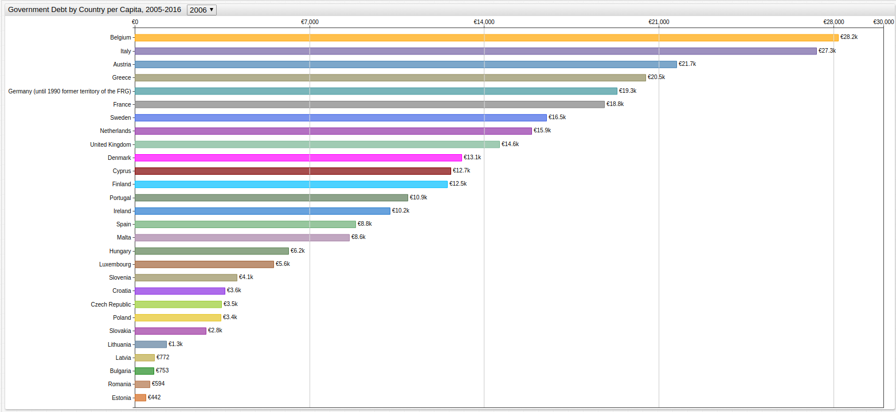

[](https://apps.axibase.com/chartlab/f78f99c7/2/#fullscreen)

**Query 1.02**

```sql
SELECT debt.tags AS 'Country', (debt.value/pop.value *1000) AS 'Per Capita Debt (Thousand Euro)'
  FROM government_consolidated_gross_debt AS debt JOIN "average_population_-_total" AS pop WHERE date_format(time, 'yyyy') = 2006
ORDER BY debt.tags.geo
```

**Table 1.02**

```ls
| Country                                              | Per Capita Debt (Thousand Euro) | 
|------------------------------------------------------|---------------------------------| 
| geo=Austria                                          | 21.70                           | 
| geo=Belgium                                          | 28.19                           | 
| geo=Bulgaria                                         | 0.75                            | 
| geo=Croatia                                          | 3.61                            | 
| geo=Cyprus                                           | 12.66                           | 
| geo=Czech Republic                                   | 3.48                            | 
| geo=Denmark                                          | 13.09                           | 
| geo=Estonia                                          | 0.44                            | 
| geo=Euro area (18 countries)                         | 18.32                           | 
| geo=Euro area (19 countries)                         | 18.15                           | 
| geo=European Union (27 countries)                    | 14.91                           | 
| geo=European Union (28 countries)                    | 14.82                           | 
| geo=Finland                                          | 12.51                           | 
| geo=France                                           | 18.81                           | 
| geo=Germany (until 1990 former territory of the FRG) | 19.32                           | 
| geo=Greece                                           | 20.48                           | 
| geo=Hungary                                          | 6.16                            | 
| geo=Ireland                                          | 10.22                           | 
| geo=Italy                                            | 27.31                           | 
| geo=Latvia                                           | 0.77                            | 
| geo=Lithuania                                        | 1.27                            | 
| geo=Luxembourg                                       | 5.56                            | 
| geo=Malta                                            | 8.59                            | 
| geo=Netherlands                                      | 15.89                           | 
| geo=Poland                                           | 3.44                            | 
| geo=Portugal                                         | 10.93                           | 
| geo=Romania                                          | 0.59                            | 
| geo=Slovakia                                         | 2.84                            | 
| geo=Slovenia                                         | 4.09                            | 
| geo=Spain                                            | 8.83                            | 
| geo=Sweden                                           | 16.48                           | 
| geo=United Kingdom                                   | 14.61                           | 
```

* Return to the [Index](#year-index)

### 2007

**Figure 1.03**

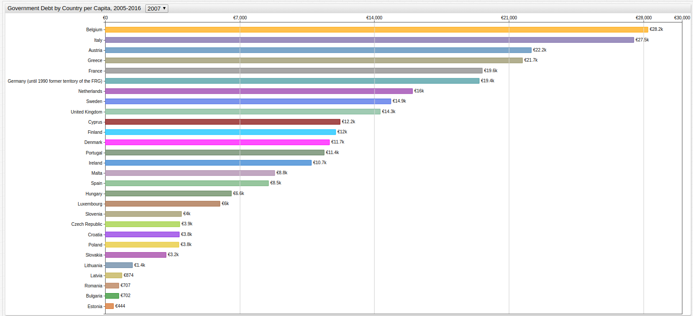

[](https://apps.axibase.com/chartlab/f78f99c7/3/#fullscreen)

**Query 1.03**

```sql
SELECT debt.tags AS 'Country', (debt.value/pop.value *1000) AS 'Per Capita Debt (Thousand Euro)'
  FROM government_consolidated_gross_debt AS debt JOIN "average_population_-_total" AS pop WHERE date_format(time, 'yyyy') = 2007
ORDER BY debt.tags.geo
```

**Table 1.03**

```sql
| Country                                              | Per Capita Debt (Thousand Euro) | 
|------------------------------------------------------|---------------------------------| 
| geo=Austria                                          | 22.16                           | 
| geo=Belgium                                          | 28.23                           | 
| geo=Bulgaria                                         | 0.70                            | 
| geo=Croatia                                          | 3.85                            | 
| geo=Cyprus                                           | 12.21                           | 
| geo=Czech Republic                                   | 3.89                            | 
| geo=Denmark                                          | 11.67                           | 
| geo=Estonia                                          | 0.44                            | 
| geo=Euro area (18 countries)                         | 18.55                           | 
| geo=Euro area (19 countries)                         | 18.39                           | 
| geo=European Union (27 countries)                    | 15.06                           | 
| geo=European Union (28 countries)                    | 14.97                           | 
| geo=Finland                                          | 11.99                           | 
| geo=France                                           | 19.62                           | 
| geo=Germany (until 1990 former territory of the FRG) | 19.45                           | 
| geo=Greece                                           | 21.71                           | 
| geo=Hungary                                          | 6.57                            | 
| geo=Ireland                                          | 10.72                           | 
| geo=Italy                                            | 27.49                           | 
| geo=Latvia                                           | 0.87                            | 
| geo=Lithuania                                        | 1.43                            | 
| geo=Luxembourg                                       | 5.97                            | 
| geo=Malta                                            | 8.83                            | 
| geo=Netherlands                                      | 16.00                           | 
| geo=Poland                                           | 3.83                            | 
| geo=Portugal                                         | 11.39                           | 
| geo=Romania                                          | 0.71                            | 
| geo=Slovakia                                         | 3.17                            | 
| geo=Slovenia                                         | 3.98                            | 
| geo=Spain                                            | 8.51                            | 
| geo=Sweden                                           | 14.87                           | 
| geo=United Kingdom                                   | 14.31                           | 
```

* Return to the [Index](#year-index)

### 2008

**Figure 1.04**

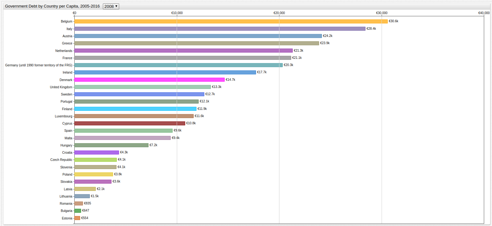

[](https://apps.axibase.com/chartlab/f78f99c7/4/#fullscreen)

**Query 1.04**

```sql
SELECT debt.tags AS 'Country', (debt.value/pop.value *1000) AS 'Per Capita Debt (Thousand Euro)'
  FROM government_consolidated_gross_debt AS debt JOIN "average_population_-_total" AS pop WHERE date_format(time, 'yyyy') = 2008
ORDER BY debt.tags.geo
```

**Table 1.04**

```sql
| Country                                              | Per Capita Debt (Thousand Euro) | 
|------------------------------------------------------|---------------------------------| 
| geo=Austria                                          | 24.15                           | 
| geo=Belgium                                          | 30.59                           | 
| geo=Bulgaria                                         | 0.65                            | 
| geo=Croatia                                          | 4.34                            | 
| geo=Cyprus                                           | 10.80                           | 
| geo=Czech Republic                                   | 4.12                            | 
| geo=Denmark                                          | 14.66                           | 
| geo=Estonia                                          | 0.55                            | 
| geo=Euro area (18 countries)                         | 19.98                           | 
| geo=Euro area (19 countries)                         | 19.80                           | 
| geo=European Union (27 countries)                    | 15.92                           | 
| geo=European Union (28 countries)                    | 15.82                           | 
| geo=Finland                                          | 11.90                           | 
| geo=France                                           | 21.15                           | 
| geo=Germany (until 1990 former territory of the FRG) | 20.33                           | 
| geo=Greece                                           | 23.90                           | 
| geo=Hungary                                          | 7.24                            | 
| geo=Ireland                                          | 17.73                           | 
| geo=Italy                                            | 28.41                           | 
| geo=Latvia                                           | 2.07                            | 
| geo=Lithuania                                        | 1.49                            | 
| geo=Luxembourg                                       | 11.63                           | 
| geo=Malta                                            | 9.39                            | 
| geo=Netherlands                                      | 21.31                           | 
| geo=Poland                                           | 3.76                            | 
| geo=Portugal                                         | 12.14                           | 
| geo=Romania                                          | 0.84                            | 
| geo=Slovakia                                         | 3.62                            | 
| geo=Slovenia                                         | 4.09                            | 
| geo=Spain                                            | 9.59                            | 
| geo=Sweden                                           | 12.68                           | 
| geo=United Kingdom                                   | 13.33                           | 
```

* Return to the [Index](#year-index)

### 2009

**Figure 1.05**

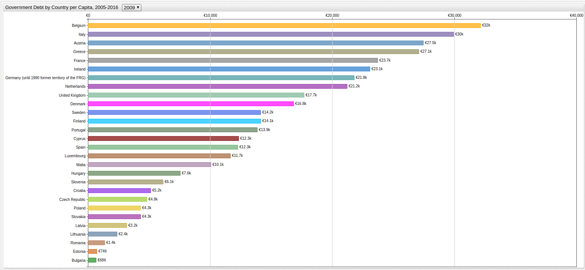

[](https://apps.axibase.com/chartlab/f78f99c7/5/#fullscreen)

**Query 1.05**

```sql
SELECT debt.tags AS 'Country', (debt.value/pop.value *1000) AS 'Per Capita Debt (Thousand Euro)'
  FROM government_consolidated_gross_debt AS debt JOIN "average_population_-_total" AS pop WHERE date_format(time, 'yyyy') = 2009
ORDER BY debt.tags.geo
```

**Table 1.05**

```sql
| Country                                              | Per Capita Debt (Thousand Euro) | 
|------------------------------------------------------|---------------------------------| 
| geo=Austria                                          | 27.47                           | 
| geo=Belgium                                          | 32.15                           | 
| geo=Bulgaria                                         | 0.69                            | 
| geo=Croatia                                          | 5.16                            | 
| geo=Cyprus                                           | 12.33                           | 
| geo=Czech Republic                                   | 4.83                            | 
| geo=Denmark                                          | 16.84                           | 
| geo=Estonia                                          | 0.75                            | 
| geo=Euro area (18 countries)                         | 21.93                           | 
| geo=Euro area (19 countries)                         | 21.74                           | 
| geo=European Union (27 countries)                    | 17.93                           | 
| geo=European Union (28 countries)                    | 17.82                           | 
| geo=Finland                                          | 14.14                           | 
| geo=France                                           | 23.73                           | 
| geo=Germany (until 1990 former territory of the FRG) | 21.80                           | 
| geo=Greece                                           | 27.11                           | 
| geo=Hungary                                          | 7.55                            | 
| geo=Ireland                                          | 23.08                           | 
| geo=Italy                                            | 29.95                           | 
| geo=Latvia                                           | 3.19                            | 
| geo=Lithuania                                        | 2.38                            | 
| geo=Luxembourg                                       | 11.68                           | 
| geo=Malta                                            | 10.09                           | 
| geo=Netherlands                                      | 21.24                           | 
| geo=Poland                                           | 4.33                            | 
| geo=Portugal                                         | 13.88                           | 
| geo=Romania                                          | 1.37                            | 
| geo=Slovakia                                         | 4.31                            | 
| geo=Slovenia                                         | 6.14                            | 
| geo=Spain                                            | 12.28                           | 
| geo=Sweden                                           | 14.16                           | 
| geo=United Kingdom                                   | 17.72                           | 
```

* Return to the [Index](#year-index)

### 2010

**Figure 1.06**

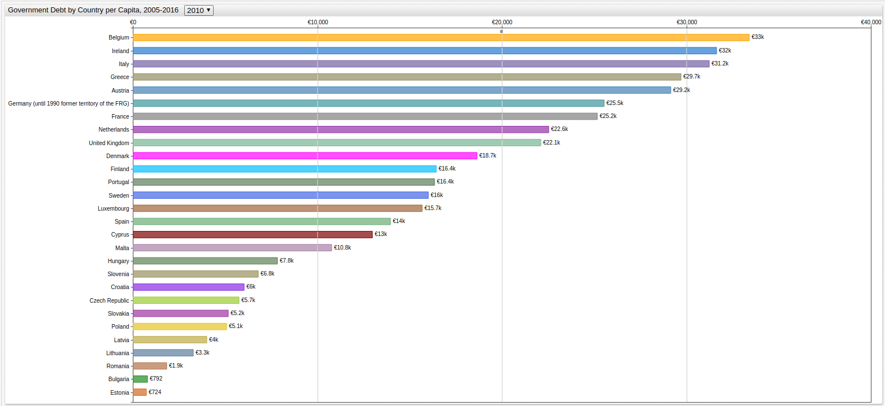

[](https://apps.axibase.com/chartlab/f78f99c7/6/#fullscreen)

**Query 1.06**

```sql
SELECT debt.tags AS 'Country', (debt.value/pop.value *1000) AS 'Per Capita Debt (Thousand Euro)'
  FROM government_consolidated_gross_debt AS debt JOIN "average_population_-_total" AS pop WHERE date_format(time, 'yyyy') = 2010
ORDER BY debt.tags.geo
```

**Table 1.06**

```sql
| Country                                              | Per Capita Debt (Thousand Euro) | 
|------------------------------------------------------|---------------------------------| 
| geo=Austria                                          | 29.16                           | 
| geo=Belgium                                          | 33.42                           | 
| geo=Bulgaria                                         | 0.79                            | 
| geo=Croatia                                          | 6.03                            | 
| geo=Cyprus                                           | 12.98                           | 
| geo=Czech Republic                                   | 5.75                            | 
| geo=Denmark                                          | 18.65                           | 
| geo=Estonia                                          | 0.72                            | 
| geo=Euro area (18 countries)                         | 24.04                           | 
| geo=Euro area (19 countries)                         | 23.85                           | 
| geo=European Union (27 countries)                    | 20.06                           | 
| geo=European Union (28 countries)                    | 19.94                           | 
| geo=Finland                                          | 16.44                           | 
| geo=France                                           | 25.17                           | 
| geo=Germany (until 1990 former territory of the FRG) | 25.54                           | 
| geo=Greece                                           | 29.72                           | 
| geo=Hungary                                          | 7.84                            | 
| geo=Ireland                                          | 31.63                           | 
| geo=Italy                                            | 31.24                           | 
| geo=Latvia                                           | 4.02                            | 
| geo=Lithuania                                        | 3.28                            | 
| geo=Luxembourg                                       | 15.68                           | 
| geo=Malta                                            | 10.77                           | 
| geo=Netherlands                                      | 22.55                           | 
| geo=Poland                                           | 5.08                            | 
| geo=Portugal                                         | 16.37                           | 
| geo=Romania                                          | 1.85                            | 
| geo=Slovakia                                         | 5.16                            | 
| geo=Slovenia                                         | 6.79                            | 
| geo=Spain                                            | 13.96                           | 
| geo=Sweden                                           | 16.03                           | 
| geo=United Kingdom                                   | 22.11                           | 
```

* Return to the [Index](#year-index)

### 2011

**Figure 1.07**

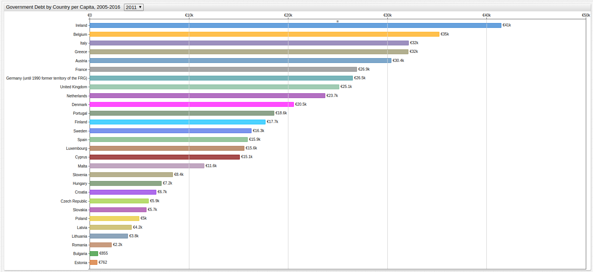

[](https://apps.axibase.com/chartlab/f78f99c7/7/#fullscreen)

**Query 1.07**

```sql
SELECT debt.tags AS 'Country', (debt.value/pop.value *1000) AS 'Per Capita Debt (Thousand Euro)'
  FROM government_consolidated_gross_debt AS debt JOIN "average_population_-_total" AS pop WHERE date_format(time, 'yyyy') = 2011
ORDER BY debt.tags.geo
```

**Table 1.07**

```sql
| Country                                              | Per Capita Debt (Thousand Euro) | 
|------------------------------------------------------|---------------------------------| 
| geo=Austria                                          | 30.37                           | 
| geo=Belgium                                          | 35.21                           | 
| geo=Bulgaria                                         | 0.86                            | 
| geo=Croatia                                          | 6.71                            | 
| geo=Cyprus                                           | 15.12                           | 
| geo=Czech Republic                                   | 5.94                            | 
| geo=Denmark                                          | 20.55                           | 
| geo=Estonia                                          | 0.76                            | 
| geo=Euro area (18 countries)                         | 25.39                           | 
| geo=Euro area (19 countries)                         | 25.19                           | 
| geo=European Union (27 countries)                    | 21.38                           | 
| geo=European Union (28 countries)                    | 21.25                           | 
| geo=Finland                                          | 17.72                           | 
| geo=France                                           | 26.93                           | 
| geo=Germany (until 1990 former territory of the FRG) | 26.51                           | 
| geo=Greece                                           | 32.08                           | 
| geo=Hungary                                          | 7.24                            | 
| geo=Ireland                                          | 41.45                           | 
| geo=Italy                                            | 32.13                           | 
| geo=Latvia                                           | 4.23                            | 
| geo=Lithuania                                        | 3.84                            | 
| geo=Luxembourg                                       | 15.58                           | 
| geo=Malta                                            | 11.55                           | 
| geo=Netherlands                                      | 23.74                           | 
| geo=Poland                                           | 5.00                            | 
| geo=Portugal                                         | 18.59                           | 
| geo=Romania                                          | 2.22                            | 
| geo=Slovakia                                         | 5.71                            | 
| geo=Slovenia                                         | 8.38                            | 
| geo=Spain                                            | 15.92                           | 
| geo=Sweden                                           | 16.30                           | 
| geo=United Kingdom                                   | 25.15                           | 
```

* Return to the [Index](#year-index)

### 2012

**Figure 1.08**

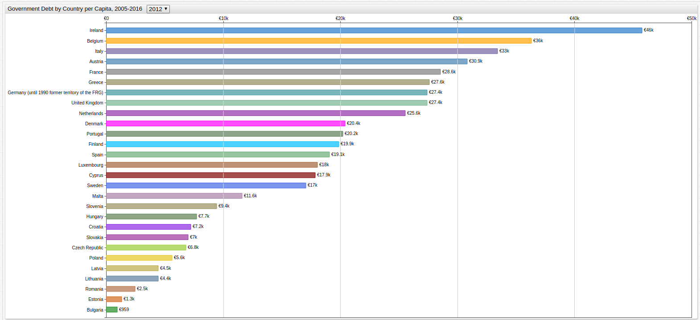

[](https://apps.axibase.com/chartlab/f78f99c7/8/#fullscreen)

**Query 1.08**

```sql
SELECT debt.tags AS 'Country', (debt.value/pop.value *1000) AS 'Per Capita Debt (Thousand Euro)'
  FROM government_consolidated_gross_debt AS debt JOIN "average_population_-_total" AS pop WHERE date_format(time, 'yyyy') = 2012
ORDER BY debt.tags.geo
```

**Table 1.08**

```ls
| Country                                              | Per Capita Debt (Thousand Euro) | 
|------------------------------------------------------|---------------------------------| 
| geo=Austria                                          | 30.86                           | 
| geo=Belgium                                          | 36.33                           | 
| geo=Bulgaria                                         | 0.96                            | 
| geo=Croatia                                          | 7.24                            | 
| geo=Cyprus                                           | 17.86                           | 
| geo=Czech Republic                                   | 6.83                            | 
| geo=Denmark                                          | 20.39                           | 
| geo=Estonia                                          | 1.32                            | 
| geo=Euro area (18 countries)                         | 26.41                           | 
| geo=Euro area (19 countries)                         | 26.22                           | 
| geo=European Union (27 countries)                    | 22.46                           | 
| geo=European Union (28 countries)                    | 22.34                           | 
| geo=Finland                                          | 19.89                           | 
| geo=France                                           | 28.55                           | 
| geo=Germany (until 1990 former territory of the FRG) | 27.42                           | 
| geo=Greece                                           | 27.62                           | 
| geo=Hungary                                          | 7.73                            | 
| geo=Ireland                                          | 45.79                           | 
| geo=Italy                                            | 33.42                           | 
| geo=Latvia                                           | 4.47                            | 
| geo=Lithuania                                        | 4.44                            | 
| geo=Luxembourg                                       | 18.05                           | 
| geo=Malta                                            | 11.62                           | 
| geo=Netherlands                                      | 25.56                           | 
| geo=Poland                                           | 5.64                            | 
| geo=Portugal                                         | 20.21                           | 
| geo=Romania                                          | 2.49                            | 
| geo=Slovakia                                         | 7.01                            | 
| geo=Slovenia                                         | 9.43                            | 
| geo=Spain                                            | 19.06                           | 
| geo=Sweden                                           | 17.04                           | 
| geo=United Kingdom                                   | 27.41                           | 
```

* Return to the [Index](#year-index)

### 2013

**Figure 1.09**

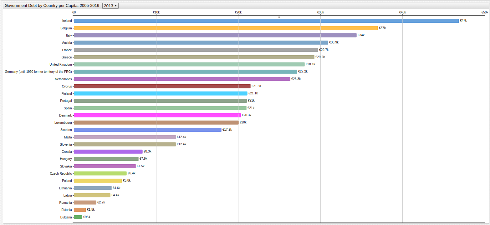

[](https://apps.axibase.com/chartlab/f78f99c7/9/#fullscreen)

**Query 1.09**

```sql
SELECT debt.tags AS 'Country', (debt.value/pop.value *1000) AS 'Per Capita Debt (Thousand Euro)'
  FROM government_consolidated_gross_debt AS debt JOIN "average_population_-_total" AS pop WHERE date_format(time, 'yyyy') = 2013
ORDER BY debt.tags.geo
```

**Table 1.09**

```ls
| Country                                              | Per Capita Debt (Thousand Euro) | 
|------------------------------------------------------|---------------------------------| 
| geo=Austria                                          | 30.94                           | 
| geo=Belgium                                          | 36.99                           | 
| geo=Bulgaria                                         | 0.98                            | 
| geo=Croatia                                          | 8.35                            | 
| geo=Cyprus                                           | 21.48                           | 
| geo=Czech Republic                                   | 6.38                            | 
| geo=Denmark                                          | 20.29                           | 
| geo=Estonia                                          | 1.46                            | 
| geo=Euro area (18 countries)                         | 27.14                           | 
| geo=Euro area (19 countries)                         | 26.94                           | 
| geo=European Union (27 countries)                    | 23.08                           | 
| geo=European Union (28 countries)                    | 22.96                           | 
| geo=Finland                                          | 21.11                           | 
| geo=France                                           | 29.69                           | 
| geo=Germany (until 1990 former territory of the FRG) | 27.15                           | 
| geo=Greece                                           | 29.23                           | 
| geo=Hungary                                          | 7.85                            | 
| geo=Ireland                                          | 46.82                           | 
| geo=Italy                                            | 34.37                           | 
| geo=Latvia                                           | 4.42                            | 
| geo=Lithuania                                        | 4.58                            | 
| geo=Luxembourg                                       | 20.04                           | 
| geo=Malta                                            | 12.39                           | 
| geo=Netherlands                                      | 26.31                           | 
| geo=Poland                                           | 5.84                            | 
| geo=Portugal                                         | 21.01                           | 
| geo=Romania                                          | 2.69                            | 
| geo=Slovakia                                         | 7.50                            | 
| geo=Slovenia                                         | 12.38                           | 
| geo=Spain                                            | 21.00                           | 
| geo=Sweden                                           | 17.92                           | 
| geo=United Kingdom                                   | 28.05                           | 
```

* Return to the [Index](#year-index)

### 2014

**Figure 1.10**

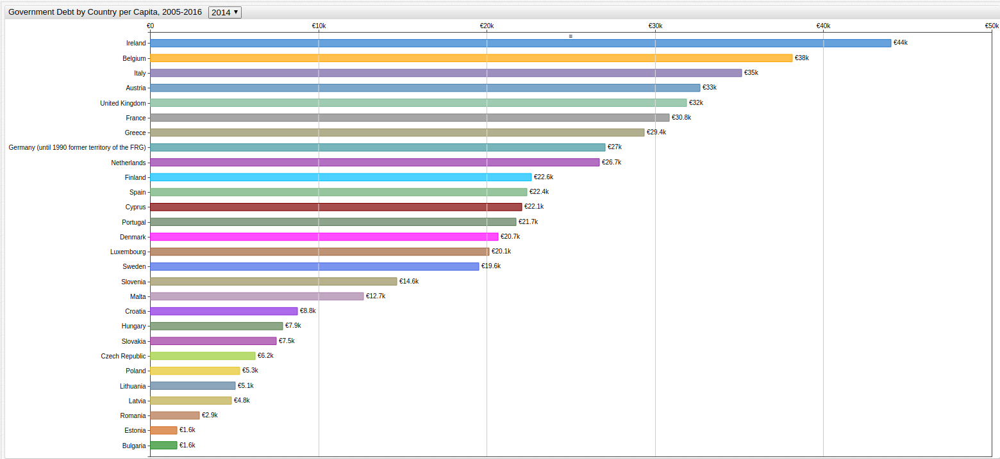

[](https://apps.axibase.com/chartlab/f78f99c7/10/#fullscreen)

**Query 1.10**

```sql
SELECT debt.tags AS 'Country', (debt.value/pop.value *1000) AS 'Per Capita Debt (Thousand Euro)'
  FROM government_consolidated_gross_debt AS debt JOIN "average_population_-_total" AS pop WHERE date_format(time, 'yyyy') = 2014
ORDER BY debt.tags.geo
```

**Table 1.10**

```ls
| Country                                              | Per Capita Debt (Thousand Euro) | 
|------------------------------------------------------|---------------------------------| 
| geo=Austria                                          | 32.66                           | 
| geo=Belgium                                          | 38.14                           | 
| geo=Bulgaria                                         | 1.60                            | 
| geo=Croatia                                          | 8.76                            | 
| geo=Cyprus                                           | 22.07                           | 
| geo=Czech Republic                                   | 6.23                            | 
| geo=Denmark                                          | 20.70                           | 
| geo=Estonia                                          | 1.60                            | 
| geo=Euro area (18 countries)                         | 27.81                           | 
| geo=Euro area (19 countries)                         | 27.61                           | 
| geo=European Union (27 countries)                    | 24.05                           | 
| geo=European Union (28 countries)                    | 23.92                           | 
| geo=Finland                                          | 22.65                           | 
| geo=France                                           | 30.83                           | 
| geo=Germany (until 1990 former territory of the FRG) | 27.04                           | 
| geo=Greece                                           | 29.35                           | 
| geo=Hungary                                          | 7.87                            | 
| geo=Ireland                                          | 44.04                           | 
| geo=Italy                                            | 35.16                           | 
| geo=Latvia                                           | 4.85                            | 
| geo=Lithuania                                        | 5.06                            | 
| geo=Luxembourg                                       | 20.15                           | 
| geo=Malta                                            | 12.68                           | 
| geo=Netherlands                                      | 26.71                           | 
| geo=Poland                                           | 5.32                            | 
| geo=Portugal                                         | 21.73                           | 
| geo=Romania                                          | 2.95                            | 
| geo=Slovakia                                         | 7.52                            | 
| geo=Slovenia                                         | 14.65                           | 
| geo=Spain                                            | 22.41                           | 
| geo=Sweden                                           | 19.55                           | 
| geo=United Kingdom                                   | 31.89                           | 
```

* Return to the [Index](#year-index)

### 2015

**Figure 1.11**

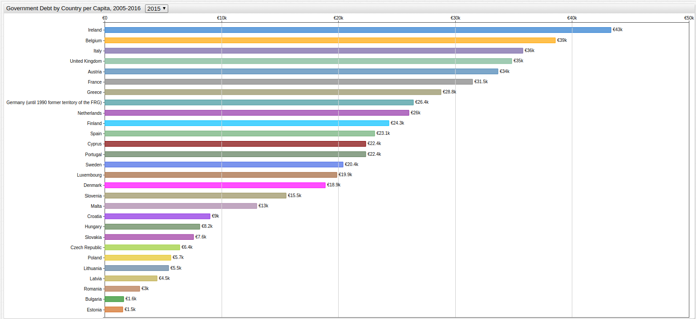

[](https://apps.axibase.com/chartlab/f78f99c7/11/#fullscreen)

**Query 1.11**

```sql
SELECT debt.tags AS 'Country', (debt.value/pop.value *1000) AS 'Per Capita Debt (Thousand Euro)'
  FROM government_consolidated_gross_debt AS debt JOIN "average_population_-_total" AS pop WHERE date_format(time, 'yyyy') = 2015
ORDER BY debt.tags.geo
```

**Table 1.11**

```ls
| Country                                              | Per Capita Debt (Thousand Euro) | 
|------------------------------------------------------|---------------------------------| 
| geo=Austria                                          | 33.65                           | 
| geo=Belgium                                          | 38.57                           | 
| geo=Bulgaria                                         | 1.64                            | 
| geo=Croatia                                          | 9.01                            | 
| geo=Cyprus                                           | 22.37                           | 
| geo=Czech Republic                                   | 6.44                            | 
| geo=Denmark                                          | 18.91                           | 
| geo=Estonia                                          | 1.55                            | 
| geo=Euro area (18 countries)                         | 28.06                           | 
| geo=Euro area (19 countries)                         | 27.87                           | 
| geo=European Union (27 countries)                    | 24.67                           | 
| geo=European Union (28 countries)                    | 24.54                           | 
| geo=Finland                                          | 24.34                           | 
| geo=France                                           | 31.49                           | 
| geo=Germany (until 1990 former territory of the FRG) | 26.43                           | 
| geo=Greece                                           | 28.80                           | 
| geo=Hungary                                          | 8.17                            | 
| geo=Ireland                                          | 43.34                           | 
| geo=Italy                                            | 35.78                           | 
| geo=Latvia                                           | 4.50                            | 
| geo=Lithuania                                        | 5.49                            | 
| geo=Luxembourg                                       | 19.86                           | 
| geo=Malta                                            | 13.02                           | 
| geo=Netherlands                                      | 26.03                           | 
| geo=Poland                                           | 5.68                            | 
| geo=Portugal                                         | 22.35                           | 
| geo=Romania                                          | 3.01                            | 
| geo=Slovakia                                         | 7.61                            | 
| geo=Slovenia                                         | 15.54                           | 
| geo=Spain                                            | 23.12                           | 
| geo=Sweden                                           | 20.40                           | 
| geo=United Kingdom                                   | 34.85                           | 
```

* Return to the [Index](#year-index)

### 2016

**Figure 1.12**

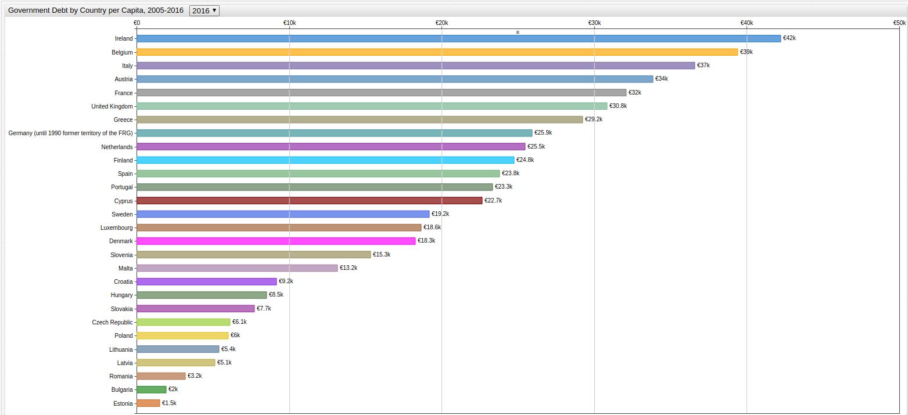

[](https://apps.axibase.com/chartlab/f78f99c7/12/#fullscreen)

**Query 1.12**

```sql
SELECT debt.tags AS 'Country', (debt.value/pop.value *1000) AS 'Per Capita Debt (Thousand Euro)'
  FROM government_consolidated_gross_debt AS debt JOIN "average_population_-_total" AS pop WHERE date_format(time, 'yyyy') = 2016
ORDER BY debt.tags.geo
```

**Table 1.12**

```ls
| Country                                              | Per Capita Debt (Thousand Euro) | 
|------------------------------------------------------|---------------------------------| 
| geo=Austria                                          | 33.87                           | 
| geo=Belgium                                          | 39.41                           | 
| geo=Bulgaria                                         | 1.96                            | 
| geo=Croatia                                          | 9.16                            | 
| geo=Cyprus                                           | 22.66                           | 
| geo=Czech Republic                                   | 6.15                            | 
| geo=Denmark                                          | 18.27                           | 
| geo=Estonia                                          | 1.51                            | 
| geo=Euro area (18 countries)                         | 28.36                           | 
| geo=Euro area (19 countries)                         | 28.16                           | 
| geo=European Union (27 countries)                    | 24.37                           | 
| geo=European Union (28 countries)                    | 24.25                           | 
| geo=Finland                                          | 24.76                           | 
| geo=France                                           | 32.10                           | 
| geo=Germany (until 1990 former territory of the FRG) | 25.95                           | 
| geo=Greece                                           | 29.24                           | 
| geo=Hungary                                          | 8.53                            | 
| geo=Ireland                                          | 42.23                           | 
| geo=Italy                                            | 36.58                           | 
| geo=Latvia                                           | 5.12                            | 
| geo=Lithuania                                        | 5.42                            | 
| geo=Luxembourg                                       | 18.65                           | 
| geo=Malta                                            | 13.18                           | 
| geo=Netherlands                                      | 25.49                           | 
| geo=Poland                                           | 6.01                            | 
| geo=Portugal                                         | 23.35                           | 
| geo=Romania                                          | 3.20                            | 
| geo=Slovakia                                         | 7.74                            | 
| geo=Slovenia                                         | 15.34                           | 
| geo=Spain                                            | 23.81                           | 
| geo=Sweden                                           | 19.20                           | 
| geo=United Kingdom                                   | 30.83                           | 
```

* Return to the [Index](#year-index)
