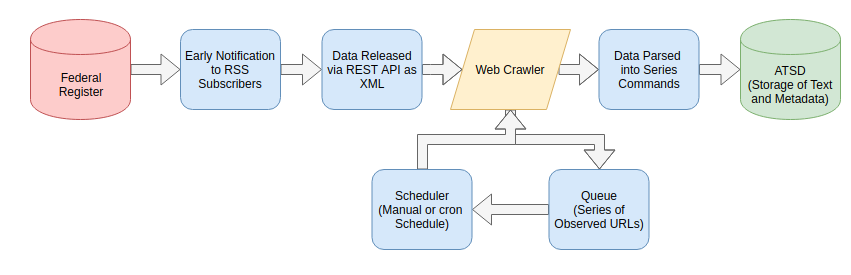
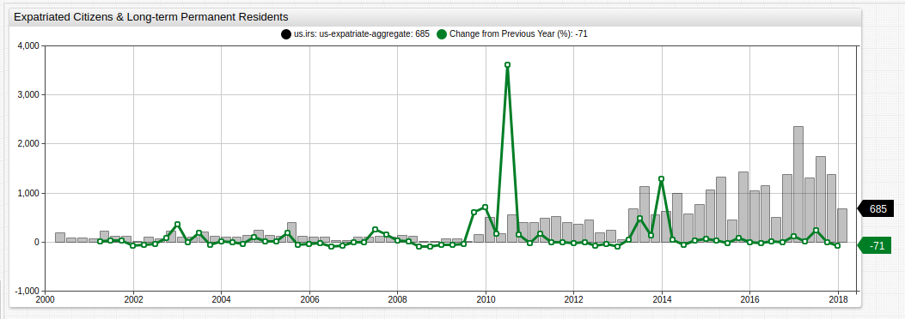

# United States Expatriation Counter


## Introduction

The [Internal Revenue Service](https://www.irs.gov/) (IRS) of the United States releases quarterly reports tracking the number of expatriated citizens processed in the previous four-month period. They publish these reports via the [Federal Register](https://www.federalregister.gov/) which is the primary publication medium of the federal government and used by a number of agencies as an outreach arm to the public.

Ostensibly, the tax bureau maintains these records instead of [Citizenship and Immigration Services](https://www.uscis.gov/) (CIS) because the IRS uses that information to adjudicate decisions regarding those expatriating citizens upon whom the [Expatriation Tax](https://www.irs.gov/individuals/international-taxpayers/expatriation-tax) should be levied.

The criteria for being among the unlucky few to fall within the IRS crosshairs are as follows:

* Your average annual net income tax for the 5 years ending before the date of expatriation or termination of residency is more than a specified amount that is adjusted for inflation ($151,000 for 2012, $155,000 for 2013, $157,000 for 2014, and $160,000 for 2015).
* Your net worth is $2 million or more on the date of your expatriation or termination of residency.
* You fail to certify on Form 8854 that you have complied with all U.S. federal tax obligations for the 5 years preceding the date of your expatriation or termination of residency.

At the end of 2017, it seemed that the trend of record high annual expatriations observed during the previous years had begun to wane but as the [first quarter report](https://www.federalregister.gov/documents/2018/05/08/2018-09709/quarterly-publication-of-individuals-who-have-chosen-to-expatriate-as-required-by-section-6039g) published on May 8th, 2018 indicates, perhaps it only seemed that way.

---

## Expatriation Review

Axibase [tracked](2018-1.md) record-high expatriation during 2017; in the fourth quarter of last year however, it seemed that expatriation levels had begun to normalize once again. Naturally, the number of expatriating citizens is far lower than the amount of number of new citizens due to naturalization, but the trend remains interesting nonetheless. This trend has been noted by such publications as the [Washington Post](https://www.washingtonpost.com/news/worldviews/wp/2017/02/10/a-potentially-historic-number-of-people-are-giving-up-their-u-s-citizenship/?noredirect=on&utm_term=.5a0d04f0ffb5) as far back as early 2017, when Axibase published our [first article](https://github.com/axibase/atsd-use-cases/blob/master/Expatriation/2017.md) citing the trend.

---

## Current Data

Annual and quarterly data may be queried to return samples stored in [Axibase Time Series Database](https://axibase.com/products/axibase-time-series-database/) using an SQL emulator in the user interface.

### Annual Data

Using [SQL Console](https://github.com/axibase/atsd/blob/master/sql/README.md) to track recent expatriation trends:

```sql
SELECT date_format(time+365*24*60*60000, 'yyyy') AS "Year",
  count(value) AS "Year Total",
  count(value)-lag(count(value)) AS "Y-o-Y Change",
  100*(count(value)-lag(count(value)))/lag(count(value)) AS "Y-o-Y Change, %"
FROM "us-expatriate-counter"
  WHERE entity = 'us.irs' AND datetime <= '2018-07-30T00:00:00Z'
GROUP BY period(1 YEAR, END_TIME)
  ORDER BY period(1 YEAR, END_TIME)
```

| Year | Year Total | Y-o-Y Change | Y-o-Y Change, % |
|------|------------|--------------|-----------------|
| 2000 | 273        | null         | null            |
| 2001 | 502        | 229          | 84              |
| 2002 | 322        | -180         | -36             |
| 2003 | 646        | 324          | 101             |
| 2004 | 474        | -172         | -27             |
| 2005 | 911        | 437          | 92              |
| 2006 | 351        | -560         | -61             |
| 2007 | 368        | 17           | 5               |
| 2008 | 394        | 26           | 7               |
| 2009 | 166        | -228         | -58             |
| 2010 | 1395       | 1229         | 740             |
| 2011 | 1812       | 417          | 30              |
| 2012 | 1412       | -400         | -22             |
| 2013 | 2091       | 679          | 48              |
| 2014 | 2766       | 675          | 32              |
| 2015 | 3626       | 860          | 31              |
| 2016 | 4143       | 517          | 14              |
| 2017 | 6807       | 2664         | 64              |
| 2018 | 3157       | ----         | ----            |

Year-on-Year absolute and percentage changes have been omitted from current year data since the collected dataset remains incomplete, however, it's plain to see that 2018 expatriation numbers are on-track to potentially surpass the record-setting numbers of 2017.

Worth nothing here is that although 2018 data technically contains two full quarters of data, one of those quarters occurred in 2017. Q1 data for each year is logged on January 1, and thus contains one quarter's worth of data from the previous year. Nonetheless, with just two quarters of data, the current year is already poised to at least meet if not exceed the previous year's data.

[**ChartLab**](../ChartLabIntro/README.md) is a visualization service which is supported by data processing and storage tasks in ATSD. **ChartLab** features a wide-range of output features without robust syntax. Used here, expatriation data may be visualized to support the above SQL query.


[](https://apps.axibase.com/chartlab/7c5c7780#fullscreen)

### Quarterly Data

Data may remain un-grouped as seen in [Annual Data](#annual-data) and shown as it is actually collected and stored. The [`CEIL`](https://github.com/axibase/atsd/blob/master/sql/README.md#mathematical-functions) clause in the [`SELECT`](https://github.com/axibase/atsd/blob/master/sql/README.md#select-expression) expression is used to apply quarter assignments for each of the datapoints. Thus, 2018 contains only one quarter of data since the official Q2 data truly applies to the first four months of 2018 and Q1 applies applies to the last four months of 2017.

```sql
SELECT CEIL(CAST(date_format(time, 'M') AS NUMBER)/3) AS "Quarter", date_format(time, 'yyyy') AS "Year",
  count(value) AS "Quarter Total"
FROM "us-expatriate-counter"
  WHERE entity = 'us.irs' AND date_format(time, 'yyyy-MM') >= '2014-01' AND datetime <= now
GROUP BY period(1 QUARTER)
  ORDER BY period(1 QUARTER)
```

| Quarter | Year | Quarter Total |
|---------|------|---------------|
| 1       | 2013 | 679           |
| 2       | 2013 | 1129          |
| 3       | 2013 | 560           |
| 4       | 2013 | 631           |
| 1       | 2014 | 999           |
| 2       | 2014 | 576           |
| 3       | 2014 | 775           |
| 4       | 2014 | 1061          |
| 1       | 2015 | 1331          |
| 2       | 2015 | 459           |
| 3       | 2015 | 1426          |
| 4       | 2015 | 1057          |
| 1       | 2016 | 1154          |
| 2       | 2016 | 506           |
| 3       | 2016 | 1379          |
| 4       | 2016 | 2359          |
| 1       | 2017 | 1313          |
| 2       | 2017 | 1756          |
| 3       | 2017 | 1374          |
| 4       | 2017 | 685           |
| 1       | 2018 | 1098          |

Although lower than 2017 Q1, 2018 Q1 data is on the order of recent, record-setting years for expatriation numbers.

Using **ChartLab** for data visualization of the quarterly samples:


[](https://apps.axibase.com/chartlab/ae048be8#fullscreen)

---

## On-Loading Expatriation Data

The data published by the Federal Register requires an intermediate ETL step in order to be available for analysis. This extraction-transformation-loading procedure is implemented by a web crawler built specifically for the task of tracking Federal Register publications for new expatriation data releases.

The Web Crawler operates according to this workflow:



The Web Crawler reads incoming data from the Federal Register and parses it into [`series` commands](https://github.com/axibase/atsd/blob/master/api/network/series.md), readable by [ATSD](https://axibase.com/products/axibase-time-series-database/), the database which hosts all the data used in this article and supports the background operations of SQL Console. A `series` command template is shown below:

```ls
series d:{iso-date} e:{entity} t:{tag-1}={val-1} m:{metric-1}={number}
```

Once the data is stored in the database, the date (`d:`) parameter may be referenced in ISO format, or modified to output human-readable date information such as those seen in the SQL queries of this article. Tags (`t:`), metrics (`m:`), and entities (`e:`) are identifying features of a particular set of data. In the case of expatriation data here, the entity is the publishing body, the IRS and the metric is the number of expatriates. The raw data does not feature tag-level differentiation, but it could be something like `us-born-citizens` versus `naturalized-citizens`, if the data were tracked that specifically.

The complete list and operation instructions of other supported Axibase data crawlers is hosted [here](https://github.com/axibase/atsd-data-crawlers).

---

### Additional Visualizations

#### `time_offset`

Data may also be compared using `time_offset` features whereby variable time-offsets may be applied to a dataset so that it may be compared to itself during a different time period, useful when working with time series data.


[](https://apps.axibase.com/chartlab/a5f1d608)

Additionally, a [`SUM`](https://github.com/axibase/charts/blob/master/syntax/value_functions.md#statistical-functions) value function may be applied to aggregate annual data and group it together using a [`period`](https://axibase.com/products/axibase-time-series-database/visualization/widgets/configuring-the-widgets/) setting. The abbreviated configuration settings that support the above visualizations are shown here:

```javascript
 period = 1 year
statistics = SUM
```

And

```javascript
time-offset = 1 year
```

#### `fred.PercentChangeFromYearAgo`

A number of built-in [statistical functions](https://github.com/axibase/atsd/blob/master/rule-engine/functions-statistical.md) are already supported by ChartLab, and [user-defined functions](../how-to/shared/trends.md#user-defined-functions) may be added to a local ATSD instance. You can follow these [instructions](https://github.com/axibase/charts/blob/master/syntax/udf.md#deploying-function-files) to upload a user-defined function as a JavaScript file.



[](https://apps.axibase.com/chartlab/a14a69a4#fullscreen)

Visualization uses the `PercentChangeFromYearAgo` user-defined function. While the absolute value of U.S. expatriates was the greatest during 2016-2017, the greatest relative change was actually observed several years ago.

While the underlying function may be quite verbose:

```ls
value = var v = value('cpi'); var p = value('prev_cpi'); if(p!=null && v!=null) return (v / p - 1) * 100
```

The syntax required in the ChartLab configuration is simple:

```ls
value = fred.PercentChangeFromYearAgo('raw')
```

> View the complete [`fred.js`](../how-to/shared/trends.md#fred-library) UDF library here.

#### Alert Expressions

Customized data monitoring in ATSD is possible using [`alert-expressions`](https://axibase.com/products/axibase-time-series-database/visualization/widgets/time-chart/#tab-id-14) whereby user-specified parameters may be defined to trigger alarms based on incoming data.

Here, alert expressions are applied to static data, but they may be easily applied to dynamic data and used for systems monitoring as seen in this [example](https://apps.axibase.com/chartlab/67aa3b61) which is monitoring one of the Axibase servers right now.


[](https://apps.axibase.com/chartlab/95617f2b)

The `alert-expression` used here highlights quarters where the percent change from the previous year was greater than 50% in red, and quarters where it was less than -10% in green.

The syntax for the `alert-expression` above is shown here:

```ls
    alert-expression = value > 50 ? 4000 : value < -10 ? -100 : 0
    alert-style = if (alert > 50) return 'color:red'
    alert-style = if (alert < -10) return 'color:green'
```

When using a two-parameter `alert-expression`, three arguments are needed: an upper bound, lower bound, and median value separated by `:` delimiter.

For more information about ChartLab syntax or to explore other features which may be used in the example above, see the complete [ChartLab documentation](https://axibase.com/products/axibase-time-series-database/visualization/widgets/).