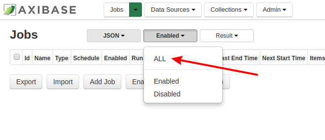
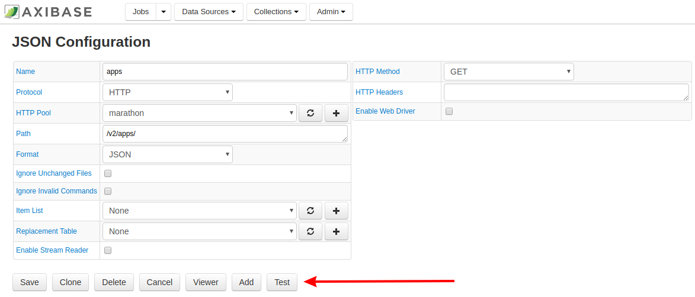

# Axibase, Marathon, and Messenger Services: Complete Application Management and Monitoring


### Overview

[Marathon](https://mesosphere.github.io/marathon/) is a production-grade container orchestration platform for 
Mesosphere’s Datacenter Operating System (DC/OS) and Apache Mesos. Using [Axibase Time Series Database](http://axibase.com/products/axibase-time-series-database/)
and the supported messaging service of your choice, reliable system monitoring can be expanded to support real time alerts and notifications sent directly to your mobile device, email, or desktop.

* ATSD is configured to work with utilities such as Marathon and Docker, and supports capabilities to integrate and deploy 
custom bots in a variety of messaging platforms and internet connected devices.

* You may launch both [ATSD](https://github.com/axibase/atsd-use-cases/tree/master/Solutions/docker#launch-atsd) and an [Axibase 
Collector](https://github.com/axibase/atsd-use-cases/tree/master/Solutions/docker#launch-axibase-collectors) using a single 
command.

**Preparing your instance of ATSD, starting the Axibase Collector, and uploading the needed files should take less than 10 minutes.**

### Prerequisites

* Download [Docker](https://www.docker.com/) with a single-line command:
```
curl -sSL https://get.docker.com/ | sh
```
* Download [Marathon](https://mesosphere.github.io/marathon/) from the Mesosphere website.

### Launch ATSD and Axibase Collector 

From the Linux terminal execute the following command:

```$ docker run -d -p 8443:8443 -p 9443:9443 -p 8081:8081 \
--name=MYSANDBOX \
--volume /var/run/docker.sock:/var/run/docker.sock \
  MYDOCKERUSERNAME/atsd-sandbox:latest
```
Replace the template information above with the credentials you'd like to use. Here, we'll use `atsd-sandbox` as our sandbox
name and `axibase` as our Docker username.

Verify that ATSD and Axibase Collector have successfully started by consulting the Docker logs with this command:
```
docker logs -f atsd-sandbox
```
Confirm the launch by waiting for the following information to appear in the Linux terminal, indicating that ATSD
has been successfully launched:
```
...
[ATSD] ATSD user interface:
[ATSD] http://172.17.0.2:8088
[ATSD] https://172.17.0.2:8443
[ATSD] ATSD start completed. Time: 2018-01-01 12-00-00.
[ATSD] Administrator account 'axibase' created.
```
>**Troubleshooting**
>
>Be sure that no other instances of ATSD or Axibase Collector are running on the selected ports as this will inhibit the
>launch process. Remove any instances that are running with the following command:
>```
>docker rm -vf CONTAINER_ID
>```
>Replace the template information above with the Container ID for the container you would like to stop. To obtain the
>Container ID for all exisiting containers, use the following command:
>```
>docker ps -a
>```
Confirm the creation of the new Axibase Collector by waiting for the following information to appear in the Linux terminal,
indicating that the creation was successful and providing the URL address of the Axibase Collector:
```
...
[Collector] Collector web interface:
[Collector] https://XXX.XX.X.X:9443
```
The template address will be replaced by the URL for the new Collector.

### Import Marathon Jobs to Axibase Collector

Once you have confirmed the successful launch of ATSD and the creation of a new Axibase Collector follow the Collector link to the URL. The link should appear similar to the one below:
```
https://XXX.XX.X.X:9443
```
Create and confirm your password on the Welcome Screen and then enter it on the next screen to access the Collector UI.


Import the XML file of the jobs Marathon is automating and that you would like to monitor and collect information about with 
Axibase Collector. In the **Jobs** tab, click **Import** and select the appropriate file from the local machine.


### Configure Marathon Properties to Ensure Connectivity

In the **Jobs** drop-down menu, select **JSON** jobs.


If the **marathon_apps** job is not visible, be sure that the **Status** drop-down menu is showing all jobs, not only those which have been enabled.



Click the job link to open the **JSON Job** page.


Then, open the **JSON Configuration** page by clicking the **apps** link from the **JSON Job** page.


Confirm connectivity by clicking the **Test** button. Click **Save**. 



Confirm the test was successfully completed. If the test fails, there was an error in the Sandbox command you used earlier.
Stop the Collector and ATSD and begin the process again from the beginning.


From the **JSON Job** page, enable the **marathon_apps** job.


### Import XML Archive to ATSD

ATSD uses a different port than Axibase Collector, changed the Collector URL to the port defined in the original Sandbox
command. The ATSD Port should appear similar to the one here:
```
https://XXX.XX.X.X:8443
```
Log in to ATSD using the username which you defined in the **Launch ATSD and Axibase Collector** portion of the process.
By default the password will be the same as the username you entered upon application launch but it may be changed by clicking the **My Account** logo in the upper right corner of the UI.


From the ATSD homepage, follow the path **Settings > Diagnostics > Back-up Import**

On your local machine, create an archive of the XML files to be uploaded. Click **Choose Files** and select the newly created archive. ATSD is able to unpack and import the archive automatically. Click **Import**.


You've successfully prepared the application to interact with Marathon. Choose the third party messenger you would like to work with, and follow one of the links below to continue.

### Integrating Notifications With a Third Party Messaging Client or Interface

* [Slack Workspace]()
* [Telegram Messenger]()
* [GitHub]()
