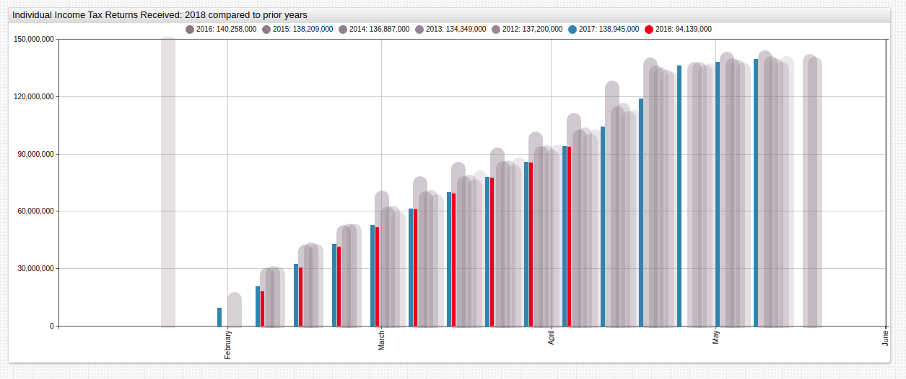

# Tax Day 2018: Open-Source Financial Intelligence

### Overview

Each year the Internal Revenue Service (IRS) releases [public data](https://www.irs.gov/newsroom/2018-and-prior-year-filing-season-statistics) about the number of Americans who have filed their annual income tax paperwork. The data for 2018 shows that American filing practice is roughly in line with the previous several years of data.

### Visualization

*Fig 1.* Tax filing data for the 2017 and 2018 superimposed over previous-year data. 

*Fig 2.* The same data displayed in with `mode = column` setting enabled.
