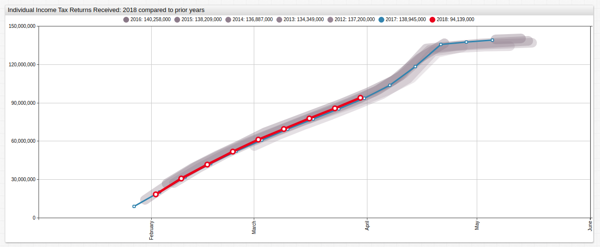
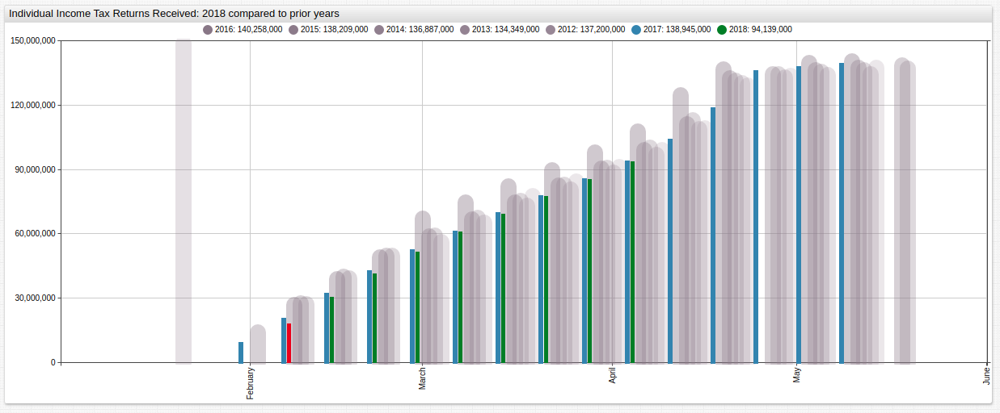
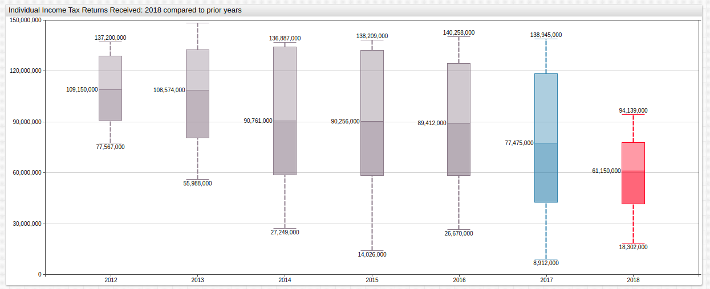

# Tax Day 2018: Open-Source Financial Intelligence

### Overview

Each year the Internal Revenue Service (IRS) releases [public data](https://www.irs.gov/newsroom/2018-and-prior-year-filing-season-statistics) about the number of Americans who have filed their annual income tax paperwork. The data for 2018 shows that American filing practice is roughly in line with the previous several years of data. Open-source data may be visualized using [Axibase Time Series Database](https://axibase.com/products/axibase-time-series-database/) and queried with [SQL console](https://github.com/axibase/atsd/tree/master/sql#overview).

### Objectives 

* Visualize public data using [ChartLab](https://apps.axibase.com);
* Query data using **SQL console**;
* Compare previous-year filing statistics with current-year data via multiple chart configurations and queries.

### Visualization

ChartLab is a data visualization sandbox that uses a simple syntax with robust performance. It is designed to be used by anyone, but a basic understanding of any programming language will be immenseley helpful here. Full ChartLab documentation may be accessed [here](https://axibase.com/products/axibase-time-series-database/visualization/widgets/); this article will demonstrate the process of using data stored in ATSD to create multiple visualizations using one dataset. Each chart will be shown with its configuration and a brief explanation of the particularities therein.

#### Configuration 1: Time Series Line Graph


[](https://apps.axibase.com/chartlab/fd986f58)

*Fig 1.* Tax filing data for the 2017 and 2018 superimposed over previous-year data. 

**Configuration Settings:**

*Configuration has been shortened to include only relevant settings for brevity, open ChartLab visualization to view the entire configuration.*

```sql
[configuration]
  disconnect-interval = 10 day

[group]

[widget]
  var offsets = range(2,6)
  for ofs in offsets
  [series]
     markers = false
     color = rgb(@{128 + ofs * 4},@{112 + ofs * 4},@{128 + ofs * 4})
     label = @{2018-ofs}
     time-offset = @{ofs} year
     style = stroke-opacity: @{0.5-ofs*0.05}; stroke-width: 20; stroke-linecap: round ; stroke-linejoin: round   
  endfor
      
  [series]
     label = 2017 
     time-offset = 1 year
     color = steelblue  
   
  [series]
     label = 2018   
     color = #d00
```

**Configuration Features:**

* `disconnect-interval`: data with missing points, or gaps in the time series, may be given a new value for a user-defined interval. Compare this [example](https://apps.axibase.com/chartlab/8234982b) which features a `disconnect-interval` setting to [this one](https://apps.axibase.com/chartlab/2f06ecee) where the setting is disabled, or [here](https://apps.axibase.com/chartlab/bb9e34e8) where the `disconnect-value` setting has been given a non-zero value. 

* `var`: ChartLab configurations may feature user-defined variables, according to the following [control structures](https://axibase.com/products/axibase-time-series-database/visualization/widgets/control-structures/). Here a variable called `offsets` is created using a `range(x,y)` function to control the settings for multiple `[series]` at once representing previous-year data, index begins at `0`

* `color`: this setting may accept RGB parameters, plain-english color names, or HTML color codes.

#### Configuration 2: Time Series Bar Chart




*Fig 2.* The same data displayed displayed with different settings.

**Configuration Settings:**

*Configuration has been shortened to include only non-repeated settings for brevity, open ChartLab visualization to view the entire configuration.*

```sql
[widget]
  type = chart
  mode = column
   
  [series]
     alias = 2018
     label = 2018   
     color = #d00
     style = stroke-width: 5
     alert-expression = value('2018') > value('2017')
     alert-style = fill:green      
```

**Configuration Features:**

* `alert-expression`: user-defined thresholds may be created via `[threshold]` series, or comparison to other series in the visualzation. Here, the two colored series are assigned an `alias` according to the year whose data they contain and compared. When the condition is satisfied, that is, the value of 2018 tax return filings is greater than the value of 2017 tax filings for the same period, the `alert-style` setting is activated, in this case coloring that period's representative bar green.

* `mode`: time charts feature several display [modes](https://axibase.com/products/axibase-time-series-database/visualization/widgets/time-chart/) to quickly change visualization styles. 

#### Configuration 3: Box-and-Whisker Plot




*Fig 3.* Average filing numbers for the entire observed period show that the total number of Americans filing a tax return has diminished in recent years.

**Configuration Settings:**

*Configuration has been shortened to include only non-repeated settings for brevity, open ChartLab visualization to view the entire configuration.*

```sql

[widget]
  type = box
  title = Individual Income Tax Returns Received: 2018 compared to prior years
```

**Configuration Features:**

* `type`: a variety of visualization widgets are available in ChartLab, see the full list [here](https://axibase.com/products/axibase-time-series-database/visualization/widgets/).
