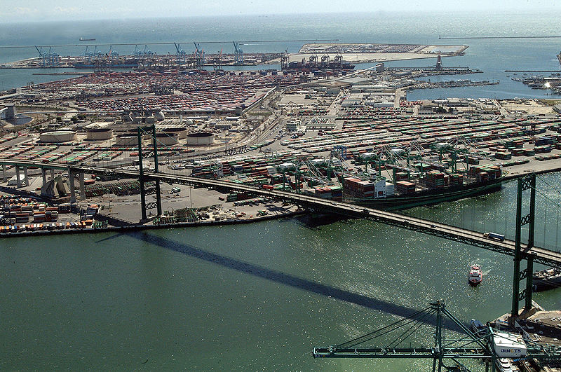
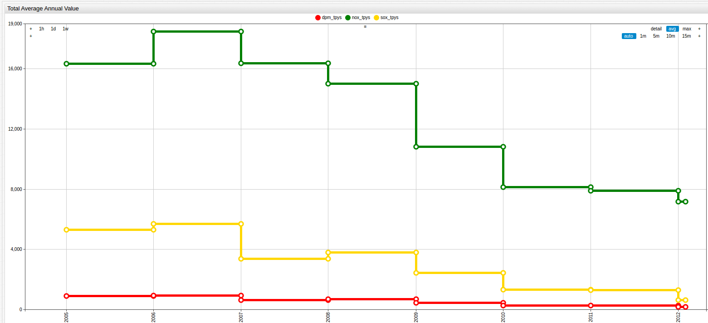
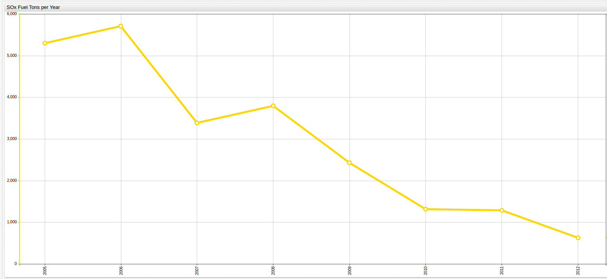
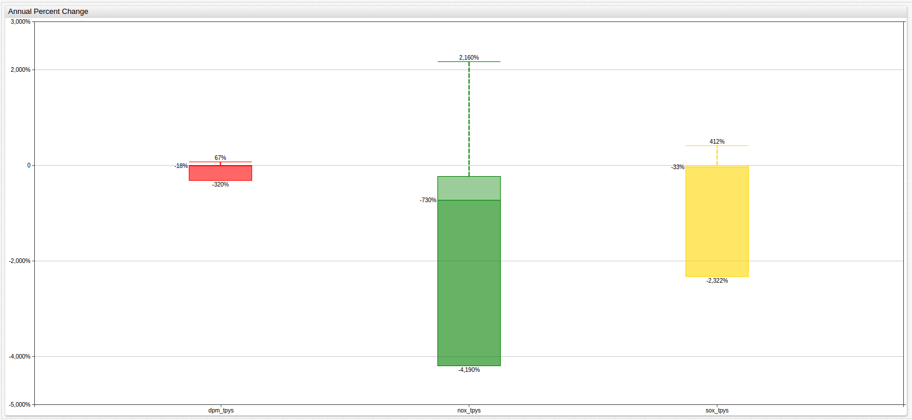
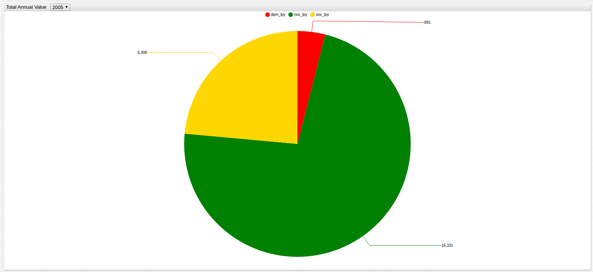
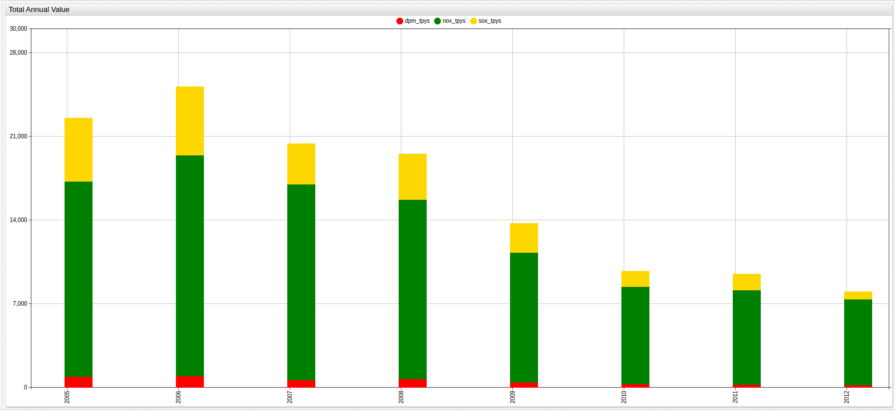

The Port of Los Angeles: Sustainable Progress for the Future of the City
===



### Introduction

The Port of Los Angeles, or America's Port as it has come to be known, occupies 7,500 acres of land and water in southern
Los Angeles. Directly across the Vincent Thomas Bridge from San Pedro, the Port's home, in Long Beach, California is the
entirely separate Port of Long Beach.

The Port of Los Angeles handles over $1.2 billion of unique cargo every day from its 23 cargo terminals, 270 deep water berths, 77 container
cranes, and 113 miles of on-port railways. [The Port employees](https://www.portoflosangeles.org/about/facts.asp) half a million Southern California residents, and has 2.8 million employees
worldwide. When ranked by cargo value, America's Port holds the top spot in the United States with a value that continues to
grow each year. By volume, the port is ranked 16th in the world (or 9th if combined with the nearby Long Beach Port), and has
recently had its [main navigational channel deepened](https://www.portoflosangeles.org/newsroom/2013_releases/news_040313_Main_Channel.asp) 
to 53 feet to accommodate the [newest line of super-sized international freighters](http://www.maersk.com/en/hardware/triple-e),
yet to debut in American port waters. 

Amongst all the traffic, the Port has managed to prioritize green initiatives to lower its internal greenhouse gas emissions
and meet city, county, state, and federally mandated goals for cutting the amount of harmful combustion by-products expelled
in to the already polluted Los Angeles air.

### Data

The City of Los Angeles has released annually-aggregated [total emission data](https://catalog.data.gov/dataset/port-of-los-angeles-emission-from-port-operations-4912c)
from a 2005 to 2012 study in order to document its progress with respect to reducing greenhouse gas emissions. Pollution is something taken
seriously in Los Angeles due to the magnitude of the problem, and the Port even allows individuals to [track live information](http://caap.airsis.com/CurrentData.aspx)
about local air quality from their on-site air quality testing center.

The pollutants recorded by the port are shown below:

| Metric | Meaning | Comment |
|--------|---------|---------|
| dpm_tpy | Diesel particulate matter | [Group 1 carcinogen](https://www.cancer.org/cancer/cancer-causes/general-info/known-and-probable-human-carcinogens.html) |
| nox_tpy | Nitric oxides | A leading contributor to both smog and acid rain |
| sox_try | Sulfur oxides | When found with NOx, may form N2SO4 (acid rain) |

> All values are recorded as tons per year (TPY)

These three forms of greenhouse gas emissions contribute to a number of negative outcomes associated with big industry. Diesel
fuel is the primary industrial fuel source the world over but despite this, the port manages to power the majority of its
on-shore technology with California-generated electricity from the Water and Power Department. Various compounds formed by
oxygen and nitrogen, specifically nitrogen dioxide, are the result of high-temperature combustion and form the tell-tale
brown haze known as smog that suffocates polluted city skylines across the globe and contributes to acid rain when mixed with
the sulfurous gases produced by coal and petroleum usage. Sulfur oxides, while sometimes naturally occurring, are more commonly
negatively associated with industry processes and the formation of dangerously acidic rain, which can harm plants and animals 
alike and even damage buildings. 

**Figure 1.1**



[](https://apps.axibase.com/chartlab/0f8b70ab/13/#fullscreen)

The annual average value of each of the observed metrics is shown above. The annual average can be helpful when looking at
overall emission totals because it establishes perspective for the following visualizations. Additionally, it shows relative
change amongst different metrics, for example when comparing DPM change to NOx change, what amounts to a huge seven year reduction
of Diesel Particulate Matter relatively, is more than doubly achieved in NOx emission reduction for 2006-2007.

#### Diesel Particulate Matter

**Figure 2.1**


[](https://apps.axibase.com/chartlab/0f8b70ab/6/#fullscreen)

The numbers associated with **Figure 2.1** are shown below:

**Table 1.1**
```ls
| Year | DPM (Tons Per Year)   | 
|------|-----------------------| 
| 2005 | 891.0                 | 
| 2006 | 947.0                 | 
| 2007 | 627.0                 | 
| 2008 | 694.0                 | 
| 2009 | 448.0                 | 
| 2010 | 277.0                 |  
| 2011 | 259.0                 |  
| 2012 | 185.0                 | 
```

> This dataset is queried using the [SQL Console](https://github.com/axibase/atsd/tree/master/sql#overview) from [Axibase](https://axibase.com).

To give these numbers perspective, when the study began in 2005, the Port of Los Angeles was responsible for 10% of
all diesel particulate matter in the Los Angeles Basin: an area composed of part or all of the counties of Los Angeles, 
San Bernadino, Riverside, and Orange. When the study concluded just seven years later that number had dropped to 4%. That six
percent reduction of greenhouse gas emission in seven years (0.85%/year) is on par with the State of California's overall 
reduction during [a twelve-year study](../ClimateChange/README.md) (0.50%/year) conducted across several states, 
with New York seeing numbers as high as 30% during the same observed period (2.5%/year).

Using the previous year as a baseline, the percent change for each year is shown below:

**Table 1.2**

| Year | Percent Change |
|:----:|:--------------:|
| 2005 | +0.00% | 
| 2006 | +5.90% | 
| 2007 | -33.79% |
| 2008 | +10.69% |
| 2009 | -35.45% |
| 2010 | -38.17% |
| 2011 | -6.50% |
| 2012 | -28.57% | 

> The average change per year was -17.98%

#### NOx: Nitrogen Oxides

**Figure 3.1**


[](https://apps.axibase.com/chartlab/0f8b70ab/7/#fullscreen)

The SQL query for this metric returns the following values:

**Table 2.1**

```ls
| Year | NOx (Tons Per Year) | 
|------|---------------------| 
| 2005 | 16331.0             | 
| 2006 | 18491.0             | 
| 2007 | 16372.0             | 
| 2008 | 15022.0             | 
| 2009 | 10832.0             | 
| 2010 | 8138.0              | 
| 2011 | 7907.0              | 
| 2012 | 7177.0              | 
```

In 2005, the Port represented only 5% of Los Angeles Basin area nitrogen emissions, but by 2012 that already low number had
fallen even further to only 3%. What is interesting to note with the NOx metric, as shown above in **Figure 1.1** and below
in **Figures 5.3** and **5.4**, NOx production by the port paradoxically represents the overwhelming majority of raw emission
numbers from the port but only a fractional amount of the Los Angeles Basin's overall emission rate, giving perspective on
the sheer magnitude of the problem of NOx emission in the Los Angeles area. NOx compounds are a contributor to both smog and acid
rain and primarily form during imperfect high-temperature combustion processes such as those that occur under the hood of 
consumer automobiles. 

**Table 2.2**

| Year | Percent Change |
|:----:|:--------------:|
| 2005 | +0.00% | 
| 2006 | +11.68% | 
| 2007 | -11.46% |
| 2008 | -8.25% |
| 2009 | -27.89% |
| 2010 | -24.87% |
| 2011 | -2.84% |
| 2012 | -9.23% | 

> The average change per year was -10.40%.

#### SOx: Sulfur Oxides

**Figure 4.1**



[](https://apps.axibase.com/chartlab/0f8b70ab/8/#fullscreen)

The numerical values associated with the above visualization are shown below:

```ls
| Year | SOx (Tons Per Year) | 
|------|---------------------| 
| 2005 | 5306.0              | 
| 2006 | 5708.0              | 
| 2007 | 3386.0              | 
| 2008 | 3798.0              | 
| 2009 | 2435.0              | 
| 2010 | 1320.0              | 
| 2011 | 1287.0              | 
| 2012 | 631.0               | 
```

Sulfur Oxide is produced naturally by volcanoes but the majority of its harmful production comes from burning fossil fuels
in industrial processes. The Port of Los Angeles has cut its own portion of such production by a stunning 20% in just 7 years,
down from 25% of the Los Angeles Basin total in 2005 to just 6% in 2012.

**Table 3.2**

| Year | Percent Change |
|:----:|:--------------:|
| 2005 | +0.00% | 
| 2006 | +7.57% | 
| 2007 | -40.68% |
| 2008 | +12.17% |
| 2009 | -35.89% |
| 2010 | -45.79% |
| 2011 | -2.50% |
| 2012 | -50.97% | 

> The average change per year was -22.30%

### Analysis

The Port of Los Angeles was able to reduce all measured metrics by a significant amount over the observed period. The histogram
belows details those changes, showing the frequency of various percentile changes.

**Figure 5.1**


[](https://apps.axibase.com/chartlab/0f8b70ab/9/#fullscreen)

The above chart details the frequency and severity of the Port of Los Angeles' efforts to reduce various observed pollution
metrics. The large central red bar shows that the majority of the reduction for diesel particulate matter was consistent
throughout the observed period, while it was much more varied for NOx pollution. Interestingly, this wider range resulted in substantially
better reduction results, detailed in the legend at the top of the screen.

**Figure 5.2**



[](https://apps.axibase.com/chartlab/0f8b70ab/12/#fullscreen)

The same data regarding average percent change can be visualized differently to highlight the deviation in percent change 
value. Here the taller green box (representing percent change in NOx emissions) has a broader area, indicating a wider range
of values whereas the red box (representing percent change in DPM emissions) has a much smaller area, indicating a much narrower
range of values.

**Figure 5.3**



[](https://apps.axibase.com/chartlab/0f8b70ab/10/#fullscreen)

> Open the diagram in ChartLab and use the drop-down menu at the top of the screen to see the changing total values of each
metric relative to one another throughout the entire observed period.

Based on the above diagram, the relative levels of each measured pollutant are shown alongside one another. Throughout the
observation period, NOx pollution was emitted significantly more than the other two metrics combined. Nitrogen oxides most
heavily contribute to the reddish-brown smog layer that hangs over Los Angeles and other polluted metropolitan areas.

**Figure 5.4**



[](https://apps.axibase.com/chartlab/0f8b70ab/11/#fullscreen)

**Figure 5.4** above shows the combined total tons per year emitted by the Port of Los Angeles, further classified by type
of pollution within each column. 2012 emission levels are about one third of what they were in 2005, demonstrating the Port's
earnest commitment to reducing harmful greenhouse gas production.

### Conclusions

Starting in 2006, the Port of Los Angeles has pursued effective and aggressive means to reduce the production of the most
harmful greenhouse gases and by objective standards they have succeeded. In fact, the according to the results of the [2012
Inventory of Air Emissions](https://www.portoflosangeles.org/pdf/2012_Air_Emissions_Inventory.pdf), the Port has outperformed
the ambitious goals it set for itself almost half a decade ago. As the world pushes further ahead in the quest to reduce the
human impact on our planet, organizations like the Port of Los Angeles show that making ardent strides forward is possible
for industries of any type, location, and size.
