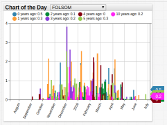
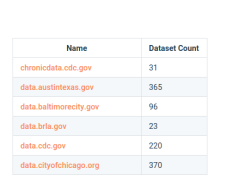
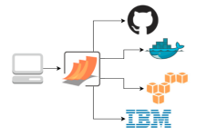
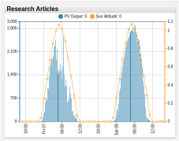
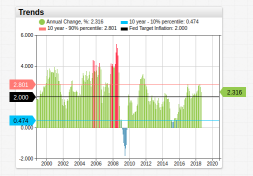
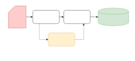
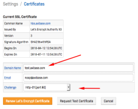

# Introduction

**Use Cases** documentation demonstrates solutions to real-world data problems using Axibase Time Series Database (ATSD) and contains in-depth guides for programmatic integration with commonly-used enterprise software systems and services, as well as tutorials for data transformation and visualizations created with ATSD.

## Chart of the Day

Interactive [visualizations](./chart-of-the-day/README.md) tracking interesting datasets from a variety of sources.

## Datasets

Curated time-series [dataset catalog](https://axibase.com/datasets/) from [`data.gov`](https://www.data.gov/) with over 7,000 entries.

## Integrations

Walkthrough [guides](./integrations/README.md) for ATSD integration with various IT infrastructure systems and services.

## Research

Detailed [research notes](./research/README.md) that feature in-depth data exploration and ATSD tools used to solve modern data problems.

## Trends

A publicly accessible ATSD service with [national economic indicators](./trends/README.md).

## Tutorials

Step-by-step [instructions](./tutorials/README.md) to perform data transformation, import configuration files, and other tasks in ATSD.

## Workshops

Internal Axibase [knowledge seminars](./workshop/README.md) made public for secondary use or personal learning.

