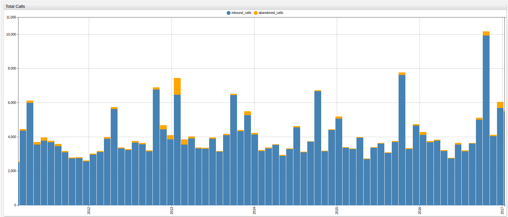
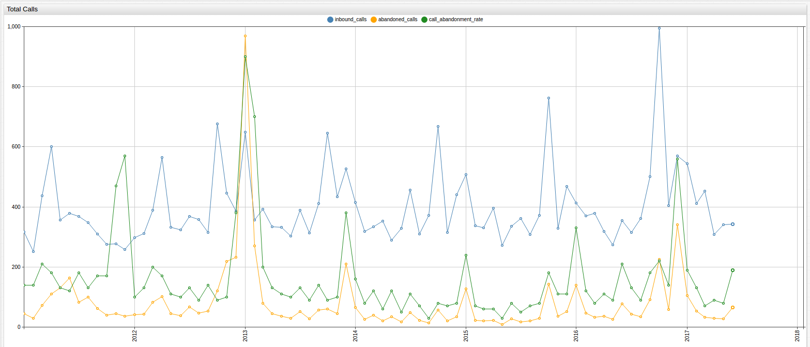
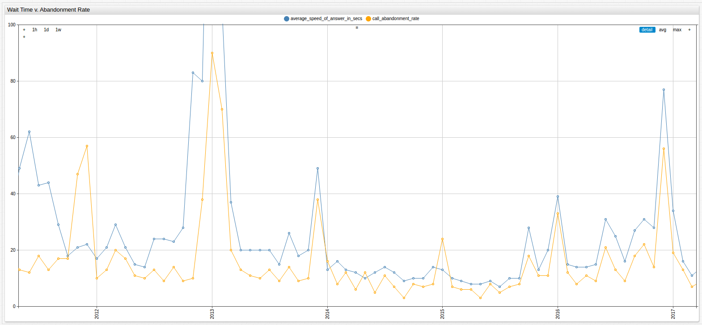
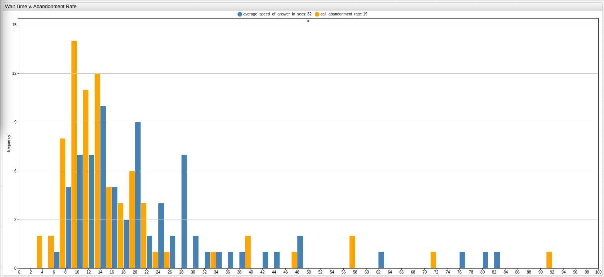
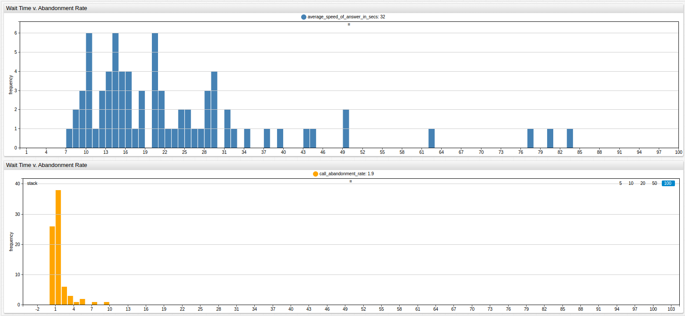
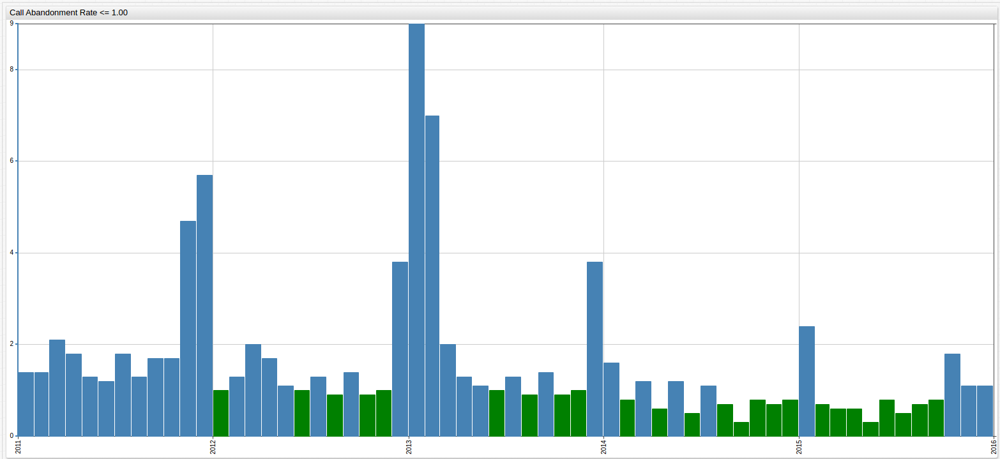

Calls May be Recorded for Quality or Training Purposes
===


### Introduction

The all too familiar notification that your phone call to almost any call center in the world is being recorded has been heard
by so many people so many times that it's probably forgotten almost as quickly as it's understood. But that hasn't stopped
data analysts who work for the companies that operate these call centers from improving customer outcomes with these and
other data that they record about client experiences.

One of the first obstacles to maintaining a successful call center is the ability to connect clients to an operator in a timely
manner, nevermind the companies now trying to use [personality metrics](http://www.informationweek.com/big-data/big-data-analytics/big-data-matching-personalities-in-the-call-center/d/d-id/1319108)
to connect clients to a similar operator or one they predict will get along with a given customer. A low call response time
is essential to starting client interactions off on the right foot and sets the tone for the entire interaction.

But what exactly is a low response time? How long is the average person willing to wait on hold before speaking to someone
on the other line?

### Methodology

Using public [call center data](https://catalog.data.gov/dataset/call-center-metrics-for-the-health-service-system) from
San Francisco's [Health Service System](http://www.myhss.org/), which is an insurance provider to city employees, elected
officials, and their families, call abandonment rates can be compared to call response times to establish baselines for call
center performance and customer patience thresholds. These data will be visualized in [ChartLab](https://apps.axibase.com/chartlab)
and dissected with the [SQL Console](https://github.com/axibase/atsd/blob/master/sql/README.md) in [Axibase Time Series Database](https://axibase.com/products/axibase-time-series-database/)
and concrete wait times that are likely to result in an abandoned call will be calculated.

### Data

**Figure 1.1**



[](https://apps.axibase.com/chartlab/b91c1140/2/#fullscreen)

**Figure 1.1** above shows the total number of calls received by the Health Service System over the entire observed period,
which began in January 2011 and continues until June 2017. Abandoned calls are shown in orange. The numbers associated with
the above figure are shown below:

**Script 1.1**

```sql
SELECT datetime AS "Date", ibc.value AS "Inbound Calls", abc.value AS "Abandoned Calls", car.value AS "Abandonment Rate"
  FROM "inbound_calls" AS ibc JOIN "abandoned_calls" AS abc JOIN "call_abandonment_rate" AS car
```

**Table 1.1**

```ls
| Date       | Inbound Calls | Abandoned Calls | Abandonment Rate |
|------------|---------------|-----------------|------------------|
| 2011-01-01 | 3171          | 45              | 1.4              |
| 2011-02-01 | 2520          | 30              | 1.4              |
| 2011-03-01 | 4379          | 72              | 2.1              |
| 2011-04-01 | 6009          | 110             | 1.8              |
| 2011-05-01 | 3559          | 130             | 1.3              |
| 2011-06-01 | 3790          | 164             | 1.2              |
| 2011-07-01 | 3685          | 82              | 1.8              |
| 2011-08-01 | 3472          | 100             | 1.3              |
| 2011-09-01 | 3101          | 62              | 1.7              |
| 2011-10-01 | 2752          | 40              | 1.7              |
| 2011-11-01 | 2763          | 45              | 4.7              |
| 2011-12-01 | 2584          | 37              | 5.7              |
| 2012-01-01 | 2970          | 41              | 1                |
| 2012-02-01 | 3117          | 43              | 1.3              |
| 2012-03-01 | 3893          | 83              | 2                |
| 2012-04-01 | 5637          | 102             | 1.7              |
| 2012-05-01 | 3325          | 44              | 1.1              |
| 2012-06-01 | 3242          | 38              | 1                |
| 2012-07-01 | 3682          | 67              | 1.3              |
| 2012-08-01 | 3585          | 46              | 0.9              |
| 2012-09-01 | 3153          | 54              | 1.4              |
| 2012-10-01 | 6771          | 120             | 0.9              |
| 2012-11-01 | 4455          | 219             | 1                |
| 2012-12-01 | 3864          | 233             | 3.8              |
| 2013-01-01 | 6481          | 969             | 9                |
| 2013-02-01 | 3566          | 271             | 7                |
| 2013-03-01 | 3926          | 80              | 2                |
| 2013-04-01 | 3331          | 45              | 1.3              |
| 2013-05-01 | 3317          | 37              | 1.1              |
| 2013-06-01 | 3034          | 30              | 1                |
| 2013-07-01 | 3898          | 51              | 1.3              |
| 2013-08-01 | 3138          | 27              | 0.9              |
| 2013-09-01 | 4108          | 57              | 1.4              |
| 2013-10-01 | 6452          | 60              | 0.9              |
| 2013-11-01 | 4340          | 44              | 1                |
| 2013-12-01 | 5274          | 210             | 3.8              |
| 2014-01-01 | 4150          | 66              | 1.6              |
| 2014-02-01 | 3187          | 25              | 0.8              |
| 2014-03-01 | 3332          | 39              | 1.2              |
| 2014-04-01 | 3535          | 21              | 0.6              |
| 2014-05-01 | 2897          | 34              | 1.2              |
| 2014-06-01 | 3288          | 17              | 0.5              |
| 2014-07-01 | 4563          | 49              | 1.1              |
| 2014-08-01 | 3104          | 23              | 0.7              |
| 2014-09-01 | 3725          | 13              | 0.3              |
| 2014-10-01 | 6674          | 56              | 0.8              |
| 2014-11-01 | 3153          | 21              | 0.7              |
| 2014-12-01 | 4403          | 34              | 0.8              |
| 2015-01-01 | 5070          | 127             | 2.4              |
| 2015-02-01 | 3367          | 23              | 0.7              |
| 2015-03-01 | 3298          | 21              | 0.6              |
| 2015-04-01 | 3957          | 22              | 0.6              |
| 2015-05-01 | 2716          | 9               | 0.3              |
| 2015-06-01 | 3361          | 27              | 0.8              |
| 2015-07-01 | 3611          | 18              | 0.5              |
| 2015-08-01 | 3073          | 21              | 0.7              |
| 2015-09-01 | 3715          | 29              | 0.8              |
| 2015-10-01 | 7625          | 142             | 1.8              |
| 2015-11-01 | 3288          | 36              | 1.1              |
| 2015-12-01 | 4676          | 52              | 1.1              |
| 2016-01-01 | 4133          | 140             | 3.3              |
| 2016-02-01 | 3695          | 46              | 1.2              |
| 2016-03-01 | 3786          | 32              | 0.8              |
| 2016-04-01 | 3184          | 36              | 1.1              |
| 2016-05-01 | 2740          | 25              | 0.9              |
| 2016-06-01 | 3552          | 77              | 2.1              |
| 2016-07-01 | 3153          | 43              | 1.3              |
| 2016-08-01 | 3607          | 34              | 0.9              |
| 2016-09-01 | 5012          | 91              | 1.8              |
| 2016-10-01 | 9943          | 225             | 2.2              |
| 2016-11-01 | 4052          | 58              | 1.4              |
| 2016-12-01 | 5705          | 340             | 5.6              |
| 2017-01-01 | 5438          | 105             | 1.9              |
| 2017-02-01 | 4122          | 53              | 1.3              |
| 2017-03-01 | 4521          | 33              | 0.7              |
| 2017-04-01 | 3084          | 29              | 0.9              |
| 2017-05-01 | 3402          | 28              | 0.8              |
| 2017-06-01 | 3425          | 65              | 1.9              |
```

When scaled appropriately, the relationships between the three values contained in **Table 1.1** are shown. Although tempting
to conclude that an increased call volume will immediately result in an increased call abandonment rate, which is simply
the calculated percent of total calls that were abandoned, is shown to be incorrect.

**Figure 1.2**



[](https://apps.axibase.com/chartlab/9c6c37ac/3/#fullscreen)

**Scale Modifications**:

* `inbound_calls = value/10`
* `call abandonment rate = value*100`

> To learn more about scale modification in ChartLab, see the [following documentation](https://axibase.com/products/axibase-time-series-database/visualization/widgets/configuring-the-widgets/).

Although an increased call volume results in an increased abandonment rate several times throughout the observed period,
several local maxima in call volume are not matched by a corresponding maxima in abandoned calls. **Figure 1.3** below compares
call wait time to call abandonment rate.

**Figure 1.3**



[](https://apps.axibase.com/chartlab/9c6c37ac/2/#fullscreen)

> The scale of this visualization has been intentionally modified to exclude the 2013 absolute maxima so as not to distort
the perspective of the rest of the data.

**Scale Modifications**:

* `call_abandonment_rate = value*100`

There is a visible relationship between call wait time and call abandonment rate. The associated SQL query is below:

**Script 1.2**

```sql
SELECT datetime AS "Date", car.value AS "Call Abandonment Rate", ROUND(cwt.value, 0) AS "Call Wait Time"
  FROM "call_abandonment_rate" AS car JOIN "average_speed_of_answer_in_secs" AS cwt
```

**Table 1.2**

```ls
| Date       | Call Abandonment Rate | Call Wait Time |
|------------|-----------------------|----------------|
| 2011-01-01 | 1.4                   | 25             |
| 2011-02-01 | 1.4                   | 18             |
| 2011-03-01 | 2.1                   | 29             |
| 2011-04-01 | 1.8                   | 29             |
| 2011-05-01 | 1.3                   | 49             |
| 2011-06-01 | 1.2                   | 62             |
| 2011-07-01 | 1.8                   | 43             |
| 2011-08-01 | 1.3                   | 44             |
| 2011-09-01 | 1.7                   | 29             |
| 2011-10-01 | 1.7                   | 18             |
| 2011-11-01 | 4.7                   | 21             |
| 2011-12-01 | 5.7                   | 22             |
| 2012-01-01 | 1                     | 17             |
| 2012-02-01 | 1.3                   | 21             |
| 2012-03-01 | 2                     | 29             |
| 2012-04-01 | 1.7                   | 21             |
| 2012-05-01 | 1.1                   | 15             |
| 2012-06-01 | 1                     | 14             |
| 2012-07-01 | 1.3                   | 24             |
| 2012-08-01 | 0.9                   | 24             |
| 2012-09-01 | 1.4                   | 23             |
| 2012-10-01 | 0.9                   | 28             |
| 2012-11-01 | 1                     | 83             |
| 2012-12-01 | 3.8                   | 80             |
| 2013-01-01 | 9                     | 224            |
| 2013-02-01 | 7                     | 106            |
| 2013-03-01 | 2                     | 37             |
| 2013-04-01 | 1.3                   | 20             |
| 2013-05-01 | 1.1                   | 20             |
| 2013-06-01 | 1                     | 20             |
| 2013-07-01 | 1.3                   | 20             |
| 2013-08-01 | 0.9                   | 15             |
| 2013-09-01 | 1.4                   | 26             |
| 2013-10-01 | 0.9                   | 18             |
| 2013-11-01 | 1                     | 20             |
| 2013-12-01 | 3.8                   | 49             |
| 2014-01-01 | 1.6                   | 13             |
| 2014-02-01 | 0.8                   | 16             |
| 2014-03-01 | 1.2                   | 13             |
| 2014-04-01 | 0.6                   | 12             |
| 2014-05-01 | 1.2                   | 10             |
| 2014-06-01 | 0.5                   | 12             |
| 2014-07-01 | 1.1                   | 14             |
| 2014-08-01 | 0.7                   | 12             |
| 2014-09-01 | 0.3                   | 9              |
| 2014-10-01 | 0.8                   | 10             |
| 2014-11-01 | 0.7                   | 10             |
| 2014-12-01 | 0.8                   | 14             |
| 2015-01-01 | 2.4                   | 13             |
| 2015-02-01 | 0.7                   | 10             |
| 2015-03-01 | 0.6                   | 9              |
| 2015-04-01 | 0.6                   | 8              |
| 2015-05-01 | 0.3                   | 8              |
| 2015-06-01 | 0.8                   | 9              |
| 2015-07-01 | 0.5                   | 7              |
| 2015-08-01 | 0.7                   | 10             |
| 2015-09-01 | 0.8                   | 10             |
| 2015-10-01 | 1.8                   | 28             |
| 2015-11-01 | 1.1                   | 13             |
| 2015-12-01 | 1.1                   | 20             |
| 2016-01-01 | 3.3                   | 39             |
| 2016-02-01 | 1.2                   | 15             |
| 2016-03-01 | 0.8                   | 14             |
| 2016-04-01 | 1.1                   | 14             |
| 2016-05-01 | 0.9                   | 15             |
| 2016-06-01 | 2.1                   | 31             |
| 2016-07-01 | 1.3                   | 25             |
| 2016-08-01 | 0.9                   | 16             |
| 2016-09-01 | 1.8                   | 27             |
| 2016-10-01 | 2.2                   | 31             |
| 2016-11-01 | 1.4                   | 28             |
| 2016-12-01 | 5.6                   | 77             |
| 2017-01-01 | 1.9                   | 34             |
| 2017-02-01 | 1.3                   | 16             |
| 2017-03-01 | 0.7                   | 11             |
| 2017-04-01 | 0.9                   | 14             |
| 2017-05-01 | 0.8                   | 16             |
| 2017-06-01 | 1.9                   | 32             |
```

### Analysis

The figures below visualize the information from **Figure 1.3** and **Table 1.2** as a distribution table to highlight median
values of the above data. **Figure 2.1** applies the same scale modification as above, while **Figure 2.2** has no scale
modification.

**Figure 2.1**



[](https://apps.axibase.com/chartlab/9c6c37ac/4/#fullscreen)

**Scale Modification**:

* `call_abandonment rate = value*10`

**Figure 2.2**



[](https://apps.axibase.com/chartlab/9c6c37ac/7/#fullscreen)

The relatively small deviation in wait times is highlighted by the tight concentration of bars on the lower graph. That data, along with
call abandonment rate, will be further analyzed below.


**Script 2.1**

```sql
SELECT date_format(time, 'yyyy') AS 'Date', AVG(value) AS 'Call Wait Time by Year'
  FROM 'average_speed_of_answer_in_secs'
GROUP BY date_format(time, 'yyyy')
```

**Table 2.1**

```ls
| Date | Call Wait Time by Year |
|------|------------------------|
| 2011 | 32.4                   | 2
| 2012 | 31.6                   | 3
| 2013 | 47.9                   | 1
| 2014 | 12.1                   | 6
| 2015 | 12.1                   | 6
| 2016 | 27.7                   | 4
| 2017 | 20.5                   | 5
```

> Overall average wait time: 26.3 seconds

**Script 2.2**

```sql
SELECT date_format(time, 'yyyy') AS "Date", AVG(value) AS "Average Call Abandonment Rate"
  FROM "call_abandonment_rate"
GROUP BY date_format(time, 'yyyy')
```

**Table 2.2**

```ls
| Date | Average Call Abandonment Rate |
|------|-------------------------------|
| 2011 | 2.2                           | 2
| 2012 | 1.4                           | 3
| 2013 | 2.6                           | 1
| 2014 | 0.9                           | 6
| 2015 | 0.9                           | 6
| 2016 | 1.9                           | 4
| 2017 | 1.2                           | 5
```

> Overall average call abandonment rate: 1.6

> The values have also been ranked, shown outside the table.

In order to preserve 2016 and 2017 data as holdout data, the values used for modeling will exclude 2016 and 2017 data. The new baseline values
are shown below:

| Metric | Baseline |
|:------:|:--------:|
| Wait Time | 32.1 seconds |
| Abandonment Rate | 1.56% |

Reviewing the training data, the first three instances of above 32 second wait times show below average abandonment rates,
indicating a need to adjust the threshold up from the average. In practical terms that means that on average, a person is
willing to wait at least the average wait time before hanging up. However such an adjustment would be passively accepting a 1.56% call abandonment
rate as normal and rarely are successful businesses content with the average. The alternative method is to adjust the abandonment rate
down and establish a less-than-average call wait time that meets the selected target abandonment rate criteria. Both methods will be pursued below.

##### Model 1: Maintain Abandonment Rate <= 1.56%

Suppose the company is content to maintain the 1.56% call abandonment rate and is simply interested in finding the typical
client's limit to wait before their call is fielded or abandoned. By averaging the wait time for only months which demonstrated a call
abandonment rate of greater than 1.56% we arrive at the following table:

**Script 3.1**

```sql
SELECT datetime AS "Date", car.value AS "Call Abandonment Rate", cat.value AS "Call Wait Time"
  FROM "call_abandonment_rate" AS car JOIN "average_speed_of_answer_in_secs" AS cat WHERE car.value > 1.56 AND datetime < '2016-01-01 00:00:00'
```

**Table 3.1**

```ls
| Date       | Call Abandonment Rate | Call Wait Time |
|------------|-----------------------|----------------|
| 2011-03-01 | 2.1                   | 29             |
| 2011-04-01 | 1.8                   | 29             |
| 2011-07-01 | 1.8                   | 43             |
| 2011-09-01 | 1.7                   | 29             |
| 2011-10-01 | 1.7                   | 18             |
| 2011-11-01 | 4.7                   | 21             |
| 2011-12-01 | 5.7                   | 22             |
| 2012-03-01 | 2                     | 29             |
| 2012-04-01 | 1.7                   | 21             |
| 2012-12-01 | 3.8                   | 80*            |
| 2013-01-01 | 9                     | 224*           |
| 2013-02-01 | 7                     | 106*           |
| 2013-03-01 | 2                     | 37             |
| 2013-12-01 | 3.8                   | 49             |
| 2014-01-01 | 1.6                   | 13             |
| 2015-01-01 | 2.4                   | 13             |
| 2015-10-01 | 1.8                   | 28             |
```
> *Values greater than twice the average wait time will be counted as 64.2, twice the average.

> Adjusted average wait time: **33.7 seconds**

The training data is visualized below with an [`alert-expression`](https://axibase.com/products/axibase-time-series-database/visualization/widgets/alert-expressions/)
included to highlight those months where the call abandonment rate exceeded 1.56%.

**Figure 3.1**


[](https://apps.axibase.com/chartlab/b91c1140/4/#fullscreen)

The adjusted average wait time value will act as the threshold by which the 1.56% call abandonment rate may be successfully
maintained and will be tested below in the [Validation](#validation) section.

##### Model 2: Achieve Abandonment Rate <= 1.00%

Suppose the goal of the Health Service System is to have a call abandonment rate no higher than 1%. What is the longest tolerable
wait time before one can be reasonably sure the call will be abandoned? The following SQL query summons all instances in the
training data of a call abandonment rate less than or equal to 1%:

**Script 4.1**

```sql
SELECT datetime AS "Date", car.value AS "Call Abandonment Rate", cat.value AS "Call Wait Time"
  FROM "call_abandonment_rate" AS car JOIN "average_speed_of_answer_in_secs" AS cat WHERE car.value <= 1 AND datetime < '2016-01-01 00:00:00'
```

**Table 4.1**

```ls
| Date       | Call Abandonment Rate | Call Wait Time |
|------------|-----------------------|----------------|
| 2012-01-01 | 1                     | 17             |
| 2012-06-01 | 1                     | 14             |
| 2012-08-01 | 0.9                   | 24             |
| 2012-10-01 | 0.9                   | 28             |
| 2012-11-01 | 1                     | 83*            |
| 2013-06-01 | 1                     | 20             |
| 2013-08-01 | 0.9                   | 15             |
| 2013-10-01 | 0.9                   | 18             |
| 2013-11-01 | 1                     | 20             |
| 2014-02-01 | 0.8                   | 16             |
| 2014-04-01 | 0.6                   | 12             |
| 2014-06-01 | 0.5                   | 12             |
| 2014-08-01 | 0.7                   | 12             |
| 2014-09-01 | 0.3                   | 9              |
| 2014-10-01 | 0.8                   | 10             |
| 2014-11-01 | 0.7                   | 10             |
| 2014-12-01 | 0.8                   | 14             |
| 2015-02-01 | 0.7                   | 10             |
| 2015-03-01 | 0.6                   | 9              |
| 2015-04-01 | 0.6                   | 8              |
| 2015-05-01 | 0.3                   | 8              |
| 2015-06-01 | 0.8                   | 9              |
| 2015-07-01 | 0.5                   | 7              |
| 2015-08-01 | 0.7                   | 10             |
| 2015-09-01 | 0.8                   | 10             |
```

> *Values greater than twice the average wait time will be counted as 64.2, twice the average.

> Adjusted average wait time: **15.5 seconds**

The training data is visualized below with an [`alert-expression`](https://axibase.com/products/axibase-time-series-database/visualization/widgets/alert-expressions/)
included to highlight those months where the call abandonment rate did not exceed 1.00%.

**Figure 4.1**



[](https://apps.axibase.com/chartlab/b91c1140/5/#fullscreen)

The adjusted average wait time value will act as the threshold by which the 1.00% call abandonment rate may be successfully
achieved and will be tested below in the [Validation](#validation) section.

### Validation

| Model Number and Goal | Wait Time (t) Threshold |
|:------------:|:-------------------:|
| Model 1: Maintain 1.56% CAR | t <= 34 seconds |
| Model 2: Achieve 1.00% CAR | t <= 16 seconds |

The following SQL query will display the holdout data to test the above models' thresholds:

**Script 5.1**

```sql
SELECT datetime AS "Date", car.value AS "Call Abandonment Rate", cat.value AS "Call Wait Time"
  FROM "call_abandonment_rate" AS car JOIN "average_speed_of_answer_in_secs" AS cat WHERE datetime >= '2016-01-01 00:00:00'
```

**Table 5.1**

```ls
| Date       | Call Abandonment Rate | Call Wait Time |
|------------|-----------------------|----------------|
| 2016-01-01 | 3.3                   | 39             |
| 2016-02-01 | 1.2                   | 15             |
| 2016-03-01 | 0.8                   | 14             |
| 2016-04-01 | 1.1                   | 14             |
| 2016-05-01 | 0.9                   | 15             |
| 2016-06-01 | 2.1                   | 31             |
| 2016-07-01 | 1.3                   | 25             |
| 2016-08-01 | 0.9                   | 16             |
| 2016-09-01 | 1.8                   | 27             |
| 2016-10-01 | 2.2                   | 31             |
| 2016-11-01 | 1.4                   | 28             |
| 2016-12-01 | 5.6                   | 77             |
| 2017-01-01 | 1.9                   | 34             |
| 2017-02-01 | 1.3                   | 16             |
| 2017-03-01 | 0.7                   | 11             |
| 2017-04-01 | 0.9                   | 14             |
| 2017-05-01 | 0.8                   | 16             |
| 2017-06-01 | 1.9                   | 32             |
```

To create confusion matrices, the following table details true positives (p,t), true negatives (n,t), false positives (p,t),
and false negatives (n,f):

**Table 5.2**: Confusion Matrices

| Model | (p,t) | (n,t) | (p,f) | (n,f) |
|:-----:|:-----:|:-----:|:-----:|:-----:|
| 1 | 3 | 11 | 0 | 4 |
| 2 | 9 | 7 | 2 | 0 |

**Table 5.3**: Error Rates

| Model | Probability (p,t)| Probability (n,t)| Probability (p,f) | Probability (n,f) | Total Error Probability |
|:-----:|:----------------:|:----------------:|:-----------------:|:-----------------:|:-----------------------:|
| 1 | .167 | .611 | 0 | .222 | .222 |
| 2 | .5 | .389 | .111 | 0 | .111 |

**Table 5.4**: Accuracy

| Model | Accuracy |
|:-----:|:--------:|
| 1 | 77.78% |
| 2 | 88.89% |

### Conclusions

Wait time threshold analysis is a common practice among businesses that operate call centers, and has become standard
practice for determing staffing and infrastructure requirements. With additional data such as average call time for example,
an analyst could determine the amount of time that any given call is likely to take, and then cross reference call volume
numbers to staff numbers to determine the capacity of the call center at any given time and make informed decisions about
times to increase or decrease operator numbers based on the results. Determining thresholds of caller patience is an essential
first step in streamlining a company's workflow and demonstrates the intrinsic value of maintaining robust operations data.

Seeing the different kinds of business optimization possible from easy to collect data such as these, corporate motivations to employ analysts and
implement data solutions capable of increasing overall profitability are not simply understandable, but required to maintain a
competitive edge.
