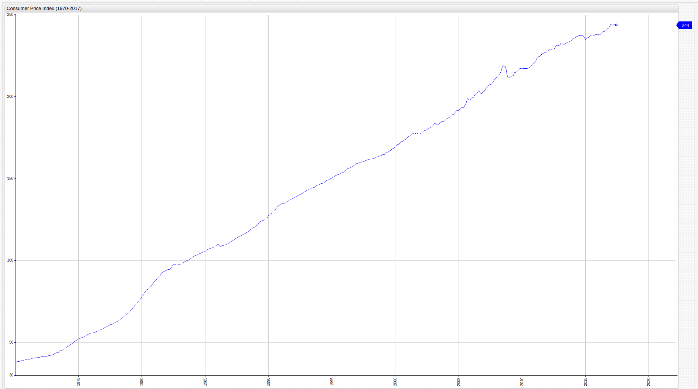
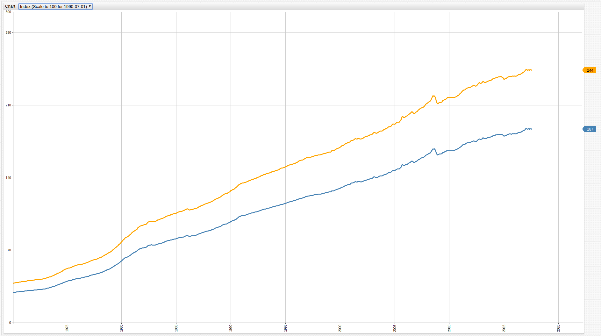
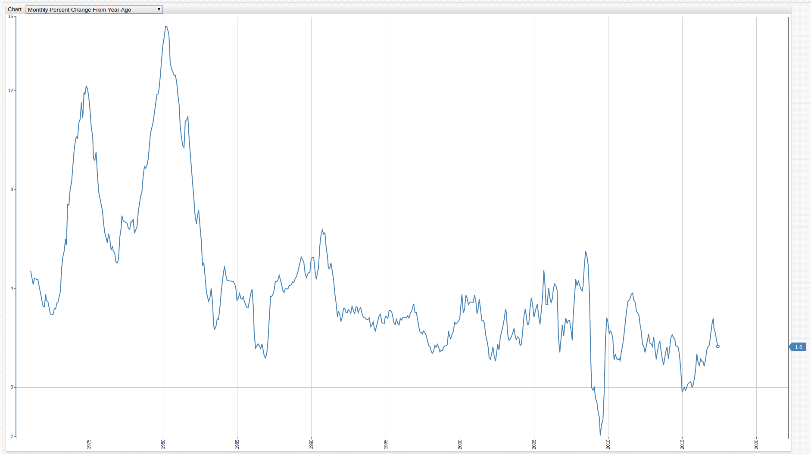

Leveraging Calculated Values to Include Many Features of the Same Data in One Visualization
===


### Executive Summary

Using [calculated values](Support/Add-Calculated-Values/README.md) in the [ChartLab](https://apps.axibase.com) interface
is useful for creating multiple outputs from one set of underlying data. [Axibase Time Series Database](https://axibase.com/products/axibase-time-series-database/)
supports a range of in-built [functions](https://github.com/axibase/atsd/blob/master/rule-engine/functions.md) which allow
the entire range of data users to manipulate a dataset to derive the desired meaning from it.

The St. Louis branch of the Federal Reserve branch maintains FRED, short for [Federal Reserve Economic Data](https://fred.stlouisfed.org/), an 
open-access platform for analyzing the data collected and published by the Federal Reserve. One important metric tracked
by FRED is the [Consumer Price Index](https://fred.stlouisfed.org/series/CPIAUCSL#0), shortened as CPI. The Consumer Price
Index is used to track inflation by measuring the costs of goods relative to some year. 

### Problem Brief

Using a number of functions supported in the ChartLab interface, the [following visualization](https://fred.stlouisfed.org/series/CPIAUCSL#0)
can be replicated in any instance of ATSD. Explore the FRED visualization with the `Edit Graph` button by selecting the desired
output. To learn more about how any of the metrics are calculated from the underlying data, the [following page](https://fredhelp.stlouisfed.org/fred/data/understanding-the-data/formulas-calculate-growth-rates/)
provides information about the underlying formulas used to modify the original CPI data, shown below in ChartLab:

**Figure 1**: Consumer Price Index (1970-2017)



[](https://apps.axibase.com/chartlab/4ac03fa7/#fullscreen)

The above visualization tracks CPI during the observed period, showing only the underlying data to be used below.

### Solution

The FRED visualization provides several options for exploring the CPI dataset, one of which is choosing the baseline year
from which the CPI will be calculated. This feature allows users to explore the recovery cycle after a recession, or choose
their own index year. The selected year is set equal to 100.00 and all preceding or subsequent years are calculated as some
fraction of that value, greater than 100.00 shows inflation of the cost of a given basket of goods while less than 100.00
shows deflation of cost.

**Figure 2**: CPI Calculated from a Variable Baseline (1970-2017)



[](https://apps.axibase.com/chartlab/978c79b4/#fullscreen)

Key Components of this visualization: 
> Open the ChartLab visualization shown above and view the Editor window.

* The list keyDates contains the same dates as the FRED chart shown in the [Problem Brief](#problem-brief):

```sql
    list keyDates = 1970-11-01, 
  1973-11-01, 1975-03-01,
  1980-01-01, 1980-07-01, 
  1981-07-01, 1982-11-01,
  1990-07-01, 1991-03-01, 
  2001-03-01, 2001-11-01,
  2007-12-01, 2009-06-01
    endlist
  ```
* These dates are fed into the dropdown menu which represent the official start dates of several recessions throughout U.S.
history. The syntax for this chart's dropdown menu is shown below:

```sql
  [dropdown]
    on-change = widget.config.series[0].value = this.value; widget.replaceSeries(widget.config.series);
    for date in keyDates
      [option]
        text = Index (Scale to 100 for @{date})
        value = value("cpi") / value("cpi_@{date}") * 100 || null
    endfor
 ```
> For more information about the above syntax see the following [documentation](https://axibase.com/products/axibase-time-series-database/visualization/widgets/dropdown/).

By modifying any of the dates contained in the `keyDates` list above, the user can select any desired date to set as the
baseline value, and the `value` equation contained in the `[option]` portion of the `[dropdown]` configuration above uses 
a simple formula to establish the new index. The `on-change` setting defines this newly calculated series, and is explained
piecewise below:

* `widget.config.series[0]` selects the series to be replaced. Series are indexed beginning with 0 and increasing by a single
step for each additional series (0,1,2,3....). There is only one underlying series in this visualization.
* `value = this.value` assigns a user-defined value, that is, the option selected in the dropdown menu, as the value for
the series defined in the the `widget.config` portion of the script. `this` defines the specific object to be modified, in this
case the dropdown menu.
* `widget.replaceSeries(widget.config.series)` replaces the underlying values of the original series defined as a parameter
of the function, with the newly calculated values defined in the `[option]` setting.

**Figure 3**: Features of CPI Data



[](https://apps.axibase.com/chartlab/3349c3dd/#fullscreen)

> Open the ChartLab visualization above and explore settings described below in the Editor window. 

The FRED visualization shown in the [Problem Brief](#problem-brief) contains the following metrics, which are provided alongside
brief explanations and the `[option]` setting which returns their desired values:

* _Monthly Change_: The monthly numerical change in CPI value over the observed period.

```sql
    [option]
      text = Monthly Change
      value = delta("cpi", "1 month")
```

This setting uses the [`delta`](https://axibase.com/products/axibase-time-series-database/visualization/widgets/configuring-the-widgets/aggregators/) function.

* _Change From a Year Ago_: The numerical change in CPI value from the same month of the previous year.

```sql
    [option]
      text = Change From Year Ago
      value = var v = value('cpi'); var p = value('prev_cpi'); if(p!=null && v!=null) return v - p
``` 
This setting uses a second underlying series which is not enabled, to select values of the Consumer Price Index from one year
ago using a [`time-offset`](https://axibase.com/products/axibase-time-series-database/visualization/widgets/time-chart/) setting,
and comparing them to the current year's values.

* _Monthly Percent Change_: The monthly percentile change in CPI value over the entire observed period.

```sql
    [option]
      text = Monthly Percent Change
      value = (value("cpi") / previous("cpi") - 1) * 100
```

This setting uses the newly-supported [`previous()`](https://github.com/axibase/charts/blob/master/syntax/functions.md) function

* _Monthly Percent Change From a Year Ago_: The percentile change in CPI from the same month of the previous year.

```sql
    [option]
      text = Monthly Percent Change From Year Ago
      value = var v = value('cpi'); var p = value('prev_cpi'); if(p!=null && v!=null) return (v / p - 1) * 100
```

* _Compounded Annual Rate of Change_: The mean annual rate of change for the Consumer Price Index.

```sql
[option]
      text = Compounded Annual Rate of Change
      value = (Math.pow(( value("cpi") / previous("cpi") ), 12) - 1) * 100
 ```

This setting uses the built-in [Math](https://developer.mozilla.org/en-US/docs/Web/JavaScript/Reference/Global_Objects/Math) javascript object.

* _Continuously Compounded Rate of Change_: The mean rate of change for the Consumer Price Index compounded continuously.

```sql
    [option]
      text = Continously Compounded Rate of Change
      value = ( Math.log(value("cpi")) - Math.log(previous("cpi")) ) * 100
```

* _Continuously Compounded Annual Rate of Change_: The annual rate of change compounded continuously for the observed period.

```sql
    [option]
      text = Continously Compounded Annual Rate of Change
      value = ( Math.log(value("cpi")) - Math.log(previous("cpi")) ) * 100 * 12
```

* _Natural Log_: Each value's logarithm to base of the mathematical constant _e_
 
```sql
    [option]
      text = Natural Log
      value = Math.log(value("cpi"))
```

* _Index_: Indexes the Consumer Price Index by its maximum and most recent value.

```sql
 [option]
      text = Index (Scale to 100 for maximum)
      value = value("cpi") / value("cpi_max") * 100 || null
```

### Debrief

The above functions demonstrate the ease with which power users are able to provide comprehensive information to end users
with interactive visualizations. These visualizations can be customized to include a range of secondary metrics that are 
derived from one set of data, as shown here, and have a very low barrier of usability. By leveraging calculated values from
within the ChartLab interface, the underlying data remains unmodified and can be operated on entirely within the ChartLab
sandbox using simple syntax with robust functionality.
