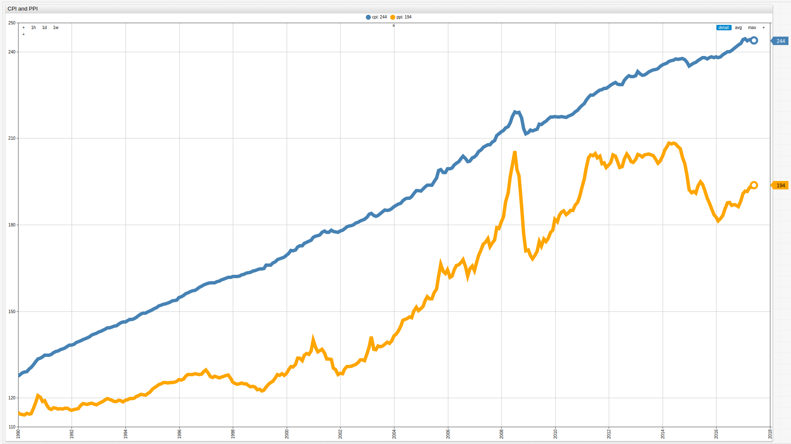

Nested Sub-Queries Using Inline Views
===

### Problem Brief

Once the collection stage of a data task is completed, manipulating the data to derive meaning from it becomes the primary 
focus of almost any analysis. The newly-supported [Inline View](https://github.com/axibase/atsd/tree/master/api/sql#inline-views),
a native Oracle protocol, allows the user to include a nested sub-query to be operated on by the containing query in [SQL Console](https://github.com/axibase/atsd/tree/master/api/sql).



The above visualization shows the Consumer Price Index (CPI) in blue and the Producer Price Index (PPI) in orange. These 
values are important economic metrics which are highly indicative of inflation, as they represent the value that consumers
and producers are spending in order to make or take a given basket of goods. To learn more about the changing relationship
between CPI and PPI, read the following [analysis](Analysis/CPI_v_PPI/README.md).

Suppose a given task requires calculating the difference between CPI and PPI, which represents a unitless number we can call
Potential Profitability value, and then defining the maximum and minimum values of that difference. 

This problem has two solutions, both of which require [adding a calculated value](../Add-Calculated-Value/README.md). The first
option is to query the data, store the resultset in ATSD, and then perform a second query on the new virtual table to return the desired values. The
second option leverages Inline Views to perform both queries simultaneously using a nested sub-query. Both will be
performed below for side-by-side comparison.

### Solution 1: Query, Store, Query

The initial query calculates the difference in CPI and PPI, called Marginal Profit:

**Query 1**

```sql
SELECT datetime, cpi.value, ppi.value, (cpi.value - ppi.value) AS "value"
  FROM cpi AS cpi JOIN ppi AS ppi
LIMIT 12
```

This query uses the [`LIMIT`](https://github.com/axibase/atsd/tree/master/api/sql#limiting) setting for the sake of brevity.

**Table 1**

```ls
| datetime                 | cpi.value | ppi.value | value | 
|--------------------------|-----------|-----------|-------| 
| 1990-01-01T00:00:00.000Z | 127.50    | 114.90    | 12.60 | 
| 1990-02-01T00:00:00.000Z | 128.00    | 114.40    | 13.60 | 
| 1990-03-01T00:00:00.000Z | 128.60    | 114.20    | 14.40 | 
| 1990-04-01T00:00:00.000Z | 128.90    | 114.10    | 14.80 | 
| 1990-05-01T00:00:00.000Z | 129.10    | 114.60    | 14.50 | 
| 1990-06-01T00:00:00.000Z | 129.90    | 114.30    | 15.60 | 
| 1990-07-01T00:00:00.000Z | 130.50    | 114.50    | 16.00 | 
| 1990-08-01T00:00:00.000Z | 131.60    | 116.50    | 15.10 | 
| 1990-09-01T00:00:00.000Z | 132.50    | 118.40    | 14.10 | 
| 1990-10-01T00:00:00.000Z | 133.40    | 120.80    | 12.60 | 
| 1990-11-01T00:00:00.000Z | 133.70    | 120.10    | 13.60 | 
| 1990-12-01T00:00:00.000Z | 134.20    | 118.70    | 15.50 | 
```

[Data exports](https://github.com/axibase/atsd/tree/master/api/sql#scheduler) are usually performed on a schedule, but
[SQL Console](https://github.com/axibase/atsd/tree/master/api/sql#overview) also supports ad-hoc exports as well.
After the data is stored in ATSD, the following query is used to return the desired values, maximum and minimum differences
in Potential Profitability over the observed time period of several decades:

**Query 2**

```sql
SELECT MAX(value), MIN(value)
  FROM "potential-profitability"
```

**Table 2**

```ls
| max(value) | min(value) | 
|------------|------------| 
| 56.51      | 12.60      | 
```

### Solution 2: Nested Sub-Query

The same information can be returned with one query that uses the newly-supported Inline Views feature. 
The containing query, and nested sub-query are shown below:

**Query 3**

```sql
SELECT MAX(value), MIN(value)
  FROM
(
SELECT datetime, cpi.value, ppi.value, (cpi.value - ppi.value) AS "value"
  FROM cpi AS cpi JOIN ppi AS ppi
)
```

**Table 3**

```ls
| max(value) | min(value) | 
|------------|------------| 
| 56.51      | 12.60      | 
```

### Summary

Using a nested sub-query allows the user to increase the speed of computation, and decrease the amount of time needed to
derive the desired information from a given dataset. Leveraging nested sub-queries on a schedule can parse a universal or
generic dataset into several derived branches which can be [sent via e-mail](https://github.com/axibase/atsd/blob/master/api/sql/scheduled-sql.md#email) 
to subscribers or [published to a url](https://github.com/axibase/atsd/blob/master/api/sql/scheduled-sql.md#link) for public use
creating an arsenal of uses far beyond the simple example covered here. Suppose the same procedure was used in a broader applcation,
that is, retrieving the maximum and minimum values for a given dataset using a dataset that featured a much lower aggregation rate, once per minute
for example, as is common with financial trading data. 

This dataset could be queried to derive maximum and minimum values once an hour, and those values could be emailed to one team. 
Additionally, the average hourly value of the entire dataset could be calculated with a second query, and published to a public website.
Further, un-modified data could be added into an existing dataset and used as training data for an predicitive algorithm,
such as the [Axibase Data Forecaster](https://github.com/axibase/atsd/tree/master/forecasting#data-forecasting). The list 
of possible uses for nested sub-queries is virtually unlimited and with support for Inline Views added to ATSD, the limit
of opportunities to monetize your companies personal data continues to approach infinity.
