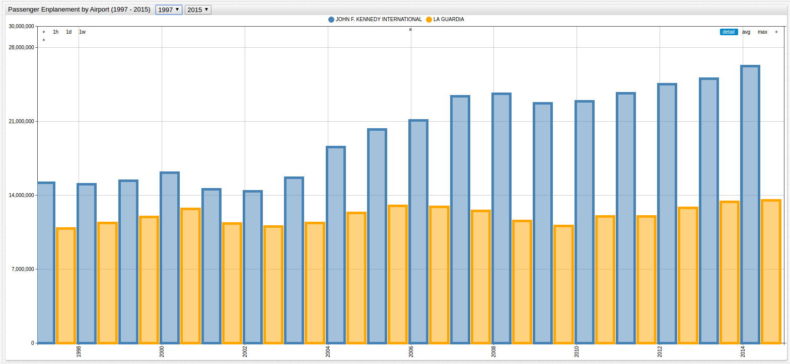
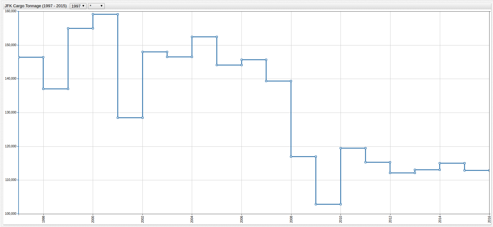
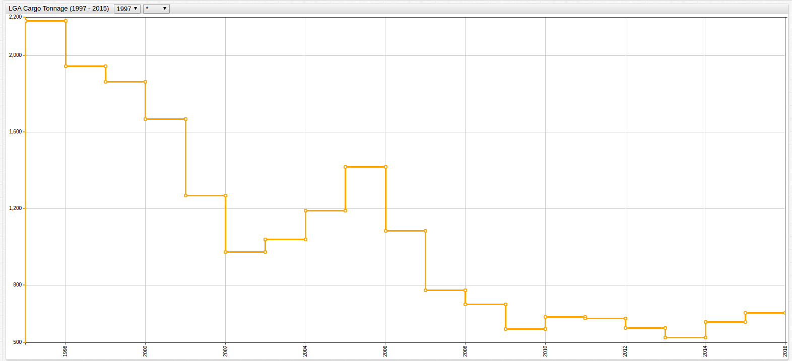
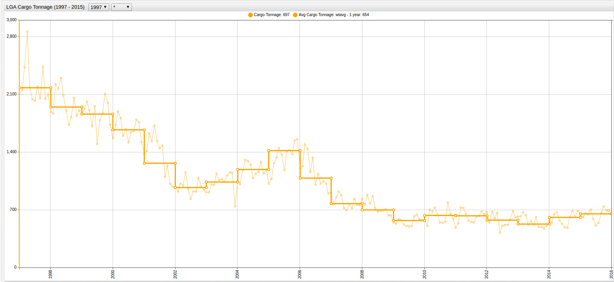

Curve Smoothing Using Moving Averages
==

### Problem Overview

Working with highly-granularized data presents a number of unique challenges to the entire range of data users. Sometimes
the data is stored incorrectly, creating the need for [modification upon import](../Schema-Parser-Mod-Pre-Import/README.md),
and sometimes the nature of the data makes it difficult to work with. Take the following example: an analyst is presented
with two possibly-related datasets, [cargo tonnage data](https://github.com/axibase/open-data-catalog/blob/master/datasets/nthh-fhwt.md) from
the two largest airports in the New York City Metropolitan Area and [passenger enplanement data](https://github.com/axibase/open-data-catalog/blob/master/datasets/vpv5-zd4k.md)
from the same airports.

The analyst is asked to create a relational model between the two datasets for a major airline looking to expand their presence
at either LaGuardia or John F. Kennedy Airport in order to facilitate the maximum number of passengers and cargo. The first
data set, collected by the [Port Authority of New York and New Jersey](http://www.panynj.gov/) is aggregated monthly while the second dataset from
the [New York Department of Transportation](https://www.dot.ny.gov/index) is aggregated annually.

The analyst knows that the data must be modified somehow, but using a schema based parser to aggregate the Port Authority Cargo data
would destroy the fine granularization that was created by monthly collection over the entire observation period and using an
average baseline calculated over the entire observation period would return results that neglected current trends because
four decades worth of data would be regarded equally.

Enter [Axibase Time Series Database](https://axibase.com/products/axibase-time-series-database/) and the [Moving Average](https://axibase.com/products/axibase-time-series-database/visualization/widgets/configuring-the-widgets/aggregators/)
setting.

### Data

The tonnage dataset is visualized below. Because of the differences in the ranges of the data, it has been split into two charts so that the high level
of variance is visible for each metric:

**Figure 1.1**: JFK Cargo Tonnage (1977-2015)


[](https://apps.axibase.com/chartlab/479e4525/#fullscreen)

**Figure 1.2**: LGA Cargo Tonnage (1977-2015)


[](https://apps.axibase.com/chartlab/f36262ee/#fullscreen)

Averaging cargo data across the entire observed period would return results that considered data from almost
half a century ago as equal to data recorded two years ago. While potentially helpful in another analysis, for the purposes
described above, such aggregation would not only be unhelpful, but most likely detrimental to the desired outcome, which is
dependant on current trends.

The passenger enplanement data, aggregated annually is shown below:

**Figure 1.3**: LGA and JFK Passenger Enplanement Data (1997-2015)



[](https://apps.axibase.com/chartlab/00cf9be3/#fullscreen)

Not only is the granularization mismatched but the observed periods differ by twenty years. The latter problem's solution is
quick enough, modify the observation period using the dropdowns in ChartLab or hardcode the desired timespan in the editor
window with the `starttime` setting, but the former doesn't offer such an obvious solution.

The syntax required to modify the dataset to reflect the moving average is two parts and shown below. It can be placed under
the `[widget]` field to modify all available series, or placed under an individual `[series]` field to modify only one desired
series.

**Setting 1**

```sql
  statistic = wtavg
  period = 1 year
```

The `period` feature of the setting is user-assigned and can be set as low as millisecond granularity and as high as any
number of years. This two line syntax calculates the average of each year's inputs and aggregates them to return one value
per selected period. Additionally, this type of ad-hoc modification does nothing to the underlying data, so it may be returned
to at any time. Read detailed documentation about the `wtavg` setting as well as other supported aggregation functions
[here](https://axibase.com/products/axibase-time-series-database/visualization/widgets/configuring-the-widgets/aggregators/).

### Implementation

Applying the moving, or weighted, average to **Figures 1.1** and **1.2** is shown below:

**Figure 2.1** Annual Average of JFK Cargo Tonnage (1997-2015)



[](https://apps.axibase.com/chartlab/b03d8e2c/#fullscreen)

**Figure 2.2** Annual Average of LGA Cargo Tonnage (1997-2015)



[](https://apps.axibase.com/chartlab/b456f1b5/#fullscreen)

> Open the ChartLab visualizations above to inspect the newly-inserted syntax on lines 17 and 18

The analyst is now able to more accurately judge the relationship between the two datasets because of the equal rate of
granularization. Combining the JFK and LGA elements from each of the two datasets, and using the `mode = column` setting,
produces the following:

**Figure 2.3**: JFK Cargo Tonnage vs. Passenger Enplanement (1997-2015)


[](https://apps.axibase.com/chartlab/897c0429/#fullscreen)

**Scale Modification**:

```javascript
enplanements = value/100
```

**Figure 2.4**: LGA Cargo Tonnage vs. Passenger Enplanement (1997-2015)


[](https://apps.axibase.com/chartlab/0de58b58/#fullscreen)

**Scale Modification**:

```javascript
enplanements = value/10000
```

Once the comparison is complete, removing the `statistic` setting from the editor window returns the data to its original
state without additional computation. Alternatively, it may be helpful to compare the modified chart with the original to
calculate concrete monthly baselines. Airport traffic and use is hugely seasonal, comparing values month to month is not only
ineffective, but misleading. Instead, months should be compared across different years and with the moving average calculation
included no additional calculations need be performed (such as attempts to correct for overall increases and decreases in
airport traffic) because they are now included in the underlying data.

**Figure 2.5**


[](https://apps.axibase.com/chartlab/6b3e4ed6/#fullscreen)

**Figure 2.6**




[](https://apps.axibase.com/chartlab/a4d77c47/#fullscreen)

Download the Community Edition of Axibase [here](https://github.com/axibase/atsd/blob/master/installation/README.md#installation),
view prepared public datasets [here](https://github.com/axibase/open-data-catalog), and contact [Axibase](https://axibase.com)
with any questions [here](https://axibase.com/feedback/).
