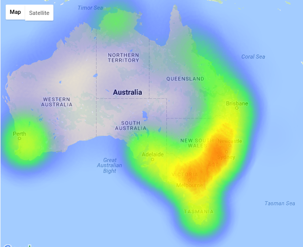
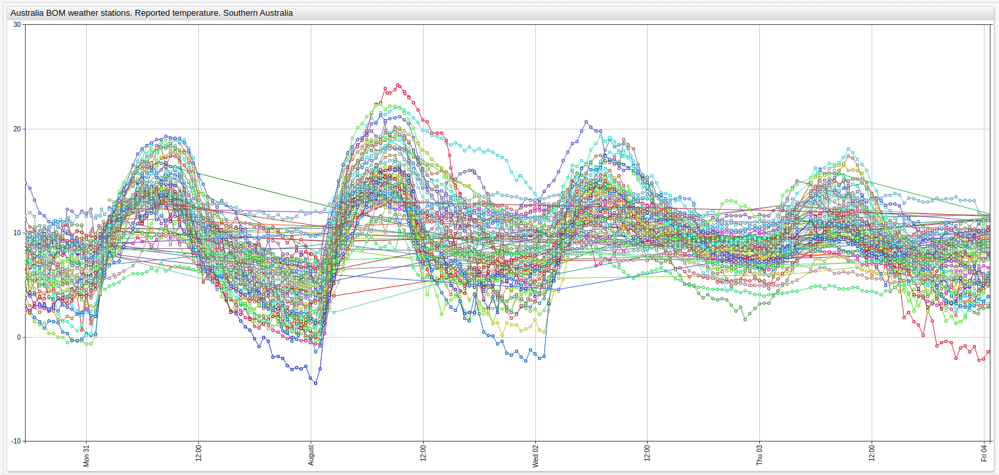
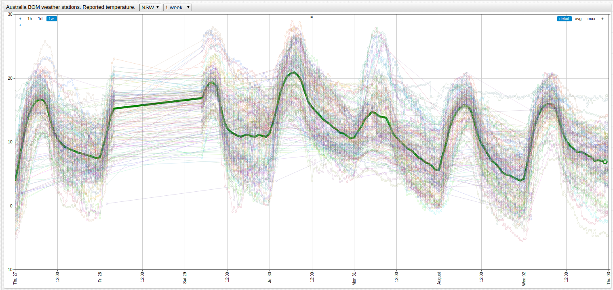

Sensor Monitoring with ATSD and jsfiddle
===



### Introduction

The [Axibase Time Series Database](https://axibase.com/products/axibase-time-series-database/) is a non-relational time series
database that supports integration into a number of [industry-standard analytics tools](https://github.com/axibase/atsd#integrations). 
Here, the [`heatmap.js` ](https://www.patrick-wied.at/static/heatmapjs/) library is used to visualize the Australian
climate and the plugin [`gmaps-heatmap.js`](https://www.patrick-wied.at/static/heatmapjs/plugin-gmaps-layer.html) arranges
the information in [Google Maps](https://www.google.com/maps). 

Using regional temperature data from the [Austrailian Bureau of Meteorology](http://www.bom.gov.au/?ref=logo) that tracks weather
stations across the continent, Axibase developer Yana Nikolai has created the above visualization which displays color-coded
temperature information across the continent that is updated as the BOM adds new data daily.

View her map [here](http://jsfiddle.net/8snq8c4w/4/). Update the visualization using the **Run** button at the top of the screen.

### Functionality

ATSD is designed to analyze and report on massive volumes of time series data collected at high frequency and jsfiddle is
a javascript sandbox which gives developers the freedom to test and share coding ideas and create visualizations such as 
the one above. BOM data was loaded into ATSD with the [Axibase Collector](https://github.com/axibase/axibase-collector/tree/master/jobs/examples/file/australia-bom)
job.

The data stored in ATSD can be visualized with [ChartLab](https://apps.axibase.com) to observe data points other than those
included in the most recent set:



[](https://apps.axibase.com/chartlab/6e5fe1c5/9/#fullscreen)

The data is sorted by region and can be explored with the dropdown menu at the top of the visualization. One dropdown navigates
between Australian states, indexed according to the table below, and the second selects the observation period.

| Australian State | Abbreviation |
|:----------------:|:------------:|
| New South Wales | NSW | 
| Northern Territory | NT |
| Queensland | QLD |
| Tasmania | TAS |
| Southern Australia | SA |
| Victoria | VIC |

Using [in-built aggregation features](https://axibase.com/products/axibase-time-series-database/visualization/widgets/configuring-the-widgets/aggregators/)
the average value of this data can be highlighted for enhanced reporting:



[](https://apps.axibase.com/chartlab/6e5fe1c5/8/#fullscreen)

### Numerical Reporting

ATSD supports an Oracle-based structured query language (SQL) to report on data:

**Query 1.1**

```sql
SELECT datetime AS 'Time', entity AS 'City', value AS 'Temperature' FROM "bom.gov.au.air_temp"
  WHERE entity = 'perth'
LIMIT 10
```

**Table 1.1**

```ls
| Time                     | City  | Temperature | 
|--------------------------|-------|-------------| 
| 2016-07-20T04:00:00.000Z | perth | 16.60       | 
| 2016-07-20T04:30:00.000Z | perth | 17.40       | 
| 2016-07-20T05:00:00.000Z | perth | 17.70       | 
| 2016-07-20T05:30:00.000Z | perth | 18.00       | 
| 2016-07-20T06:00:00.000Z | perth | 18.30       | 
| 2016-07-20T06:30:00.000Z | perth | 18.20       | 
| 2016-07-20T07:00:00.000Z | perth | 17.80       | 
| 2016-07-20T07:30:00.000Z | perth | 16.70       | 
| 2016-07-20T08:00:00.000Z | perth | 16.10       | 
| 2016-07-20T08:30:00.000Z | perth | 16.00       | 
```

Download the [Community Edition](https://github.com/axibase/atsd/blob/master/installation/README.md#installation) of ATSD
and use the above query and visualization as templates.
