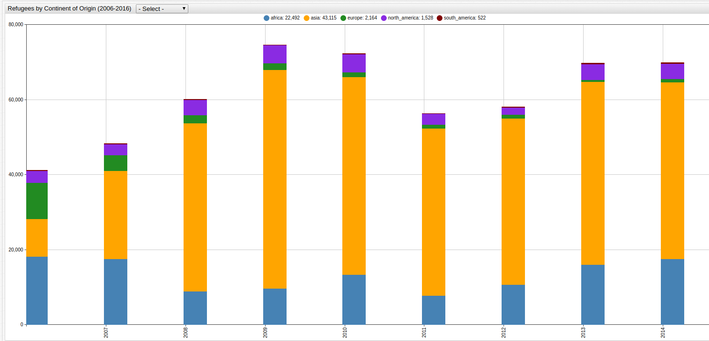
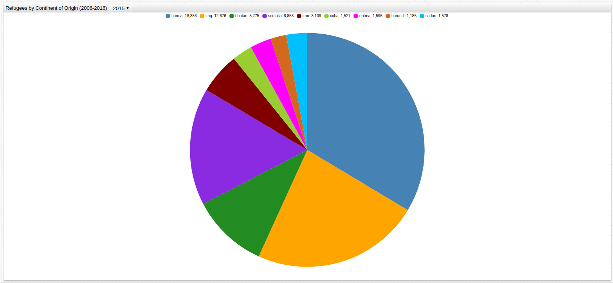
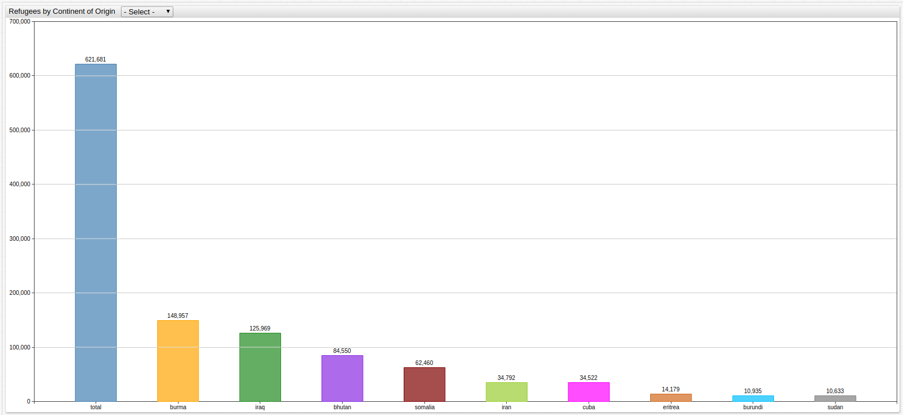
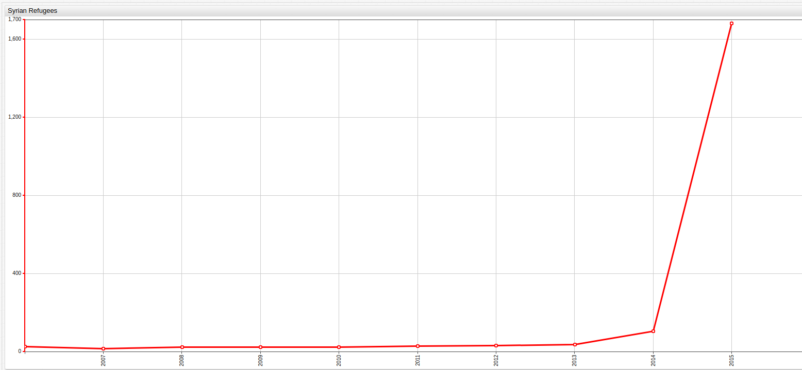
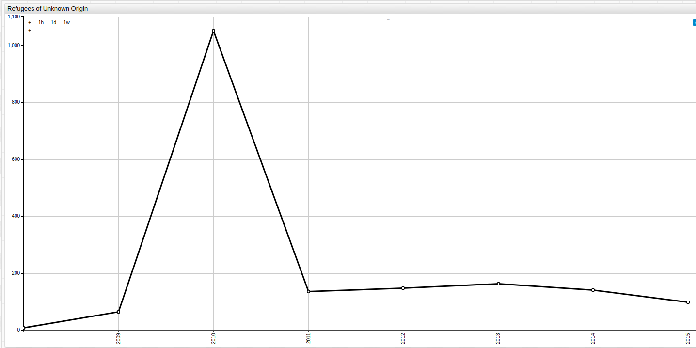
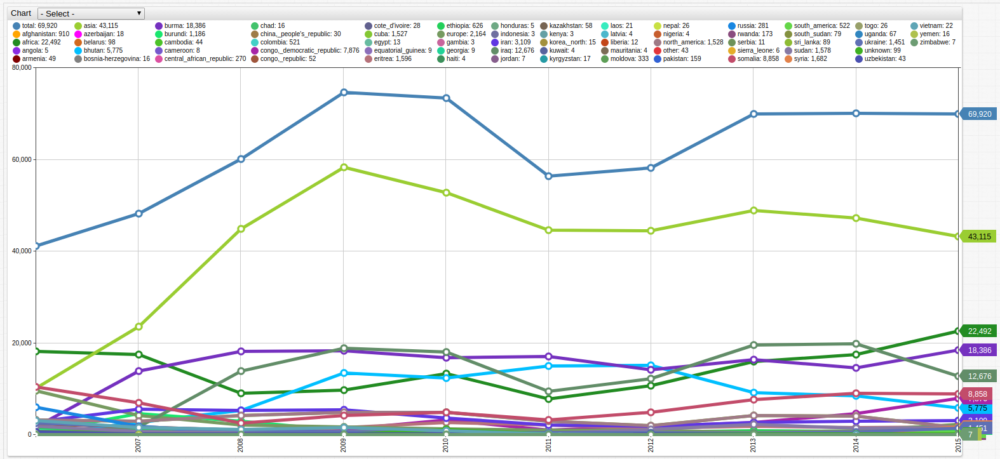

How Many Refugees Come to the United States? 
===


### Introduction

One of the most contentious issues during the 2016 Presidential Elections  was the subject of refugee immigration to the United
States. Since the Mayflower landed in 1620, immigration has been a cornerstone of American life, and since it has achieved economic
prosperity and a perceived higher quality of life, America has also taken on a second role: that of a safe haven for the world's refugees. 
Some of the greatest American minds were refugees: [Henry Kissinger](http://www.henryakissinger.com/), a Jew who fled Germany to escape the Nazi regime and
later served in the Army against Hitler as an officer of military intelligence; [Albert Einstein](http://www.nobelprize.org/nobel_prizes/physics/laureates/1921/einstein-bio.html),
who also fled Germany when Hitler came to power and went on to become a Nobel Prize winner and a United States Citizen;
[Madeline Albright](https://history.state.gov/departmenthistory/people/albright-madeleine-korbel), whose Czechoslovakian family
fled Communist rule in 1948 and who went on to become the first female Secretary of State are just a few notable examples,
but refugees have played an integral role in America's history.

[Axibase](https://axibase.com) has explored [U.S. Expatriation Data](/Expatriation_Aug2017/README.md), as well as [Visa Application Data](/USVisa/README.md)
using the [Axibase Time Series Database](https://axibase.com/products/axibase-time-series-database/), both analyses provide excellent context 
for the following information.


### Data

The [Department of Homeland Security](https://dhs.gov) records the number of refugees entering America and their country of
origin. That data has been published at the following [link](https://www.kaggle.com/dhs). 

**Figure 1**



[](https://apps.axibase.com/chartlab/6508479b/4/#fullscreen)

> Open the ChartLab visualization above and observe refugee data parsed by continent of origin, or use the dropdown menu 
to target a desired continent.

**Query 1**

```sql
SELECT YEAR(time) as "Year", value AS "Total Refugees"
  FROM "refugee-count" WHERE entity = "total"
```

**Table 1**

```ls
| Year | Total Refugees | 
|------|----------------| 
| 2006 | 41,094          | 
| 2007 | 48,218          | 
| 2008 | 60,107          | 
| 2009 | 74,602          | 
| 2010 | 73,293          | 
| 2011 | 56,384          | 
| 2012 | 58,179          | 
| 2013 | 69,909          | 
| 2014 | 69,975          | 
| 2015 | 69,920          | 
```

According to DHS, over the last decade, roughly 600,000 refugees have been granted asylum in the United States. The difference
between an immigrant and refugee is necessity. An immigrant leaves by choice but a refugee is forced from their home due to
persecution. The most current [population estimates](https://www.census.gov/topics/population.html) from the Bureau of the Census
place America's population at 321.3 million people.

Over the entire observed period, America received more refugees from the following countries than any others:

**Figure 2**



[](https://apps.axibase.com/chartlab/c66bdd3d/3/#fullscreen)

> Open the ChartLab visualization above to see the top 10 origin countries for American refugees, and use the dropdown menu
to navigate through time.

**Query 2**

```sql
SELECT entity AS "Country", SUM(value) AS "Total Refugees"
  FROM "refugee-count" WHERE entity != "total" AND entity != "asia" AND entity != "africa" AND entity != "north_america" AND entity != "europe"
GROUP BY entity
ORDER BY SUM(value) DESC
  LIMIT 10
```

**Table 2**

```ls
| Country                    | Total Refugees | 
|----------------------------|----------------| 
| burma                      | 148,957         | 
| iraq                       | 125,969         | 
| bhutan                     | 84,550          | 
| somalia                    | 62,460          | 
| iran                       | 34,792          | 
| cuba                       | 34,522          | 
| congo,_democratic_republic | 24,108          | 
| eritrea                    | 14,179          | 
| burundi                    | 10,935          | 
| sudan                      | 10,633          | 
```

Of the countries listed above, three appear on the list of countries banned by the President's highly contested [visa ban](https://www.whitehouse.gov/the-press-office/2017/01/27/executive-order-protecting-nation-foreign-terrorist-entry-united-states),
which he enacted just a week after taking office; those banned countries are Sudan, Somalia, and Iran. Shown below is a
[bar chart](https://axibase.com/products/axibase-time-series-database/visualization/widgets/bar-chart-widget/) which visualizes
the data from **Table 2** Additionally, a 90-day complete ban on any individuals from Iraq, Syria, Libya, and Yemen
entering the United States was included in the Executive Order. 

**Figure 3**



[](https://apps.axibase.com/chartlab/22ed41e8/3//#fullscreen)

> Use the dropdown menu to select the desired year.

### Analysis

Syrian refugees are at the center of the fierce debate surrounding who is coming to America under the auspices
of refugee protection. Currently, the country is engaged in the multi-sided Syrian Civil War that began as a part of the
2011 Arab Spring uprisings, which spread across the Middle East and unseated a number of rulers in several countries. The total number of Syrian refugees accepted by America is shown below:

**Figure 4**



[](https://apps.axibase.com/chartlab/df3b4cc1/#fullscreen)

**Query 3**

```sql
SELECT YEAR(time) AS "Year", value AS "Refugees"
  FROM "refugee-count" WHERE entity = "syria"
```

**Table 3**

```ls
| Year | Refugees | 
|------|----------| 
| 2006 | 27       | 
| 2007 | 17       | 
| 2008 | 24       | 
| 2009 | 25       | 
| 2010 | 25       | 
| 2011 | 29       | 
| 2012 | 31       | 
| 2013 | 36       | 
| 2014 | 105      | 
| 2015 | 1,682     | 
```

Additionally, the number of refugees whose origins are unknown are recorded:

**Figure 5**



[](https://apps.axibase.com/chartlab/ff6c1645/#fullscreen)

**Query 4**

```sql
SELECT YEAR(time) AS "Year", value AS "Refugees"
  FROM "refugee-count" WHERE entity = "unknown"
```

**Table 4**

```ls
| Year | Refugees | 
|------|----------| 
| 2008 | 9        | 
| 2009 | 65       | 
| 2010 | 1,053     | 
| 2011 | 136      | 
| 2012 | 148      | 
| 2013 | 164      | 
| 2014 | 141      | 
| 2015 | 99       | 
```

Use the following ChartLab visualization to view refugee numbers from any of the observed countries over the entire observed
period:

**Figure 6**



[](https://apps.axibase.com/chartlab/5e3355d7/#fullscreen)

> Use the dropdown menus in the visualization above to toggle between countries.

The number of refugees accepted each year is a function of a number of political mechanisms, but the President has some ability
to control refugee immigration just as the other branches of government have proven that they also wield the power to
work against such policies.

### Conclusions

