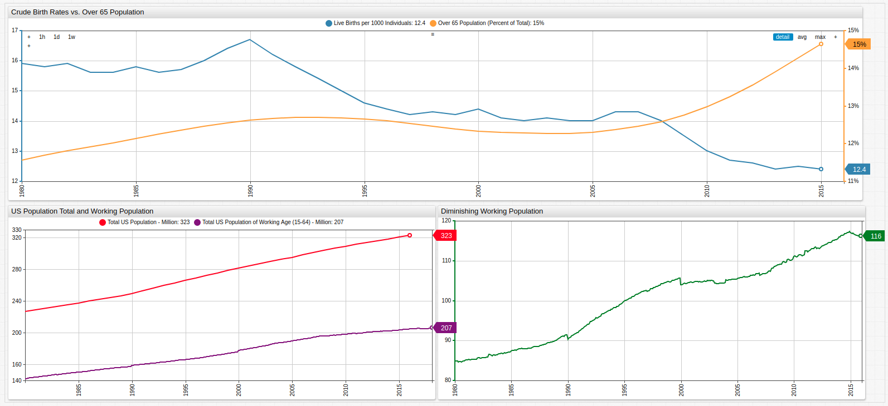

# Aging America: Modeling Birth Trends in the United States

*Fig. 1*: The upper graph shows the growing senior population contrasted against the diminishing birth rate while the lower graphs show the growing difference in total population and total work-eligible population aged 15-64.

## Overview

The United States provides retirement security for the elderly and disabled in a number of ways: Medicaid, Medicare, and Social Secuirty are the main components of the social welfare program. Each of these systems is financed primarily with payroll taxes called the Federal Insurance Contribution Act (FICA) tax. The underlying philosophy of this, and almost any, social welfare program is thus: the young should pay for the healthcare of those unable to do so themselves due to age or disability in the hopes that one day the next generation will do the same for them. Sound logic to be sure, but what happens when the previous generation failed to repopulate the nation in the same way their parents did? What happens when this trend is repeated through one, two, three, or four generations? For a long time analysts have been warning about the coming drought in the Social Security Administration's coffers, but more and more it's starting to appear that it may be just over the horizon.

## Objectives

Using [**Forecasting**](https://axibase.com/products/axibase-time-series-database/forecasts/) functionality from [Axibase Time Series Database](https://axibase.com/), current population figures, and birth data, models may be created to predict trends in America's population crisis. 

## Data

All data is sourced from the United States Federal Reserve.

* [U.S. Population Aged 65 or Above](https://fred.stlouisfed.org/series/SPPOP65UPTOZSUSA)
* [Crude Birth Rate for the United States](https://fred.stlouisfed.org/series/SPDYNCBRTINUSA)
* [Working Age Population: Aged 15 - 64](https://fred.stlouisfed.org/series/LFWA64TTUSM647S)
* [Population Total: United States](https://fred.stlouisfed.org/series/POPTOTUSA647NWDB)

## Methodology

1. Visualize Datasets using [ChartLab](https://apps.axibase.com/);
2. Implement Forecasting.

## Visualization

**Working Population as a Portion of Total Population**

Open the ChartLab visualzation and use the drop-down menu to navigate through time to compare working-aged popualtion to the United States total population.

*Fig 2.*: The portion of the population eligible forwork (aged between 15 and 64) is shown in purple, while the remaining ineligible population is shown in red.

**Births per 1000 / Population Over 65**

The upper histogram tracks annual crude births per one thousand persons and the lower histogram tracks the 65+ population in percentile terms. Deceptively, the data seems to show that the average amount of births outperforms the aging population, but when scaled to 100, in fact, the aged population severely outnumbers the amounnt of crude births which are occurring.

*Fig 3.*: Open the ChartLab visualization and modify the number of bars in either histogram using a [`bar-count`](https://axibase.com/products/axibase-time-series-database/visualization/widgets/histogram-chart/#tab-id-1) setting for more granularized data visualization.

**Dimishing Working Population**

Using a `value` expression, calculated series may be created using existing data. Here, working-aged population data is subtracted from total population data to create a new series.

*Fig 4.*: The [box chart](https://axibase.com/products/axibase-time-series-database/visualization/widgets/box-chart-widget/) and [histogram](https://axibase.com/products/axibase-time-series-database/visualization/widgets/histogram-chart/) establish the dataset's median value and range, which are then used in the [`alert-expression`](https://axibase.com/products/axibase-time-series-database/visualization/widgets/time-chart/#tab-id-14), which activates when a condition is satisfied. Here, the condition is set to color a bar red if it is greater than the calculated median value which shows that since late 1998, the number of people deemed ineligible to work has surpassed the calculated median value and continued to grow.

### Forecasting

The ATSD Forecast tool may be used to model future trends based on existings data. See the [Resources](#resources)

### Resources
