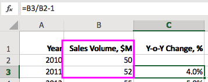

# Excel - Going Strong in 2018

Microsoft Excel is `33` years old. For any technology product this type of longevity is almost beyond reach. Even the venerable iPhone looks young and vulnerable in comparison.

Despite repeated [attempts](https://www.wsj.com/articles/stop-using-excel-finance-chiefs-tell-staffs-1511346601) to depose it, Excel remains the most commonly used tool for business analysis and reporting.

The modern workplace is continuously evolving as it absorb the [Generation X, Y, and Z](https://hbr.org/2017/08/a-survey-of-19-countries-shows-how-generations-x-y-and-z-are-and-arent-different) waves. However as the [Digital Natives](https://cyber.harvard.edu/research/youthandmedia/digitalnatives) enter the workforce, they are surprised to discover that their digital skills are lagging behind. We are talking about skills necessary to analyze data in **Excel** - the reigning king of number crunching.

*Table 1*: The Impact of Generational Shift on Workplace

| | 1985-2000 | 2000-2015 | 2015+ |
|---|---|---|---|
| Organizational Structure | Hierarchical | Matrix | Horizontal |
| Work Unit | Function | Product | Project |
| Dominant Tribe | Baby Boomers | Gen X | Millennials |
| Runner-up Tribe | Gen X | Millennials | Digital Natives |
| Workspace Layout | Private Office | Cubicle | Open Floor |
| Schedule | 9-to-5 | Flex Hours | Always On |
| Communications | Phone | Email | Chat |
| Knowledge Medium | Book | Article | Video |
| Data Analysis | **Excel** | **Excel** | **Excel** |

While there could be many reasons, both technical and cultural (e.g. network effects), that explain the tool's staying power, here's my short list of the possible reasons:

* Excel combines the data and the code in a single file. This bundling approach works well for ad hoc (task specific) analysis. Unlike R and Python, changing the existing data or creating new records with click and copy beats writing `for each` loops and `INSERT` statements.

* Charting library that covers all the bases for graphical representation of data. It may not offer the latest and greatest visualization options (choropleths, Voronoy diagrams, cross-tabs, etc) but works for the majority of use cases.

* Reference style that works for staged calculations. Whether `R1C1` or `A1`, users find the Excel way of passing calculation results _by reference_ most intuitive.

In particular, being able to assemble step-by-step calculations by referring to other cells makes visual programming with numbers very simple to master.

In combination with a compact syntax that allows fixing referenced rows/columns `$A$1` and `LOOKUP`/`VLOOKUP` functions, it provides a  programming environment that works even for non-programmer users.

Lessons learned:

* `simple` beats `complex`
* `specialized` beats `generic`
* `clicking` beats `typing`