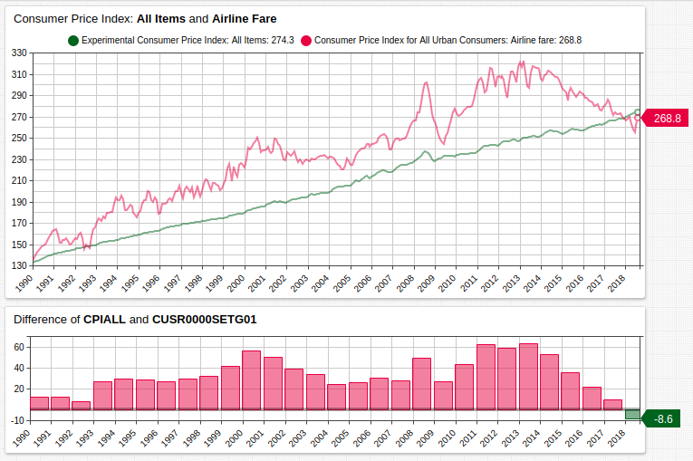
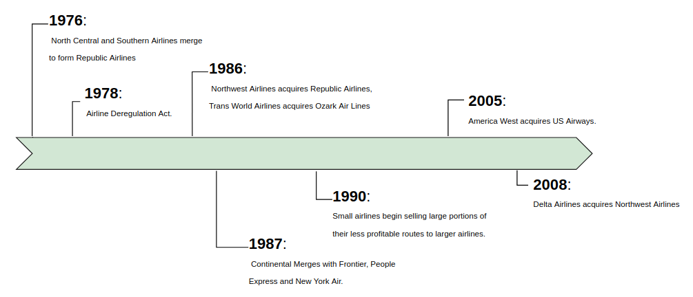
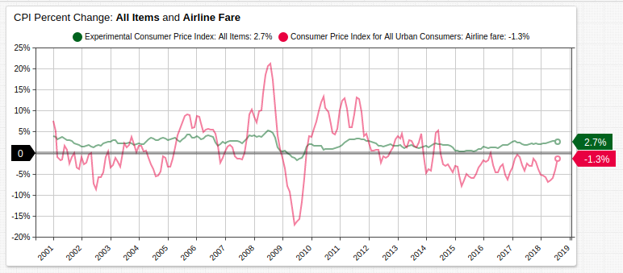
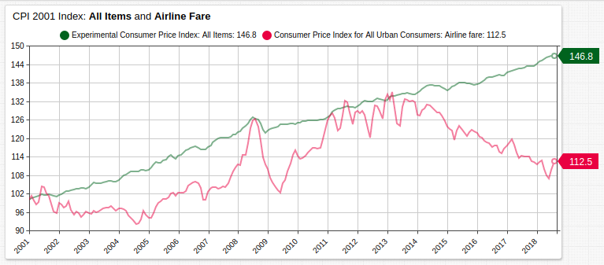

# Increased Competition Fosters Falling Airline Prices

## Introduction

The 1978 [Airline Deregulation Act](https://www.gpo.gov/fdsys/pkg/STATUTE-92/pdf/STATUTE-92-Pg1705.pdf) granted private airlines the freedom to select routes, set fares, and design schedules. Previously these were regulated by a federal agency, the Civil Aeronautics Board.[1](https://www.archives.gov/research/guide-fed-records/groups/197.html) The government took a more *laissez-faire* approach to the airline industry, and it began to consolidate under the control of its largest players.

A forty-year timeline is shown below which illustrates that centralization within the airline industry occurred rapidly among smaller providers, culminating in eventual acquisition by larger providers in some cases.

Consolidation seemed to be the best way to compete with the four largest American airline companies, whose percent market capitalization is shown below:

* **American Airlines**: 5.6%
* **Delta Air Lines**: 11.2%
* **Southwest Airlines**: 8.1%
* **United Airlines**: 8.6%

> Source: *The New York Times*, 2018[2](https://markets.on.nytimes.com/research/markets/usmarkets/industry.asp?industry=52421)

The true result however was decreased competitiveness which precipitated rising prices, evidenced by the growth of the CPI basket price for air travel at a rate greater than that of generalized inflation as well as airport-level economic studies.[3](http://faculty.haas.berkeley.edu/borenste/download/AERPP90AirMerge.pdf)

## The Dawn of Ultra Low Cost Carriers

Despite dubious reviews on popular advisory sites,[4](https://www.airlinequality.com/airline-reviews/spirit-airlines/) a number of carriers which bill themselves as "ultra low cost" have emerged on the national market in the last two decades:

* **Allegiant Air**: founded 1997, declared bankruptcy in 2000, acquired by [Maurice Gallagher Jr.](https://gsm.ucdavis.edu/gallagher) in 2001 and restructured as a low cost airline.
* **JetBlue Airways**: founded in 2000 as one of the first low cost by design airlines.
* **Spirit Airlines**: founded in 1983 as Charter One, began to transition to low cost airline in 2007.
* **Sun Country Airlines**: Founded in 1983, declared bankruptcy in 2001, purchased and restructured before again declaring bankruptcy in 2008, purchased again in 2011 and restructured as a low cost airline.

Representing less than the market share of American Airlines between them, the emergence of multiple, regional, independent airlines who are able to target their high-priced competitors has re-introduced an atmosphere of competition at the domestic level.[5](https://www.forbes.com/sites/mikeboyd/2018/08/01/ultra-low-cost-carriers-are-the-new-wildcatter-airlines/#1b8aacf56340)

Although more dramatically affected by the economic downturn which began in 2008, the emergence of JetBlue in 2000 and the formation of additional low cost airlines throughout the decade have noticeably affected the overall cost of airline travel in the United States. Not only did the airline fare CPI basket grow less significantly than the overall basket of goods, the majority of years, it actually decreased indicating that relative prices were decreasing with respect to overall inflation.

## The Future of Low Cost

The [World Bank](https://www.worldbank.org/) anticipates the low cost revolution will spill over into areas where air travel is less common.[6](https://openknowledge.worldbank.org/bitstream/handle/10986/20191/905860PUB0Box3014648028290Sep102014.pdf) Because of lower operating costs and ticket prices, areas traditionally uninteresting to larger international carriers are an ideal grounds for smaller organizations to grow their customer base.

In fact, relative airline costs have fallen roughly 50% since 1980[7](https://www.theatlantic.com/business/archive/2013/02/how-airline-ticket-prices-fell-50-in-30-years-and-why-nobody-noticed/273506/) showing that industry regulation usually serves to stifle competition, increase barriers to market access for new players, and decrease innovation via stagnation. Indeed, economic consulting firm [Compass Lexecon](http://www.compasslexecon.com/) released a 2017 report showing that increased competition has not only resulted in lower prices, but also increased quality among those airlines which are not interesting in pursuing the low cost model.[8](http://darinlee.net/pdfs/airline_competition.pdf)

Likewise, this trend has been noted by Federal Reserve economists, who postulate that the airline industry is essentially an oligopoly which steadily moving towards an environment of true competition.[9](https://research.stlouisfed.org/publications/page1-econ/2018/11/01/the-economics-of-flying-how-competitive-are-the-friendly-skies)

Data from this article is sourced from the Federal Reserve database [FRED](https://fred.stlouisfed.org/) and valued on a 100-point scale. The CPI basket for airline fares is indexed in 1982, meaning all following values are derived based on their relationship to the 1982 value. If that index year is changed to 2001, the stark difference in CPI inflation from all items and airfare becomes obvious.

