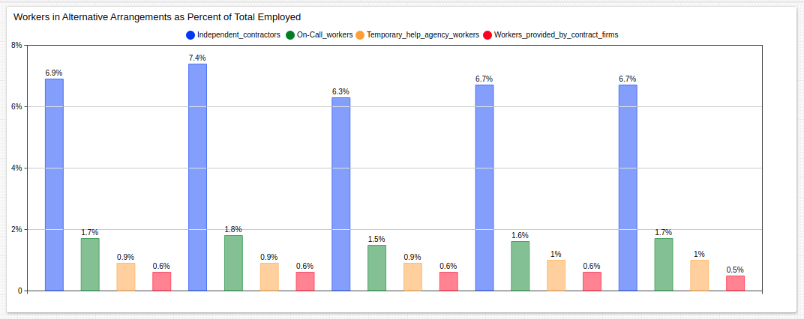
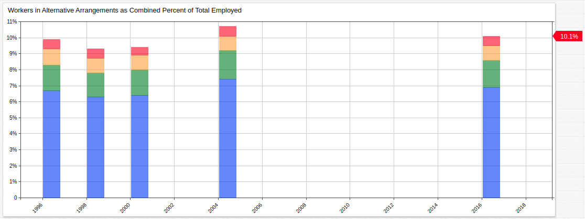

# Workers in Alternative Arrangements

## Overview

* Data is sourced from the [Bureau of Labor Statistics](https://www.bls.gov/home.htm).
* Alternative employment is defined as those who work via contract, on-call, or through some kind of agency (such as those which connect temporary employees with employers).
* Despite the massive potential for decentralization afforded by modern means of connectivity, overall the rate of alternative employment has remained mostly unchanged since 1995.
* Remote workers who file [Form W-2](https://www.irs.gov/forms-pubs/about-form-w-2) tax instead of [Form 1099](https://www.irs.gov/businesses/small-businesses-self-employed/forms-and-associated-taxes-for-independent-contractors) are not considered independent contractors.
* BLS has not released information for this statistic since 2005.
* Alternative workers have decreased as a portion of the whole since 2005.

## Keywords

`format`, `for`, `opacity`, `time-offset`, `color`, `style`

## Graphics

### Percent of Total Employed

[](https://apps.axibase.com/chartlab/0ca75c28#fullscreen)



### Combined Percent of Total Employed

[](https://apps.axibase.com/chartlab/59fc796a#fullscreen)



## Syntax Features

* [`for`](https://axibase.com/docs/charts/syntax/control-structures.html#for) loop to add lagged series.

```ls
list offsets = 0 year, 12 year, 18 year, 20 year, 22 year

for offset in offsets

 [series]
   time-offset = @{offset}

endfor
```

* [`time-offset`](https://axibase.com/docs/charts/widgets/shared/#time-offset) to track each series at five independent points in time.

```ls
[series]
 time-offset = 12 year
```

* [`format`](https://axibase.com/docs/charts/syntax/format-settings.html#format-settings) setting to include `%` sign in values and axes.

```ls
format = percent
```

* [`column-stack`](https://axibase.com/docs/charts/widgets/time-chart/#mode) mode in [Time Chart](https://axibase.com/docs/charts/widgets/time-chart/).

```ls
[widget]
  type = chart
  mode = column-stack
```