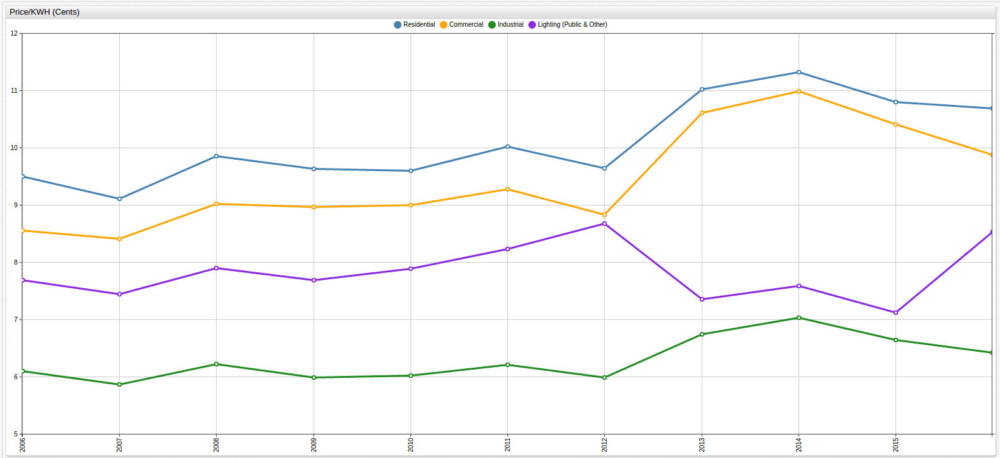

<!-- markdownlint-disable MD101 -->

# Public Utilities and Private Industry in Austin



[](https://apps.axibase.com/chartlab/efc684ff/2/#fullscreen)

Austin, Texas is the capital city of the Lone Star State and one of the fastest growing cities in America. Home to the University
of Texas at Austin, which produces thousands of well-qualified computer science graduates each year and funnels new talent into largest employers in Austin. Dubbed "the Silicon Hills" for the high concentration of post-dot-com-boom and other newer
high-tech companies that populate the city, Austin is seen as an all-around business friendly city.

One of the tenets of good business is healthy competition but currently, Austin residents only have one choice for an electricity
provider: [Austin Energy](https://austinenergy.com/wps/portal/ae/home/!ut/p/a1/jY_NCsIwEISfxUOOmk2rUr3F-tOqWPBQay6SSqyVmoQ0VXx7o-BFFF3YwzLfzuxihjPMJL-UBbelkrx6zKy_I1GvS0ZA5sGUDIBGq266DmN_RogDtg6AL0Xh1_4GsycCXuBFIXhxMknGEKdJSpNFCLPQfwHfI-Z_HEll7gcFZkYchBGm0xj33NFaXQ8RIOBNbUsppDDFrbNXZwRXXSPQylheOVm4zlVjEThRc3lra6MOZSU-eR9VbXH2bon1OYNTr7osaat1B4vV0aY!/dl5/d5/L2dBISEvZ0FBIS9nQSEh/).
The company, formed in 1895, has almost half a million client accounts and through its public infrastructure, gives lighting
to more than a million residents.

The visualization above highlights one of the main reasons that "Public Utility" has become a dirty word in certain
circles. Opponents of city-managed utilities claim government mismanagement leads to increased prices that would be positively
affected by introducing competitors whereas proponents of regulation say just the opposite, electricity is more than a business
it is a modern necessity, and government regulation ensures access for everyone. Using the web-based [SQL Console](https://axibase.com/docs/atsd/sql/) in ATSD, the numerical information associated with the above visualization is shown:

```sql
SELECT tags.customer_class AS "Customer Class", AVG(value) AS "Avg kWh (Cents)"
  FROM "rate_cents_per_kwh" WHERE tags.customer_class != 'Total'
GROUP BY tags.customer_class
  ORDER BY AVG(value) DESC
```

| Customer Class            | Avg kWh (Cents) |
|---------------------------|-----------------|
| Residential               | 10.11           |
| Commercial                | 9.45            |
| Lighting (Public & Other) | 7.83            |
| Industrial                | 6.29            |

> Over the observed time period, residential customers paid an average $0.04 more per kilowatt hour (kWh) than industrial
clients.

While four cents an hour certainly does not seem like much, the table below shows the amount of revenue generated from each class of customer. Typically, business and industry
pays the lion's share of utility costs because of the nature of their usage: large-scale power grids and 24/7 operation, but
in Austin, the exact opposite is true. In fact, the industrial class paid an average 35% of the residential class over the
observed period, which is detailed in the table below the visualization.


[](https://apps.axibase.com/chartlab/efc684ff/3/#fullscreen)

```sql
SELECT tags.customer_class AS "Customer Class", AVG(value)/1000000 AS "Revenue (Million USD)"
  FROM "revenue" WHERE tags.customer_class != 'Total'
GROUP BY tags.customer_class
  ORDER BY AVG(value) DESC
```

| Customer Class            | Revenue (Million USD) |
|---------------------------|-----------------------|
| Commercial                | 430.45                |
| Residential               | 429.32                |
| Industrial                | 151.99                |
| Lighting (Public & Other) | 83.19                 |

This dramatic difference may be explainable by looking at electricity usage numbers, in the visualization below, where residential
customers significantly out-use the industrial sector by almost double.


[](https://apps.axibase.com/chartlab/efc684ff/4/#fullscreen)

```sql
SELECT tags.customer_class AS "Customer Class", AVG(value)/1000000 AS "Usage (Million MWh)"
  FROM "megawatt_hour" WHERE tags.customer_class != 'Total'
GROUP BY tags.customer_class
  ORDER BY AVG(value) DESC
```

| Customer Class            | Usage (Million MWh) |
|---------------------------|---------------------|
| Commercial                | 4.55                |
| Residential               | 4.24                |
| Industrial                | 2.40                |
| Lighting (Public & Other) | 1.06                |

Whether you are a proponent, opponent, or some compromise of the two, with respect to government regulation of public utilities,
understanding the data surrounding the issue is the most critical step to having an informed opinion and thanks to [City of Austin](https://data.austintexas.gov/)
efforts to publish data for the public to inspect, that possibility is becoming a reality for more and more people every day.
