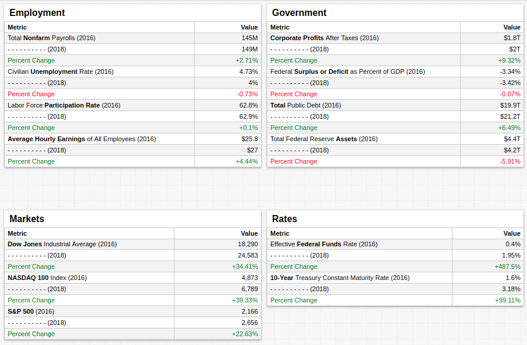
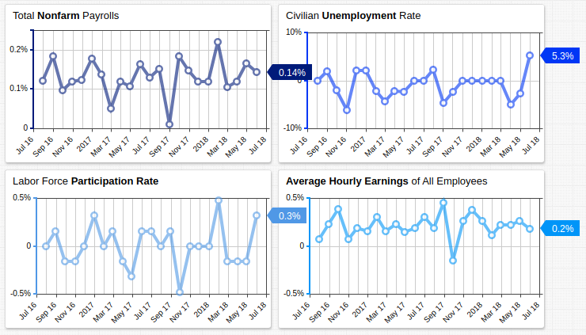
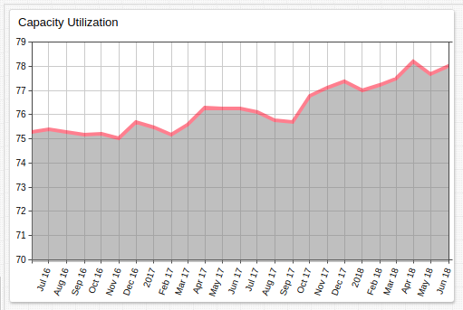
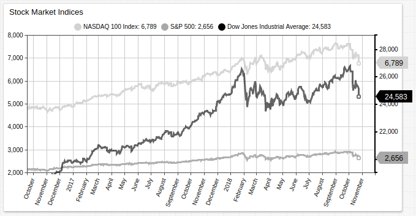
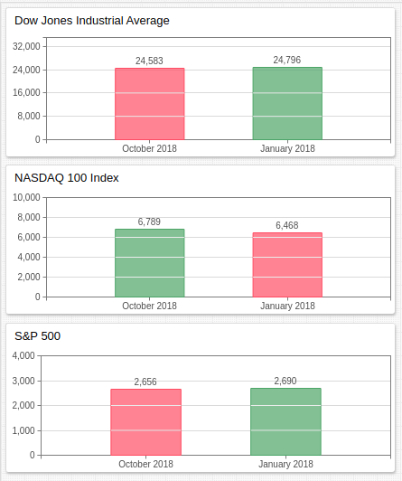
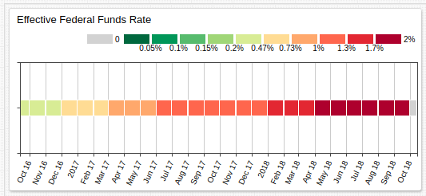

# Biennial Evaluation of the Trump Administration



[](https://trends.axibase.com/81002545#fullscreen)

## Contents

* [Overview](#overview)
* [Employment](#employment)
* [Government](#government)
* [Markets](#markets)
* [Rates](#rates)

## Overview

January 20, 2019 marks the halfway point of the first term of the Trump administration. The President has repeatedly boasted on the state of the economy and lauded the growth which has been a central plank in the administration platform since the campaign trail.

Collected from the Federal Reserve [Economic Research](https://fred.stlouisfed.org/) Division, the metrics shown above are tracked by October 2016 value, in the month leading up to the election of President Trump, alongside the most recent value, the exact date of which varies by metric.

## Employment



[](https://trends.axibase.com/#fullscreen)

```ls
value = fred.MonthlyPercentChange('payems')
```

These [charts](https://github.com/axibase/charts/blob/master/widgets/time-chart/README.md#time-chart) parse the total values shown in the **Employment** table above by month and track the percent change during each interval.

The BLS [Employment Situation Summary](https://www.bls.gov/news.release/empsit.nr0.htm) (released October 5, 2018) contains the most current public information available and offers additional employment insights:

* The Civilian Unemployment Rate fell 20 basis points (0.2%) in September to 3.7%
* Total Nonfarm Payrolls increased by 134,000, against an average monthly increase of 201,000 during the previous 12 months.
* Labor force participation remained constant.
* Average hourly earnings of nonfarm employees increased by 8 cents.



Also in the past two years, [Capacity Utilization](https://fred.stlouisfed.org/series/TCU) has approached 80%, a feat which has not been accomplished in more than a decade.

## Government

The latest federal budget deficit, according to the [Congressional Budget Office](https://www.cbo.gov/topics/budget), is $793 billion. According to the CBO [2018 Long-Term Budget Outlook](https://www.cbo.gov/system/files?file=2018-06/53919-2018ltbo.pdf), the two main factors which will contribute to an increased budget deficit and public debt are thus:

* The Federal Funds Rate has increased almost 500% in the last two years. Net interest costs account for 1.8% of 2018 GDP but CBO analysts expect this amount to rise to 3.6% of GDP by 2028.
* Non-interest outlays are expected to rise from 19% of GDP to 23% by 2048.


[](https://trends.axibase.com/6b9f6470#fullscreen)

```ls
statistic = avg
period = 1 month
```

An additional thorn in the side of the government is the rising per person cost of healthcare. One of the primary failures of the Trump administration was the repeal of the ACA, famously defeated by an across-the-aisle vote from the late Senator [John McCain](https://www.youtube.com/watch?time_continue=1&v=hT2pp_KrJGg). Healthcare mandatory spending is also projected to outpace per person GDP growth, which requires further allotment of federal funds.

## Markets

["The economy, stupid!"](https://en.wikipedia.org/wiki/It%27s_the_economy,_stupid) was a Clinton-era campaign slogan which lambasted then-President George H.W. Bush for his failure to lead the country out of recession.

Since taking office, among President Trump's most vocal proponents have been Wall St. brokers who recorded [4% S&P 500 growth](https://www.vox.com/policy-and-politics/2018/1/17/16897656/trump-wall-street-stock-market) in the first 2 weeks of 2018.



Mark Twain famously quipped, "October. This is one of the peculiarly dangerous months to speculate in stocks. The others are July, January, September, April, November, May, March, June, December, August, and February." He supposedly singled out October in reference to the so-called [October Effect](http://lexicon.ft.com/Term?term=October-effect), whereby stock markets are supposed to be particularly prone to disaster during the month of October; the stock market collapses of [1929](https://en.wikipedia.org/wiki/Wall_Street_Crash_of_1929), [1987](https://en.wikipedia.org/wiki/Black_Monday_(1987)), and [2008](https://en.wikipedia.org/wiki/Financial_crisis_of_2007%E2%80%932008) could all be said to have began in October.

The curse appears to remain in effect as October losses have swept away all Dow Jones Industrial Average gains since the start of 2018, a bitter pill to swallow in the tenth month of the year with less than 60 days before FY 2018 Q4 economic reports are released.



> Only the NASDAQ 100 Index remains greater than its valuation in January 2018.

## Rates

The effective federal funds rate has grown almost 500% during President Trump's administration, and 10-year Treasury bond yield has doubled.

The former was held at less than 0.2% for almost a decade, when the Fed called for an increase to 0.3% in January of 2016 for the first time since the rate was set below 0.3% in December 2008. Since then, the Fed has increased the target range to between 2% and 2.25%, with rumblings of a [forthcoming hike](https://www.marketwatch.com/story/fed-hikes-interest-rates-signals-strong-support-for-another-increase-in-december-2018-09-26) in the next few months.



[](https://trends.axibase.com/4b471a9e#fullscreen)

```ls
[widget]
thresholds = 0, 0.2, 1.0, 2.0
summarize-period = 1 month
```

The [Calendar Chart](https://github.com/axibase/charts/blob/master/widgets/calendar-chart/README.md) tracks deviation from a calculated threshold. Here, each monthly value is assigned a color based on how it compares to overall average monthly value. Refer to the legend along the top of the chart for reference. The steep increase in the effective Fed rate began in October 2016 and has continued to the present. A higher Fed rate means larger return on investment in US Treasury bonds, but has the caveat of requiring larger net interest payments as well.

## Conclusion

The traditional basket of indicators is mostly positive for the first two years of the Trump administration, but there are warning signs that the economy is not yet out of harm's way.

Perennial market bear Peter Schiff, who correctly predicted the 2008 crisis, recently spoke to [RT America](https://www.youtube.com/watch?time_continue=3&v=mowurscobbk) highlighting numerous potentially catastrophic conditions which could bring the US economy, and worldwide hegemony of the dollar, to its knees:

* Increased debt service costs caused by rising Fed interest rates. Schiff compared this phenomena to the surge in adjustable-rate mortgages which precipitated the housing crisis in 2006.
* Increased borrowing under the Trump administration. Schiff stressed that he believes the Trump administration [Tax Cuts and Jobs Act](https://www.congress.gov/bill/115th-congress/house-bill/1) will likely serve to decrease government revenue, forcing the Congress to authorize further borrowing. This is a contestable point, as the traditional libertarian perspective argues that lower tax rates also reduce deductable wages, and serve to potentially increase government revenue.
* According to Schiff, the $15 trillion public debt has become utterly untenable, and paying it all off is a fantasy. It logically follows that this will eventually inspire distrust in the dollar and result in loss of value.

Schiff is among a small school of serious thinkers who advocates ridding oneself of dollar-denominated assets as he predicts a dark future ahead.