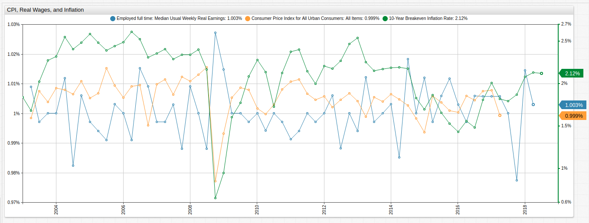

# Calculating Breakeven Inflation

## Overview

The breakeven rate of a security is the percent gain which an asset must achieve to break even against inflation. The rate differentiates the nominal and real return on an investment, the former being the raw percentage of increase or decrease and the latter being that percentage with inflation factored in.

But what if that investment is not a financial instrument at all, or at least not a financial instrument in the traditional sense?

Using [Federal Reserve economic data](https://fred.stlouisfed.org/), this article calculates the breakeven inflation rate and compares that rate to real wages and the Consumer Price Index to see how the average salary and cost of living stacks up if they were investments.

## Treasury Maturity Rate

To calculate the breakeven inflation rate, use 10-Year Treasury Constant Maturity Rate ([DGS10](https://fred.stlouisfed.org/series/DGS10)) and 10-Year Treasury Inflation-Indexed Security, Constant Maturity ([DFII10](https://fred.stlouisfed.org/series/DFII10)).

Download these datasets from the `/resources` directory, where they are reformatted for data upload, or directly from FRED.

[](./resources/README.md)

### Visualization

The two datasets used for this article are visualized below using [ChartLab](https://github.com/axibase/charts/blob/master/README.md) which is a data visualization service supported by [Axibase Time Series Database](https://axibase.com/docs/atsd/), the database used for data storage and processing tasks required by this research.


[](https://apps.axibase.com/chartlab/4cb24313)

Treasury maturity rates track the value at which United States Treasury bonds are being traded for a given denomination of time, in this case ten years. This metric is typically used by investors to gauge inflation, whereby lower maturity rates indicate higher inflation and vise versa.

## Breakeven Inflation Rate

The two trend lines above are shown on [independent axes](https://github.com/axibase/charts/blob/master/widgets/time-chart/README.md#dual-axis) to highlight their relationship to one another, but in fact the inflation-indexed maturity rate is roughly half the non-indexed rate, indicating the inflation rate.

A second measure of inflation is the Consumer Price Index for All Urban Consumers ([CPIAUCSL](https://fred.stlouisfed.org/series/CPIAUCSL)) which is shown independent of the two maturity rate datasets below.


[](https://apps.axibase.com/chartlab/3788ec10)

To calculate the breakeven rate, create a [derived series](../../tutorials/add-calculated-value/README.md) from the two maturity rate datasets. The value of the breakeven rate indicates the rate at which goods and salaries must grow to match inflation. To perform this calculation, create an `alias` for each of the underlying series and use the `replace-value` setting to perform the calculation.

```ls
[series]
  metric = dgs10
  alias = dgs
  
[series]
  metric = dfii10
  alias = dfii
```

> To hide the underlying series, add the `display = false` setting at the `[series]` level.

The breakeven rate is calculated by subtracting the value of the non-indexed maturity rate by the value of the indexed maturity rate to produce the inflation value.

```ls
[series]
  value = value('dgs') - value('dfii')
```

The breakeven inflation rate visualization is shown below alongside the underlying data.


[](https://apps.axibase.com/chartlab/78a12181)

To validate the calculation, see the Federal Reserve 10-Year Breakeven Inflation Rate ([T10YIE](https://fred.stlouisfed.org/series/T10YIE)) dataset.

## CPI and Median Wages

[Consumer Price Index](../../research/analysis/cpi-ppi/README.md) is a metric which defines the cost of goods based on their cost during the index year, where the value is `100`. Real wages are inflation-adjusted wages. Both of these datasets are available in the `/resources` directory.

[](./resources/README.md)

Alternatively, download the raw data directly from the Federal Reserve.

* Consumer Price Index for All Urban Consumers: All Items ([CPIAUCSL](https://fred.stlouisfed.org/series/CPIAUCSL))
* Employed Full Time: Median Usual Weekly Real Earnings ([LES1252881600Q](https://fred.stlouisfed.org/series/LES1252881600Q))

These datasets are visualized below. The monthly CPI dataset is transformed to match the aggregation period of the real wage data, which is collected quarterly.

```ls
[series]
  group-period = 3 months
  group-statistic = avg
```


[](https://apps.axibase.com/chartlab/aa6d135d)

<!-- markdownlint-disable MD026 -->

## Breaking Even?

<!-- markdownlint-enable MD026 -->

To calculate percent change per data sample, ChartLab supports `previousValue` syntax which, when used in a `replace-value` statement, returns the percentile rate of change.

```ls
[series]
  replace-value = value/previousValue
```



[](https://apps.axibase.com/chartlab/c79abd79)

<!-- markdownlint-disable MD102 -->

For the entire observed period, which is over a decade, both CPI and inflation growth outstripped growth in real wages. In some cases, dramatically so. That disparity has decreased in recent years, but the early part of the millennium experienced unequal growth on the order of several percent. Indeed, the only notable period when wage growth matched the increased in cost of living was during the Great Recession of 2009 when economic growth and inflation was almost at a standstill.

Federal Reserve data resolutely shows that wages are not growing proportionally alongside the cost of living. If wages were indeed an investment, the fund manager who kept re-investing would probably already be out of a job.

<!-- markdownlint-enable MD102 -->

The final visualization below combines all three metrics to show how much inflation is outgrowing real wages and CPI each year. Because the final data sample for CPI is recorded in April 2017, newer data is excluded from this visualization using the `endtime` setting.

```ls
[configuration]
  endtime = May 2017

[series]
  value = value('inflation') - (value('cpi') - value('wage'))
```


[](https://apps.axibase.com/chartlab/08c0d788)

## Validation

Reproduce the processes and calculations in this article using the same tools:

1. Follow the ATSD [Installation Instructions](https://axibase.com/docs/atsd/installation/) or launch the [Docker Image](https://axibase.com/docs/atsd/installation/docker.html).
1. Upload the data and CSV parser configurations used here from the [`/resources`](./resources/README.md) directory.
1. Explore ChartLab syntax and features in the [Charts Documentation](https://github.com/axibase/charts/blob/master/README.md).
1. Follow configuration instructions in the [ChartLab Tutorial](../../tutorials/shared/chartlab.md).
1. For additional ATSD features, see the [ATSD Documentation](https://axibase.com/docs/atsd/).