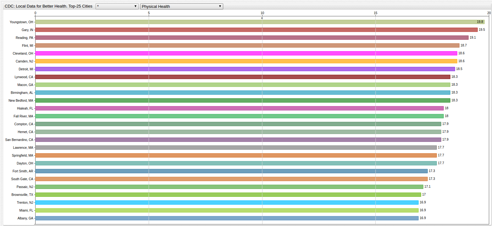
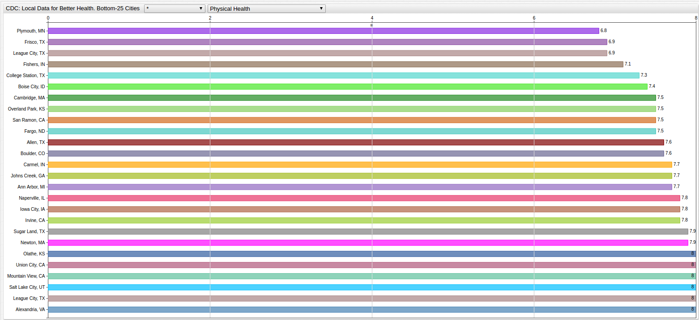
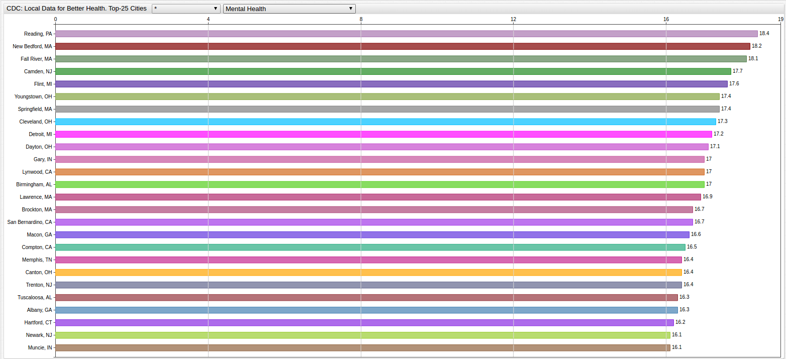
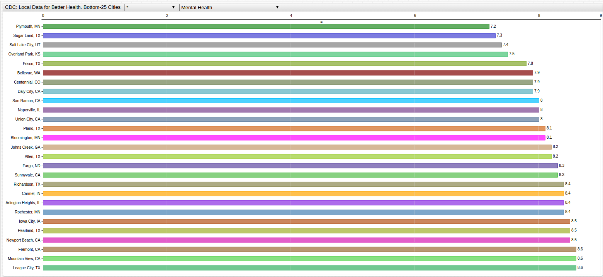

# 500 Cities: Local Data for Better Health

## Keywords

`LAST`, `GROUP BY`, `grouping`, `ORDER BY`, `ordering`, `LIMIT`, `horizontal`, `hide-empty-columns`, `legend-position`, `sort`, `list`, `group`, `tags`

## Overview

Learning about the local health of your favorite city has never been easier. With help from
data stored in the [Axibase Data Catalog](https://axibase.com/datasets/socrata/6vp6-wxuq.html) released by [The Centers for Disease Control and Prevention](https://www.cdc.gov/) (CDC) plus
visualization and querying tools in ATSD, spotting your city's place in the rankings
is not just for your health, but vital to informing your company's next health-related venture
or enhancing the already existing knowledge of your staff with such valuable public data.

The [500 Cities Project](https://www.cdc.gov/500cities/index.htm) uses self-reporting and census-style data-gathering methodology
to engage in the country-wide conversation about public health using small-area samples from the 500 largest cities in the nation.
That means cities like Los Angeles and New York are broken up into smaller segments to give a better picture of
the public health indicators of any given location. The information is then presented in a straightforward
and easy to understand format that simply shows the percent of respondents who answered in the affirmative to a particular question,
creating simple solutions for sometimes complex data problems.

Which US city really is the healthiest? Well if you ask them, almost 20% of Youngstown,
Ohio residents responded positively when asked in they are in good health.



[](https://apps.axibase.com/chartlab/1e6f3425/3/#fullscreen)

```sql
SELECT TAGS.placename, TAGS.stateabbr, LAST (VALUE)
  FROM  phlth_crudeprev
GROUP BY TAGS.placename, TAGS.stateabbr, VALUE
  ORDER BY VALUE DESC
LIMIT 25
```

| `tags.placename` | `tags.stateabbr` | `last(VALUE)` |
|----------------|----------------|-------------|
| Youngstown     | OH             | 19.8        |
| Gary           | IN             | 19.5        |
| Reading        | PA             | 19.1        |
| Flint          | MI             | 18.7        |
| Cleveland      | OH             | 18.6        |
| Camden         | NJ             | 18.6        |
| Detroit        | MI             | 18.5        |
| New Bedford    | MA             | 18.3        |
| Macon          | GA             | 18.3        |
| Lynwood        | CA             | 18.3        |
| Birmingham     | AL             | 18.3        |
| Hialeah        | FL             | 18.0        |
| Fall River     | MA             | 18.0        |
| Compton        | CA             | 17.9        |
| San Bernardino | CA             | 17.9        |
| Hemet          | CA             | 17.9        |
| Dayton         | OH             | 17.7        |
| Springfield    | MA             | 17.7        |
| Lawrence       | MA             | 17.7        |
| Fort Smith     | AR             | 17.3        |
| South Gate     | CA             | 17.3        |
| Passaic        | NJ             | 17.1        |
| Brownsville    | TX             | 17.0        |
| Miami          | FL             | 16.9        |
| Albany         | GA             | 16.9        |

What about the least physically healthy cities?



[](https://apps.axibase.com/chartlab/1e6f3425/4/#fullscreen)

```sql
SELECT TAGS.placename, TAGS.stateabbr, LAST (VALUE)
  FROM  phlth_crudeprev
GROUP BY TAGS.placename, TAGS.stateabbr, VALUE
  ORDER BY VALUE ASC
LIMIT 25
```

| `tags.placename`  | `tags.stateabbr` | `last(VALUE)` |
|-----------------|----------------|-------------|
| Plymouth        | MN             | 6.8         |
| Frisco          | TX             | 6.9         |
| Fishers         | IN             | 7.1         |
| College Station | TX             | 7.3         |
| Overland Park   | KS             | 7.5         |
| Cambridge       | MA             | 7.5         |
| San Ramon       | CA             | 7.5         |
| Fargo           | ND             | 7.5         |
| Allen           | TX             | 7.6         |
| Boulder         | CO             | 7.6         |
| Carmel          | IN             | 7.7         |
| Ann Arbor       | MI             | 7.7         |
| Johns Creek     | GA             | 7.7         |
| Iowa City       | IA             | 7.8         |
| Naperville      | IL             | 7.8         |
| Irvine          | CA             | 7.8         |
| Sugar Land      | TX             | 7.9         |
| Newton          | MA             | 7.9         |
| Alexandria      | VA             | 8.0         |
| Olathe          | KS             | 8.0         |
| League City     | TX             | 8.0         |
| Mountain View   | CA             | 8.0         |
| Rochester       | MN             | 8.1         |
| Lawrence        | KS             | 8.1         |
| Cary            | NC             | 8.1         |

Of course, physical health is only half of the total picture; mental health is another
important metric for gauging overall public health, which city has the most
stable demeanor, and perhaps more interestingly, what city considers itself to have
the lowest level of mental health?



[](https://apps.axibase.com/chartlab/1e6f3425/5/#fullscreen)

```sql
SELECT TAGS.placename, TAGS.stateabbr, LAST (VALUE)
  FROM mhlth_crudeprev
GROUP BY TAGS.placename, TAGS.stateabbr, VALUE
  ORDER BY VALUE DESC
LIMIT 25
```

| `tags.placename` | `tags.stateabbr` | `last(VALUE)` |
|----------------|----------------|-------------|
| Reading        | PA             | 18.4        |
| New Bedford    | MA             | 18.2        |
| Fall River     | MA             | 18.1        |
| Camden         | NJ             | 17.7        |
| Flint          | MI             | 17.6        |
| Youngstown     | OH             | 17.4        |
| Springfield    | MA             | 17.4        |
| Cleveland      | OH             | 17.3        |
| Detroit        | MI             | 17.2        |
| Dayton         | OH             | 17.1        |
| Gary           | IN             | 17.0        |
| Lynwood        | CA             | 17.0        |
| Birmingham     | AL             | 17.0        |
| Lawrence       | MA             | 16.9        |
| Brockton       | MA             | 16.7        |
| San Bernardino | CA             | 16.7        |
| Macon          | GA             | 16.6        |
| Compton        | CA             | 16.5        |
| Canton         | OH             | 16.4        |
| Memphis        | TN             | 16.4        |
| Trenton        | NJ             | 16.4        |
| Albany         | GA             | 16.3        |
| Tuscaloosa     | AL             | 16.3        |
| Hartford       | CT             | 16.2        |
| Muncie         | IN             | 16.1        |

And it would not be any fun with the bottom twenty-five as well, included below:



[](https://apps.axibase.com/chartlab/1e6f3425/4/#fullscreen)

```sql
SELECT TAGS.placename, TAGS.stateabbr, LAST (VALUE)
  FROM mhlth_crudeprev
GROUP BY TAGS.placename, TAGS.stateabbr, VALUE
  ORDER BY VALUE ASC
LIMIT 25
```

| `tags.placename`    | `tags.stateabbr` | `last(VALUE)` |
|-------------------|----------------|-------------|
| Plymouth          | MN             | 7.2         |
| Sugar Land        | TX             | 7.3         |
| Overland Park     | KS             | 7.5         |
| Frisco            | TX             | 7.8         |
| Centennial        | CO             | 7.9         |
| Bellevue          | WA             | 7.9         |
| Naperville        | IL             | 8.0         |
| San Ramon         | CA             | 8.0         |
| Bloomington       | MN             | 8.1         |
| Plano             | TX             | 8.1         |
| Allen             | TX             | 8.2         |
| Johns Creek       | GA             | 8.2         |
| Sunnyvale         | CA             | 8.3         |
| Fargo             | ND             | 8.3         |
| Arlington Heights | IL             | 8.4         |
| Rochester         | MN             | 8.4         |
| Carmel            | IN             | 8.4         |
| Richardson        | TX             | 8.4         |
| Pearland          | TX             | 8.5         |
| Newport Beach     | CA             | 8.5         |
| League City       | TX             | 8.6         |
| Mountain View     | CA             | 8.6         |
| Fremont           | CA             | 8.6         |
| Alexandria        | VA             | 8.7         |
| Olathe            | KS             | 8.7         |

The CDC has included over a dozen such metrics, ranging from diabetes to dental
health, and asthma to arthritis. Open ChartLab with the button below any of the charts
show above and navigate the rest of this analytical gold mine yourself to find your favorite
(or least favorite) city using the drop-down list at the top of the display to select the city and metric.
