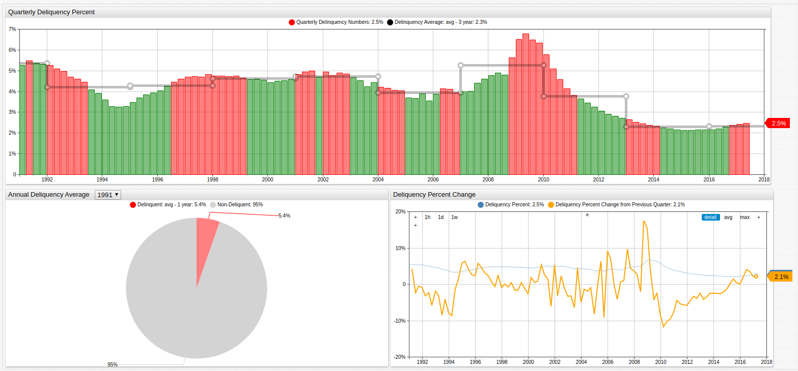

# Credit Card Loan Delinquency at 25 Year Low

> Open the ChartLab visualization above to modify the years of observation in any of the three graphs.

**Data Source**: [Federal Reserve Economic Data](https://fred.stlouisfed.org/series/DRCCLACBS#0)

**Visualization Tool**: [Axibase Time Series Database](https://axibase.com/docs/atsd/)

Since credit card loan delinquency rose to almost seven percent at the height of the most recent global recession, United States
consumers have shown a positive trend in reducing the percent of consumers paying off their personal credit card debt delinquently.
Credit card loan delinquency is often a sign of downturn in the amount of household income present and puts a strain on
loan outfits who may not be prepared to not recoup those assets.

The visualization above tracks credit card loan delinquency by quarter from 1991 to the most recent second quarter data from 2017.
The black line tracks the three year average of that delinquency rate and if a given quarter is higher than the three-year
average value, it is shown in red. Although American consumers have been ahead of the curve for the majority of the time
since the recession ended, the last four consecutive quarters have shown higher than average delinquency rates.

The graph on the bottom left tracks the annual average delinquency rate, while the graph on the bottom right tracks the
quarterly percent change in delinquency rate.
