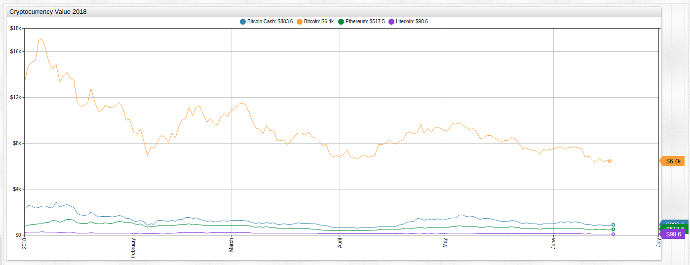
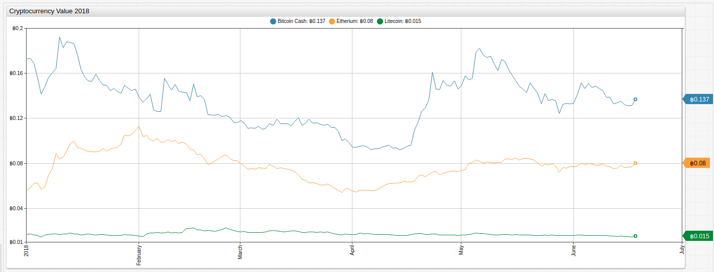
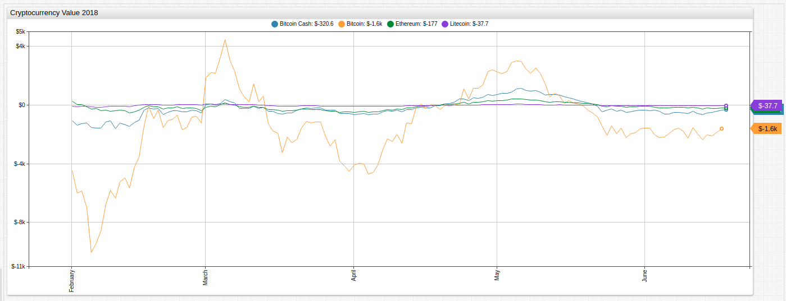
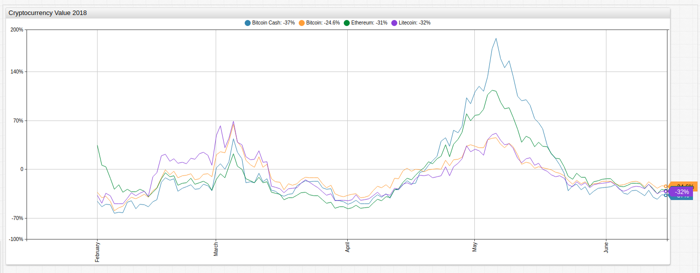
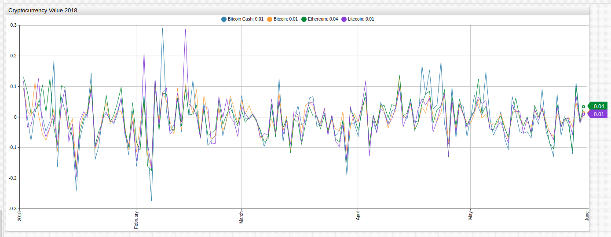
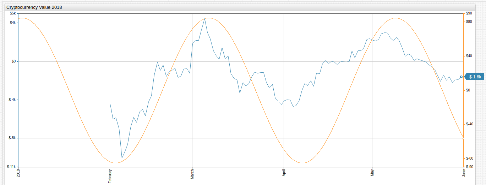

# Tracking 2018 Cryptocurrency Value

Although in existence since 2009, the world's first cryptocurrency Bitcoin did not begin making headlines until 2014 when the digital asset's value grew almost 1,000% in a matter of days, jumping from under $100 to almost $1,000. Then it happened again in 2017 at an even larger scale, when Bitcoin was valued at nearly $20,000 for a single coin.

Things have cooled off slightly for `BTC`, as its known on the digital currency news and analysis site [CoinDesk](https://www.coindesk.com/) but the sustained popularity of Bitcoin has led to the creation of hundreds of other similar products.

The relevance of the technology, and the acceptance of digital currency in general, was given a significant boost recently when the Federal Reserve [announced](https://news.research.stlouisfed.org/2018/06/fred-adds-cryptocurrency-series/) that it would begin hosting cryptocurrency pricing data on its economic data website [FRED](https://research.stlouisfed.org/).

## Bitcoin Index

Cryptocurrency movement against the dollar has always been volatile. This visualization tracks the value of Bitcoin against the other three cryptocurrencies showing that the same volatility is present when comparing cryptocurrencies with one another. Both Bitcoin Cash and Litecoin moved upwards or downwards more than 50% at least once in the 6-month observation period.

## Mathematical Functions

This article tracks the four hosted cryptocurrency's prices for 2018 and transforms the underlying data using [user-defined functions](https://github.com/axibase/charts/blob/master/syntax/udf.md#user-defined-functions) in ATSD and [ChartLab](../../tutorials/shared/chartlab.md). The [`fred.js`](../../tutorials/shared/trends.md#fred-library) library is a collection of mathematical functions used to transform the FRED data.

### Monthly Change

Although Bitcoin had the largest absolute movement during the observed period, each currency behaved similarly.

### Monthly Percent Change

Cryptocurrency markets fluctuate at surprisingly similar rates when comparing month-on-month changes.

### Log Return

The log return of a dataset is computed `log(value_t/value_t-1)`. By creating the argument using a [consecutive value calculation](../../tutorials/subtract-subsequent-values/README.md#charts-functions) and applying the natural logarithm function, log returns may be used to quickly estimate and compare asset performance.

Although similar to [discrete returns](#monthly-change) log returns are helpful for comparing assets of different orders of value. This is a helpful operation when comparing the movement of `BTC` (average value $7000) to `LIC` (average value $200).

## Dow Theory

Comparing Bitcoin monthly value change to the `sine` function demonstrates the semi-regular periodicity of asset value [hypothesized](https://en.wikipedia.org/wiki/Dow_theory) by Charles H. Dow over 100 years ago. As Dow's theory was meant to explain the cyclical nature of asset valuation caused by human factors, applying the principle to the intrinsically valueless cryptocurrency is an interesting study.

## Different Prices, Similar Story

Comparing absolute returns, percent returns, and log returns shows that although each of the four selected cryptocurrencies are used by a variable number of consumers for a variable number of transactions, and valued on significantly different orders of magnitude, the patterns of returns are quite similar.

Although it may prove not to be economically viable as a means of currency, blockchain technology is already [being implemented](http://fortune.com/2017/12/26/blockchain-tech-companies-ibm/) in a number of other industries to ensure data consistency and security.