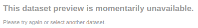
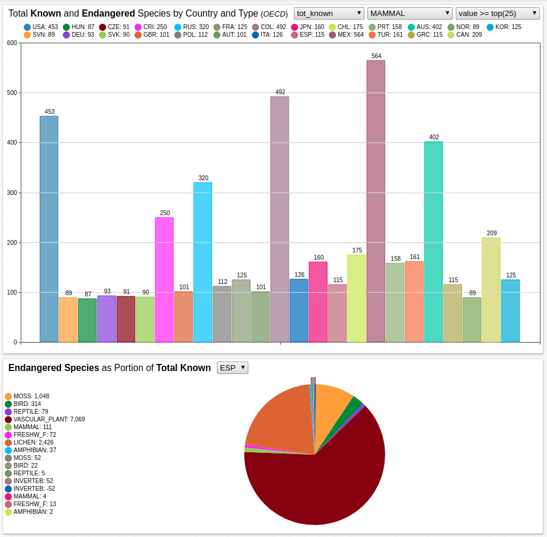

# Total Known and Endangered Species by Country and Type

## Overview

* The Organization for Economic Co-operation and Development (OECD) maintains the database [**OECD.Stat**](https://stats.oecd.org/), which tracks data and metadata for OECD and non-member countries.
  * One such dataset is [**Threatened Species**](https://stats.oecd.org/Index.aspx?DataSetCode=WILD_LIFE) (Dataset Code: `WILD_LIFE`), which records the number of total known species and those recognized as endangered, critical, threatened, and vulnerable by country.
  * Native OECD visualization is currently unavailable for this particular dataset.

    

* The upper [Bar Chart](https://axibase.com/docs/charts/widgets/bar-chart/) tracks all included data, and allows for sorting based on value, metric, and species.
* The lower [Pie Chart](https://axibase.com/docs/charts/widgets/pie-chart/) tracks data by country; endangered species are shown as a portion of the whole.
* Use the [drop-down lists](https://axibase.com/docs/charts/configuration/drop-down-lists.html) to filter data.
  * Metrics with the annotation `_ind` refer to those statistics for indigenous species.

## Keywords

`expand`, `list`, `drop-down`, `column-label-format`, `expand`, `group-by`

## Graphics

[](https://apps.axibase.com/chartlab/4531593b#fullscreen)



## Syntax Features

* [`expand`](https://axibase.com/docs/charts/widgets/pie-chart/#expand) setting for endangered species in lower Pie Chart.

```ls
[series]
  expand = true
```

* [`[dropdown]`](https://axibase.com/docs/charts/configuration/drop-down-lists.html#drop-down-lists) heading controls the structure and content of drop-down lists.

```ls
[dropdown]
  options = @{metrics.escape()}
  change-field = column.series.metric
```

* [`list`](https://axibase.com/docs/charts/syntax/control-structures.html#list) control structure to create human-readable legends.

```ls
list classifications = MAMMAL,
        BIRD,
        REPTILE,
        AMPHIBIAN,
        VASCULAR_PLANT,
        FISH_TOT,
        MARINE_F,
        FRESHW_F,
        INVERTEB
endlist
```

* [`column-label-format`](https://axibase.com/docs/charts/widgets/bar-chart/#column-label-format) setting hides lower column formatting.

```ls
column-label-format = &nbsp;
```