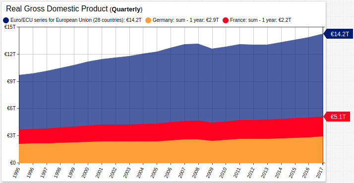

# The Practicality of A True European Army

> Germany and France represent a large portion of the total real GDP in Europe. Source: Federal Reserve database [FRED](https://fred.stlouisfed.org/)

## Overview

On 6 November, 2018 in the forever-haunted Verdun (or as it was known at the time of the battle to be commemorated, *Verdun-sur-Meuse*) ahead of a ceremony marking the centenary remembrance of the end of hostilities in Europe during the First World War, French President Emmanuel Macron enunciated the need for a true European army.[1](https://www.bbc.com/news/world-europe-46108633) Within several days, German Chancellor Angela Merkel voiced her support for the notion before the European Parliament in Strasbourg.[2](https://multimedia.europarl.europa.eu/en/debate-on-the-future-of-europe-opening-statement-by-angela-merkel-german-federal-chancellor-_I162933-V_rv) Within hours of both events, and indeed during Chancellor Merkel's speech itself, critics of the idea intervened to resonate their displeasure with or, in the case of the President of the United States, offense at the suggestion.[3](https://www.ft.com/content/11944bce-e485-11e8-8e70-5e22a430c1ad) Even those who spoke in favor of the plan, underlined that despite recent increases in European defense budgets, an army on the level of which Macron spoke is still a distant ambition.[4](https://news.sky.com/story/emmanuel-macron-calls-for-real-european-army-to-defend-against-russia-and-us-11546376)

## Economic Imperative

The chart above visualizes the Franco-Germanic proportion of real European Union gross domestic product, with inflation measured from 2010 Euro valuation, and highlights both the paradox and opportunity therein. France and Germany together represent roughly 35% of the whole, albeit down from 37% in 1995, and as such are the only European nations fit to administer or finance dramatic increases in defense spending throughout the continent. Conversely, the overall rate of growth in Germany, France, and indeed the European Union as a whole has seldom exceeded the oft-targeted 3% per annum.

Nonetheless, President Macron's appeal is a far cry from the rearmament of the 1930s, whereby combatant nations increased military armament production in some cases up to five times their pre-war levels.[5](https://warwick.ac.uk/fac/soc/economics/staff/mharrison/public/ehr88postprint.pdf) In fact, despite nearly universal criticism, President Macron's suggestion could represent an important evolution of the current world order; European security in the hands of European nations would deliver a tangible increase in European Union autonomy and potentially reinvigorate the beaurocratic body, which some experts have already begun to eulogize.[6](https://www.hoover.org/research/why-europe-gets-no-respect)

President Trump has made known his displeasure with the amount of NATO spending pledged by Germany, France, and other member countries;[7](https://www.reuters.com/article/us-nato-summit/trump-claims-nato-victory-after-go-it-alone-ultimatum-idUSKBN1K135H) data shows that the combined efforts of Germany and France although significantly less in absolute terms, are in fact comparable in relative terms to United States outlays.

> Combined German and French military expenditures have drastically exceeded the European Union average and rank among the most significant in the world. Source: [World Bank Data](https://data.worldbank.org/indicator/MS.MIL.XPND.GD.ZS?end=2017&locations=DE-FR-US-EU-RU&start=1990)

Contravening NATO convention is not a new trend among French presidents: in 1967, erstwhile President Charles De Gaulle removed France from the alliance's military structure in protest of the domination of the decision-making structure by Great Britain and the United States.[8](https://www.nato.int/cps/en/natohq/opinions_139272.htm) President Macron's ambitions are diametrically opposed to those of De Gualle's; President Macron stated that President Trump's "America First" policy is demonstrative of the same protectionism which delayed U.S. involvement in both world wars and suggested Europe take a more active role in its own protection.

## Combined Accountability

Forever shackled to its role in the outbreak of both world wars, the modern German state has always styled itself as the beneficiary, rather than the guarantor, of modern security doctrine.[9](https://www.bbc.com/news/world-europe-40172317) However, German economic energy has continued to prove inextinguishable and perhaps its military should grow to reflect that productivity; since reunification and the birth of the new Germany in 1989, the formerly partitioned and heretofore occupied, albeit by allied troops, nation has already grown to the world's forth largest economy. Indeed, Germany is the only European nation whose GDP exceeds that of California.[10](https://www.businessinsider.com/california-economy-ranks-5th-in-the-world-beating-the-uk-2018-5)

Likewise, France has generally positioned itself as a war-intolerant nation: outspoken criticism of coalition efforts in Iraq,[11](https://www.thenation.com/article/france-united-states-iraq/) skepticism of NATO intervention in the former Yugoslavia,[12](https://www.washingtonpost.com/wp-srv/national/daily/sept99/airwar20.htm) and a general malaise with respect to U.S. operations in the former French colony of Vietnam throughout the seventies have all defined French foreign policy with respect to coalition warfare.[12](https://www.jstage.jst.go.jp/article/kokusaiseiji/2009/156/2009_156_156_90/_article)

> France and Germany need to increase military spending to make serious inroads towards a true European army. 
Source: Combined [FRED](https://fred.stlouisfed.org/) and [World Bank](https://www.worldbank.org/) data.

The charts above contrast dollar-denominated defense spending by a combined France and Germany (upper) and the United States (lower). At the moment, U.S. defense spending is around five and a half times larger in absolute terms. In order to match U.S. spending, both nations would be forced to increase defense spending a least threefold, individually. Thus, their combined output would be on the level of the United States.

If the historically antagonistic German and French states could reach an understanding and foster genuine military cooperation, the balance of power could swing westward for the first time in recent memory. The neutrality of the Low Countries, specifically Belgium, has always been tied to the delimitation of France and Germany,[13](http://faculty.virginia.edu/setear/students/jcs/neutrality.htm) but an environment of integrated cooperation might eliminate the need for the *de facto* buffer states. Indeed, the additional manpower, technology, and capitol from the disproportionately productive nation could even serve to bolster French and German investment in a common defense infrastructure.

## Conclusion

Not only is the European army initiative viable for defense purposes, it is likewise feasible financially. Thus far, reaction to President Macron's and Chancellor Merkel's unified ambition has been met with derision,[14](https://nationalinterest.org/feature/one-step-closer-bad-idea-european-union-army-23780) but there is nothing within the NATO framework which prevents both commands from working together in a synchronous fashion.[15](https://www.nato.int/cps/en/natohq/topics_50316.htm)

Indeed, much of the current United States and French military structure as well as the Supreme Allied Command of NATO demonstrate significant overlap; current Secretary of State James Mattis served in the role a decade ago and has since then been succeeded by consecutive French military officials.[16](https://act.nato.int/list-of-supreme-allied-commanders-atlantic)

> <i>"The most powerful weapon on Earth is the human soul on fire."</i> Ferdinand Foch, *The Principles of War* 1903[17](https://archive.org/details/principlesofwar00foch/page/n7)