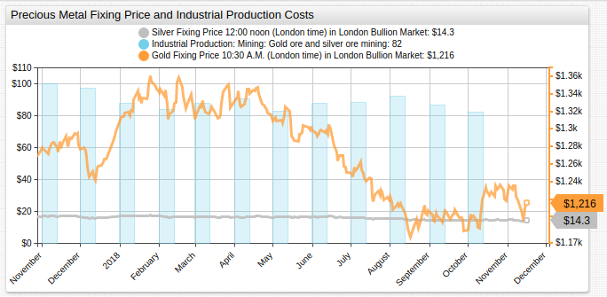
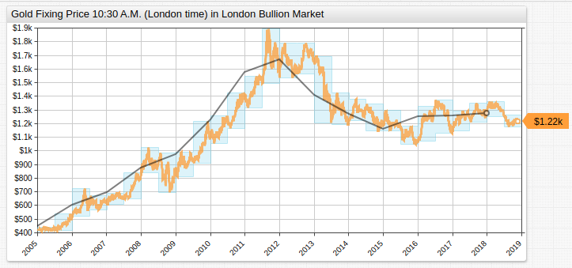

# Fixing Price for Precious Metals

## Overview

* Since [2018](#short-term-fixing-price) began, gold prices in the [London Bullion Market](http://www.lbma.org.uk/) have fallen 12.4%.
* [Long-term fixing price](#long-term-fixing-price) is still up compared to 2005 value, and equal when compared to 2010 value
* Indexed industrial production value at 82 (scale of 100), down from previous month value 87.
* Silver prices down 14% since January 2018.
* Month-on-month change tracked via [user-defined functions](https://axibase.com/docs/charts/syntax/udf.html).

## Graphics

### Short-Term Fixing Price

[](https://apps.axibase.com/chartlab/61de3cb1#fullscreen)



### Long-Term Fixing Price

[](https://apps.axibase.com/chartlab/25fbaef7#fullscreen)



## Syntax Features

* [`axis`](https://axibase.com/docs/charts/widgets/shared/#axis) to compare data of different orders of magnitude.

```ls
axis = right
# define axis for specified data.
```

* [`style`](https://axibase.com/docs/charts/widgets/shared/#widget-style) CSS style applied to series.

```ls
style = stroke-width: 3; opacity: 0.75
# define series, header, or overall widget styles
```

> Use [`header-style`](https://axibase.com/docs/charts/widgets/shared/#header-style) to customize widget header, or use the setting at the `[widget]` level to modify the entire widget.

* [`format`](https://axibase.com/docs/charts/syntax/format-settings.html#format-settings) controls displayed series and axis values.

```ls
format = '$' + currency
# formatting allows chart axis and value customization.
```