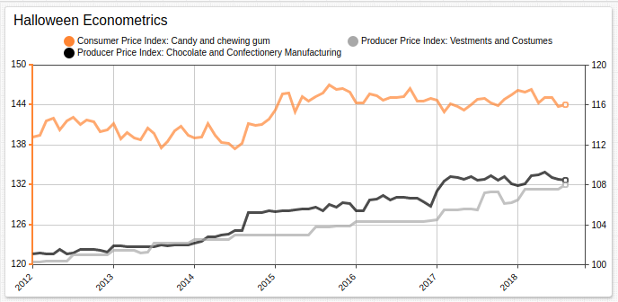
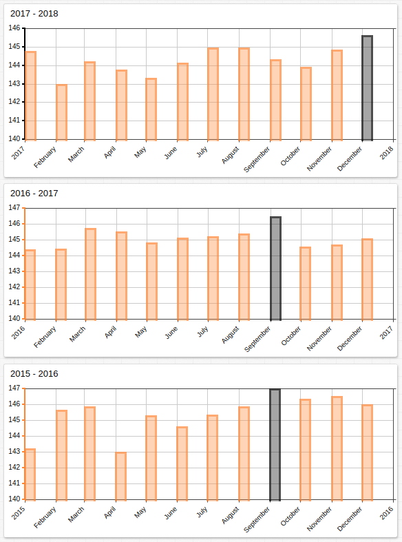
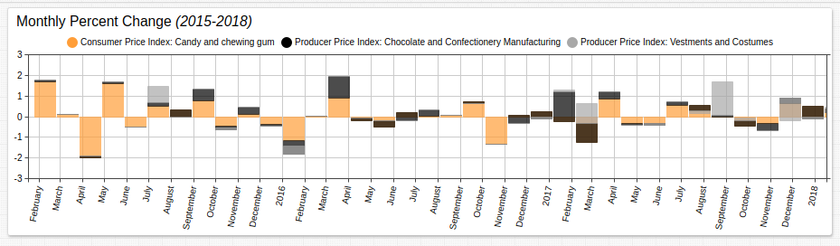
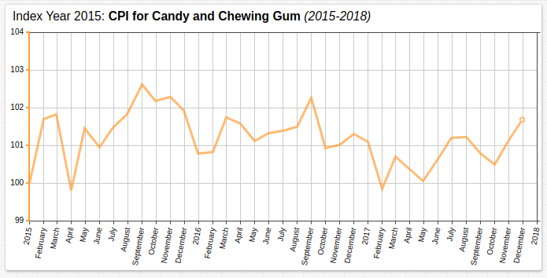

# The Econometrics of Halloween

## Overview

It turns out that the family member who insists on buying their Halloween candy after the actual holiday, but in the year before may be on to something.

Federal Reserve economic metrics show that CPI value for candy and chewing gum is wont to increase sharply around the holiday seasons: not just Halloween but New Year's Eve as well. This increase is not met with an analogous increase in PPI value during the same months.

## Spooky Spikes in Holiday Prices

The time charts below track monthly CPI value for candy and chewing gum for the most recent three years. The maximum value is highlighted with an [`alert-expression`](https://github.com/axibase/charts/tree/master/widgets/shared#alert-expression).

Notice that the greatest value for the cost of candy and sweets always falls during the fourth quarter of the year, suspiciously close to All Hallows' Eve? Uncanny!

## A Vampire's Ball

Using the [`MonthlyPercentChange`](https://github.com/axibase/charts/blob/master/syntax/udf.md#examples) function from the [user-defined function](https://github.com/axibase/charts/blob/master/syntax/udf.md) library `fred.js`, the monthly percent change value for each metric is calculated.

Each series is assigned a color, visible in the widget legend, and stacked with other series to show combined total increase or decrease with respect to percent value. The Halloween candy-price creep is demonstrated perfectly in 2015. October 2015 shows an increase in the CPI index for candy and chewing gum in August, followed by no change in September, another increase in October, a slight decrease the following month in November, and a final increase in December. Candy CPI value decreases each month in succession until the second-largest candy-giving day in the United States, Easter.

The good news is that during the last three years, despite seasonal increases, the overall price of products tracked by the Federal Reserve has not meaningfully increased.

## Conclusion

The anecdotal phenomena observed by unscrupulous savers across the country has real economic data to back it up. Those concerned with saving a little extra money this season can refer to the Federal Reserve database [FRED](https://fred.stlouisfed.org/) for further economic data to reinforce their holiday habits.

<big>Happy Halloween from Axibase!</big>