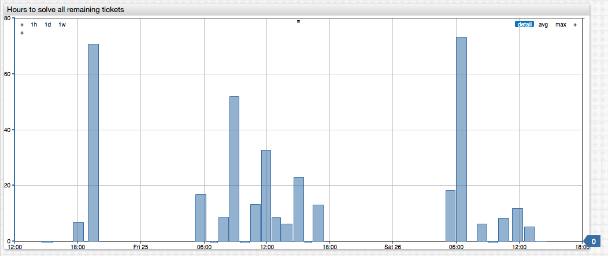

# Hetzner Outage, May 2018

If you're a [Hetzner](https://hetzner.de) hosting customer in Germany or elsewhere, you've likely found the service reliable and easy to manage. You're also likely to recommend it for its reasonable pricing with respect to bare computing and bandwidth services that Amazon and Google have yet to match. However, after the May 2018 power outage that affected all Hetzner primary data centers outside Nuremberg, there remain lessons to be learned- especially for dedicated server customers.

## Infrastructure Outage

An outage of this type typically affects shared resources at the data center level. Since `DC07`, `DC10`, and `DC12` source power from the same grid in Falkenstein, any problems that may occur affect all data centers simultaneously, which highlights the grid as a single point of failure.

In this particular case the temporary voltage spike caused a shutdown of both the network gear and dedicated servers in Hetzner data centers. The UPS backups failed to work for reasons to be investigated. While the network services restarted relatively quickly, the outage lasted several days. Many dedicated servers, some of which went down during the power outage and others taken down by customers in a futile attempt to reboot the servers with hardware resets, failed to boot.

Here is what happened to some of the Axibase servers according to the tickets addressed by Hetzner support.

```txt
Your server was stuck initializing the raid controller. After a reboot your server is back online.
# Downtime 9 hours
```

```txt
It was not starting any more so we had to replace it completely except for the drives. Now your OS is reachable again.
# Downtime: 32 hours
```

## Hetzner Status

The power outage was reported on May 24, 2018 at 09:30 UTC and affected many customers renting both virtual and dedicated servers.

Filing ticket for each affected server and watching the Hetzner status page for progress, a saved PDF copy of which is linked [here](./resources/hetzner-status.pdf) for reference. As it became clear that the outage would last more than a few hours Axibase started planning for the worst case scenario, estimating how much time it could take Hetzner support to fix the machines given their processing rate. As the situation stabilized, Hetzner began releasing reports about pending outage tickets.


[](https://apps.axibase.com/chartlab/984e6935/5#fullscreen)

## Time to Resolve

We used the reported counters as inputs to arrive at a rough time-to-resolution (TTR) estimate by dividing the ticket count by the hourly rate, calculated as delta value from the previous report.

```javascript
hourly_rate = -1 * (ticket_count - previous_ticket_count);
hours_to_fix = ticket_count / rate;
```

The reports are hourly with large gaps in the evenings and nights suggesting a shortage of resources during local non-business hours.

To adjust for the irregularity, we normalized the rate (time fields below are reported in milliseconds).

```javascript
hourly_rate = -1 * (ticket_count - previous_ticket_count)/(current_time - previous_time)*60*60000;
hours_to_fix = ticket_count / hourly_rate
```

Plugging these formulas in to a `replace-value` setting and calculated the time-to-repair via division of the count by the first derivative. This assumed that the servers would be the last to be fixed, abiding firmly by Murphy's law.



[](https://apps.axibase.com/chartlab/984e6935/7#fullscreen)

P.S. Axibase servers were recovered earlier than that, the longest outage lasting about 32 hours.
