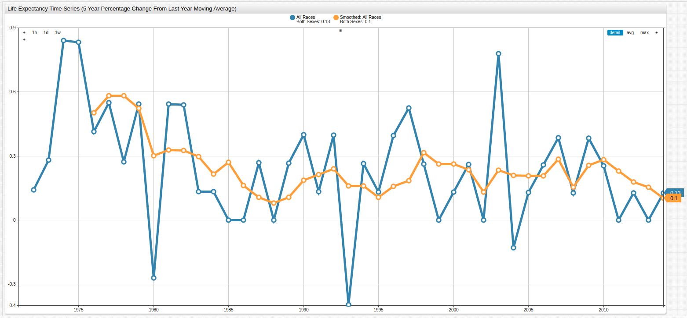
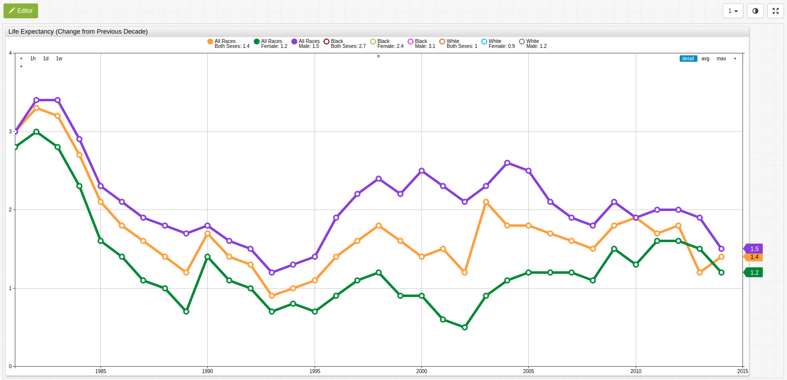

# Slow Growth is Becoming a Human Trend Too


[](https://trends.axibase.com/a31598af#fullscreen)

*Fig 1.* The above chart shows United States life expectancy figures for the last three and a half decades contrasted against the age-adjusted death rate per 100,000 persons.

## Overview

The slowing growth of the American economy is at the forefront of many investors' minds; the United States has not seen 3% annual GDP growth for over a decade, which many analysts consider to be a fairly modest goal. Meanwhile, developing countries like China and India have consistently seen twice that amount for more than thirty years now. As [US debt](../../research/analysis/the-new-bubble/README.md) remains nearly three times the size of British debt, the country with the second largest public debt in the world, and the Social Security Administration is [preparing to cope](../../research/aging-america/README.md) with the growing number of would-be applicants, another phenomenon is garnering more and more attention: average life expectancy.

The number of Social Security recipients is growing all the time and those recipients are living for longer each year. At the same time, the number of live births is still on the decline and the number of people paying in to these already over-taxed systems is decreasing. Social Security and other disability-aid systems, often collectively referred to as "entitlements" need to be addressed by any administration that is truly interested in reversing the potentially precipitous fall from economic grace of America.

### Objectives

Track life expectancy growth using calculated series in [Axibase Times Series Database](https://axibase.com/docs/atsd/) with statistical functions optimized for time series processing. Use data visualizations to illustrate growth trends.

## Data

This data is sourced from the Center for Disease Control and Prevention.

* [NCHS - Death rates and life expectancy at birth](https://catalog.data.gov/dataset/age-adjusted-death-rates-and-life-expectancy-at-birth-all-races-both-sexes-united-sta-1900)

Data is visualized using **Trends** service from Axibase, a public data repository with subsets of public data from organizations like the United States Federal Reserve, SEC, FCC, the Central Bank of Israel, and other government agencies. to replicate data visualizations in a local ATSD instance see the [Resources](#resources) section of this article.

## Methodology

1. Visualize Datasets using [**Trends**](https://trends.axibase.com/);
2. Implement formulas to derive calculated series;
3. Use statistical functions to transform the dataset.
4. Compare the original and transformed datasets in one visualization.

## Visualization

### Change in Age Expectancy from Previous Decade

Open the **Trends** visualization to toggle secondary datasets on and off using the labeled buttons along the top of the visualization.


[](https://trends.axibase.com/172ff342#fullscreen)

*Fig 2.* Using a variable `value` expression and a `time-offset` setting, previous-year data may be compared to current-year data to show the diminishing growth of life expectancy from all measured metrics. The [Box Chart](https://axibase.com/products/axibase-time-series-database/visualization/widgets/box-chart-widget/) below the [Time Series](https://axibase.com/products/axibase-time-series-database/visualization/widgets/time-chart/) chart tracks the distribution range of values and shows that the average growth rate of the life expectancy has not achieved for the last several years from all tracked demographics.

The `value` expression using to derive the above series is shown here:

```sql
value = var v = value('x'); var p = value('y'); if(p!=null && v!=null) return v - p
```

To create such a series in a local **Trends** instance, use this syntax as a template:

```ls
[group]
  [widget]
    type = chart
    title = Life Expectancy (Change from Previous Decade)
     [tags]
      race = *
      sex = *

  [series]
    display = false
    alias = cle

  [series]
      time-offset = 10 year
      display = false
      alias = cleo

  [series]
      label-format = tags.race\ntags.sex
      style = stroke-width: 5
      value = var v = value('cle'); var p = value('cleo'); if(p!=null && v!=null) return v - p
```

For both series used to calculate the derived series, an `alias` is applied and the `display` setting is `false`. The `time-offset` setting is applied to a second identical dataset and used in the third **[series]** expression. For metrics with multiple tags, [wildcard](https://axibase.com/products/axibase-time-series-database/visualization/widgets/configuring-the-widgets/) (`*`) symbols are used. Metric tag labels are set automatically using [label formatting](https://axibase.com/products/axibase-time-series-database/visualization/widgets/label-formatting/) settings.

### Compounded Decadal Rate of Change

Because changes in life expectancy may fluctuate dramatically, compounding the decadal rate of change is useful to smooth such volatility across the entire trend line.


[](https://trends.axibase.com/e9e54d0f#fullscreen)

*Fig 3.* Because compounded rate of change is an iterative set of added values, the individual points along the trend line display even more variance than before but the slope of the line is shown to be distinctly negative.

Once again, a `value` expression is used to derive the above series, but here a JavaScript `Math.` library is used to create an exponential argument:

```ls
value = (Math.pow(( value("x") / previous("x") ), 12) - 1)
```

The underlying configuration is shown here:

```ls
[group]
  [widget]
    type = chart
    entity = catalog.data.gov
    metric = average_life_expectancy_(years)
    title = Life Expectancy (Compounded Annual Change)

    [series]
      display = false
      alias = cle
      [tags]
      race = *
      sex = *

    [series]
      label-format = tags.race\ntags.sex
      style = stroke-width: 5
      value = (Math.pow(( value("cle") / previous("cle") ), 120) - 1)
      format = %
```

The `previous` function is used to select the entry preceding the current value.

### Moving Average Statistical Function

While the compounded annual rate of change for this dataset showed the overall downward trend of the growth in life expectancy figure, it failed to smooth the individual points along the trend line and exaggerated them in some places.

The moving average [statistical function](https://axibase.com/products/axibase-time-series-database/visualization/widgets/configuring-the-widgets/aggregators/) is a native ATSD aggregator which records a new average value for some number of index positions, in this case each index position represents one year.


[](https://trends.axibase.com/0533f119#fullscreen)

*Fig 4.* Not only is the general downward slope of the trend line visible but most of the dramatically varied data points have been smoothed, moving them closer to the median value. The upper time series chart shows the smoothed data, the lower chart shows the original data for comparison.

To create such a series, add an additional **[series]** expression with a derived value using the Statistical Function syntax:

```ls
value = avg('series', 'time')
```

Where `series` is the `alias` of the series from which the new series is derived and `time` is the period for which the moving average is calculated.

The configuration above may be used a template for additional user-derived series:

```ls
[group]
  [widget]
    type = chart
    entity = catalog.data.gov
    metric = average_life_expectancy_(years)
    title = Life Expectancy Time Series (5 Year Percentage Change From Last Year Moving Average)

    var seriesDescriptors = getSeries("average_life_expectancy_(years)", "catalog.data.gov")

    for descriptor in seriesDescriptors

      [series]
        alias = cle-@{descriptor.tags.race}-@{descriptor.tags.sex}
        display = false
        [tags]
        race = @{descriptor.tags.race}
        sex = @{descriptor.tags.sex}

      [series]
        display = false
        value = (value('cle-@{descriptor.tags.race}-@{descriptor.tags.sex}')/previous('cle-@{descriptor.tags.race}-@{descriptor.tags.sex}')-1)*100
        alias = cleo-@{descriptor.tags.race}-@{descriptor.tags.sex}
        label-format = @{descriptor.tags.race}\n@{descriptor.tags.sex}

      [series]
        value = movavg('cleo-@{descriptor.tags.race}-@{descriptor.tags.sex}', 5)
        label-format = Smoothed: @{descriptor.tags.race}\n@{descriptor.tags.sex}

    endfor
```

Instead of using a wildcard to access each tag for the given series, this configuration uses the `getSeries` function to load tag combinations from the server.

Compare the combined life expectancy data for both sexes and racial categories on one chart to see the effects of smoothing:


[](https://trends.axibase.com/1e7242d7#fullscreen)

*Fig 5.*: The original life expectancy change from previous year data is shown here with the same data after it the `movavg` function has been applied.

## Conclusion

The diminishing increase in United States life expectancy indicates that this rate of improvements may be as good as it gets for mankind. A number of [easily accessible](https://lmgtfy.com/?q=peak+life+expectancy) and recent resources have shown large research organizations coming to the same conclusion: sometime in the next 20 - 30 years we may see a complete flattening of that line. Despite the continuous increase in nutritional, performance-enhancing, and medical / surgical options, scientists are beginning to believe that current human life expectancy may not reach much higher than it already has.


[](https://trends.axibase.com/feeee62f#fullscreen)

*Fig 6.* Open the **Trends** visualization above and disable the series as shown to reproduce the above visualization showing that allow life expectancy continues to increase, the derivative rate of increase is approaching zero.

Under the assumption that human life expectancy increases roughly 1.4 years each decade and calculating from the current combined life expectancy value (78.9 years), American life expectancy will reach 100 in roughly 151 years. Stay tuned for updates.

## Resources

The following tools may be used to replicate these results in a local ATSD instance:

* Instructional [guide](../../integrations/shared/trends.md) for using **Trends**;
* [Death rates and life expectancy data](#data);
* Use this [guide](../../integrations/socrata/python/README.md) to quickly upload data.gov datasets to a local ATSD instance.
