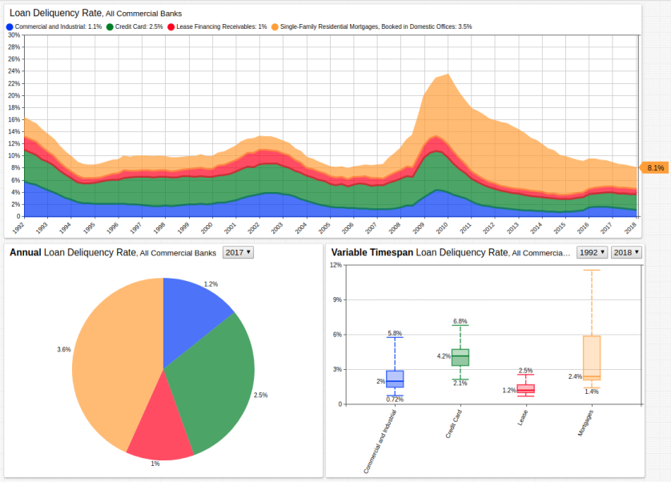

# Loan Delinquency Rates, All Commercial Banks

## Overview

* The Federal Reserve tracks loans in four distinct categories:
  * Commercial and Industrial
  * Credit Card
  * Lease Financing Receivables
  * Single-Family Residential Mortgages, Booked in Domestic Offices
* During the Great Recession, total delinquency rate reached more than 23%.
  * In 2008, total delinquency rate was 8.5%
  * Currently, total delinquency rate is 8.1%.
* Each individual category of loan delinquency has reached pre-recession levels <b>except</b> single-family mortgages.
* After it exceeded credit card loans for the first time in 2009, mortgage delinquency has remained the largest contributor to the overall loan delinquency rates.

## Keywords

`legend-position`, `label`, `markers`, `pointer-position`, `drop-down`, `histogram`, `header-style`

---

## Graphics

[](https://apps.axibase.com/chartlab/f1674d40#fullscreen)



---

## Syntax Features

* [`header-style`](https://axibase.com/docs/charts/widgets/shared/#header-style) setting applies CSS formating to widget header area.

```ls
header-style = background: white;display: flex;align-items: stretch;padding: 4px;width: auto;
```

* [`[dropdown]`](https://axibase.com/docs/charts/configuration/drop-down-lists.html#drop-down-lists) with [`range`](https://axibase.com/docs/charts/syntax/functions.html#range) function for timespan selection.

```ls
[dropdown]
  change-field = start-time
  options = @{range(1992,2017)}
```

* [`format`](https://axibase.com/docs/charts/syntax/format-settings.html#format-settings) setting for axis and value labeling.

```ls
[configuration]
  format = percent
```