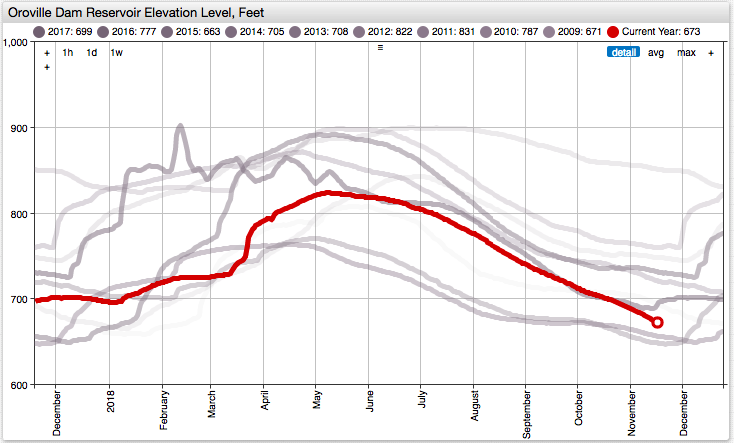

# Oroville Dam Reservoir Baselines

## Overview

* Oroville Dam water levels continue to be suppressed following the February, 2017 incident.
* Lagged time series facilitate year-on-year comparison and help determine the [baseline](https://axibase.com/docs/charts/configuration/baselines.html#baselines).
* Past series are de-emphasized using calculated opacity.

## Keywords

`last-marker`, `time-offset`, `hex code`, `range`, `context-path`, `for`

## Graphics

[](https://apps.axibase.com/chartlab/e0271c06)



## Syntax Features

* [`time-offset`](https://axibase.com/docs/charts/widgets/shared/#time-offset) setting to add time lag to the series.

```ls
[series]
  time-offset = @{offset} year
  # time-offset = 1 year
```

* [`for`](https://axibase.com/docs/charts/syntax/control-structures.html#for) loop to add multiple lagged series.

```ls
for name in offsets
  # access current element by @{name}
endfor
```

* [`range`](https://axibase.com/docs/charts/syntax/functions.html#range) function to generate a numeric sequence, for example a range of years by which the series is shifted to the past. The function can be invoked inline.

```ls
# define named array
var offsets = range(1,20)
# inline array
for offset in range(1,10)
```