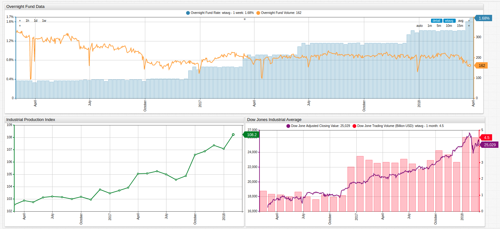

# The Creeping Overnight Fund Rate

## Keywords

`axis`, `style`, `format`, `statistic`, `period`, `format`, `wtavg`

* **Overnight Fund Data**: This charts uses an [`axis`](https://axibase.com/docs/charts/widgets/shared/#axis) setting to compare two series measured in different units, the Overnight Fund Rate and the Overnight Fund Volume. As expected, while interest rates are under 0.4%, overnight funding activity is the highest and as the Fed steadily raised rates, overnight fund volume steadily decreased.

* **Industrial Production Index**: The Industrial Production Index is a measure of real output from United States manufacturing, mining, and electric, and gas utilities. Because this time series data tracks a longer span of time that the target period, `start-time` and `end-time` [settings](https://axibase.com/docs/charts/widgets/shared/#data-loading) are used to display only the target period.

* **Dow Jones Industrial Average**: One of the best indicators of economic strength is stock market performance. Using the [`statistics`](https://axibase.com/docs/charts/widgets/shared/#statistics) setting and [weighted average `wtavg`](../../tutorials/weighted-avg/README.md) function, volatile trade volume values may be smoothed to show a rolling average for a specific time period. Here, the data is grouped by month and shown alongside the closing value of the stock market, which remains unmodified.

The overnight market is the shortest term loan market available, whereby banks borrow money overnight which must be repaid the following morning plus interest. Because of the extreme short term nature of these types of loans, they also have some of the lowest interest rates - typically reflective of the target interest rate mandated by the United States Federal Reserve.

This week, the Fed [announced](https://www.bbc.com/news/business-43489661) an increase of its target interest rate by 0.25% from 1.5% to 1.75% citing a stronger economic outlook in the future as a justification for the move. Fed Chairman Jay Powell also cited plans to increase the effective rate two more times during 2018.

An increased interest rate is among the top fears among stock market bears who feel that an increased rate could prevent the United States from making meaningful progress towards paying the over $21 trillion in outstanding debt that currently exists.