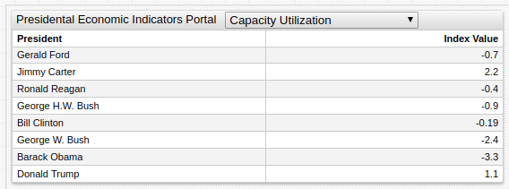

# Presidential Economic Metrics Portal


[](https://trends.axibase.com/24dd54d5)

## Overview

The portal above tracks economic metrics for American presidential administrations from Gerald Ford (1974-1977) to Donald Trump (2017-present). Open the portal and use the drop-down list to navigate between tracked metrics.

Each line is indexed to the beginning of the respective president's term in office. Thus, these metrics are tracked from that president's time in office to the present day.

The portal is available through the **Trends** service, which is a public instance of ATSD, the database responsible for the underlying data management and processing tasks used to create the visualization.

## Data

The underlying economic data used in this portal is sourced from the St. Louis Branch of the Federal Reserve data library [FRED](https://fred.stlouisfed.org/).

### Presidential Administrations

President | In Office | Portrait
:--:|:--:|:--:
Gerald Ford | August 9, 1974 - January 20, 1977 | 
Jimmy Carter | January 20, 1977 – January 20, 1981 | 
Ronald Reagan | January 20, 1981 – January 20, 1989 | 
George H.W. Bush | January 20, 1989 – January 20, 1993 | 
Bill Clinton | January 20, 1993 – January 20, 2001 | 
George W. Bush | January 20, 2001 – January 20, 2009 | 
Barack Obama | January 20, 2009 – January 20, 2017 | 
Donald Trump | January 20, 2017 - Present | 

### Economic Metrics

Metric | FRED ID | Units | Description
--|--|--|--|
[Consumer Price Index](https://fred.stlouisfed.org/series/CPIAUCSL) | `CPIAUCSL` | Index | The Consumer Price Index is a measure of the average monthly change in the price for goods and services paid by urban consumers between any two time periods.
[Real Gross National Product](https://fred.stlouisfed.org/series/A001RO1Q156NBEA) | `GNPC96` | Billions of Dollars | Gross national product (GNP) is the market value of all the goods and services produced in one year by labor and property supplied by the citizens of a country.
[National Income](https://fred.stlouisfed.org/series/A032RC1A027NBEA) | `A032RC1A027NBEA` | Billions of Dollars | National income is the monetary value of the final goods and services produced by an economy over a period of time.
[Corporate Profits Before Tax](https://fred.stlouisfed.org/series/A464RC1A027NBEA) | `A464RC1A027NBEA` | Billions of Dollars | Profit before tax (PBT) is a measure that looks at a company's profits before the company has to pay corporate income tax. It deducts all expenses from revenue including interest expenses and operating expenses except for income tax.
[GDP Per Capita](https://fred.stlouisfed.org/series/A939RC0A052NBEA) | `A939RC0A052NBEA` | Dollars | The Gross Domestic Product of the United States per individual.
[Average Sale Price of Houses](https://fred.stlouisfed.org/series/ASPUS) | `ASPUS`| Dollars | The mean sale price of homes in the United States.
[Capacity Utilization](https://fred.stlouisfed.org/series/CAPUTLB50001SQ) | `CAPUTLB50001SQ` | Percent of Capacity |For a given industry, the capacity utilization rate is equal to an output index divided by a capacity index. The Federal Reserve Board capacity indexes attempt to capture the concept of sustainable maximum output-the greatest level of output a plant can maintain within the framework of a realistic work schedule, after factoring in normal downtime and assuming sufficient availability of inputs to operate the capital in place.
[Cash Surplus or Deficit](https://fred.stlouisfed.org/series/CASHBLUSA188A) | `CASHBLUSA188A` | Percent of GDP) |Cash surplus or deficit is revenue (including grants) minus expense, minus net acquisition of non-financial assets.

### Relative Economic Performance

Each Presidential administration serves as an index baseline for the respective metrics. Thus, comparisons to previous and future Presidents are observable. Of course, the efficacy of a particular administration is gauged by many more metrics than those shown here, such as foreign policy successes and failures, domestic social stability, and the posture of an administration with respect to other branches of government. Nonetheless, American prosperity has traditionally be grounded in economic growth and innovation making the portal an effective tool for inter-administrative comparisons.



[](https://trends.axibase.com/7fe16e8d)

This table tracks each metric through the first 100 days of the respective President's administration. Thus, since Gerald Ford took office in 1974, United States capacity utilization declined 0.7%. See the [Economic Metrics](#economic-metrics) table above for the units used for each metric.

## Creating the Portal

The Presidential Economic Indicators Portal features a number of syntax features enumerated below:

### User Defined Functions

Charts applications support [user defined functions](https://github.com/axibase/charts/blob/master/syntax/udf.md),
which are JavaScript files which comprise particular mathematical functions not available using typical Charts syntax.

This portal uses the [`fred.js`](https://apps-chartlab.axibase.com/portal/resource/scripts/fred.js)  library to modify the index position. This modification transforms data to reflect the selected administration.

```ls
[series]
  value = fred.Index('raw', '1974')
```

### Inline CSV

The portal contains an [inline CSV](https://github.com/axibase/charts/blob/master/syntax/functions.md#csv-inline-text-mode) file to define each of the tracked economic metrics and their associated `FRED ID`. The CSV is shown here:

```ls
csv metrics =
  name,id
  Consumer Price Index,CPIAUCSL
  Real Gross National Product,A001RO1Q156NBEA
  National income,A032RC1A027NBEA
  Corporate Profits Before Tax,A464RC1A027NBEA
  GDP per Capita,A939RC0A052NBEA
  Average Sale Price of Houses,ASPUS
  Capacity Utilization,CAPUTLB50001SQ
  Cash Surplus or Deficit(% GDP),CASHBLUSA188A
endcsv
```

This CSV list is used to by `[dropdown]` level settings to populate the [drop-down list](https://github.com/axibase/charts/blob/master/configuration/drop-down-lists.md) of available metrics

```ls
[dropdown]
  change-field = metric

  for option in metrics
    [option]
      text = @{option.name}
      value = @{option.id}
  endfor
```

The setting also features a [`for`](https://github.com/axibase/charts/blob/master/syntax/control-structures.md#for--endfor) statement, which is a [control structure](https://github.com/axibase/charts/blob/master/syntax/control-structures.md) that iterates over the CSV array to read each `name` and `id`. The `name` field is added to the drop-down list and the `id` is passed to the `metric` setting to refactor the visualization.

## Action Items

* To begin work within the **Trends** environment, refer to the [Getting Started Tutorial](../../tutorials/shared/trends.md).
* For more information about ATSD, or to deploy a local instance, see [ATSD Documentation](https://axibase.com/docs/atsd/).
* For complete Charts syntax, refer to the [Charts Documentation](https://github.com/axibase/charts).
* To access raw datasets, append the `FRED ID` of any metric to the URL `https://fred.stlouisfed.org/series/` or use the links in the [Economic Metrics](#economic-metrics) table above.
* To view all metrics stored in the **Trends** environment, refer to the [Reference Catalog](https://trends.axibase.com/public/reference.html).