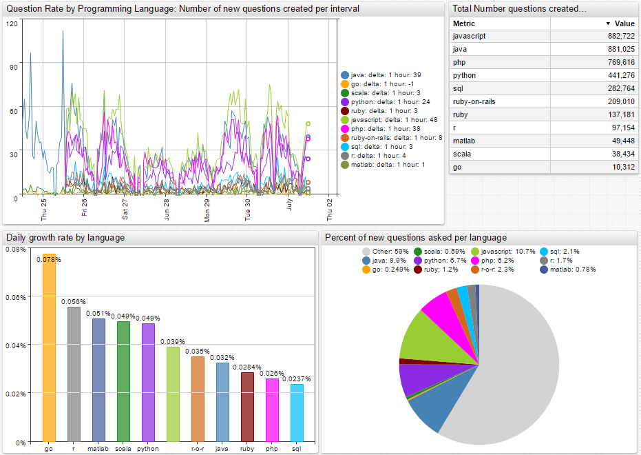
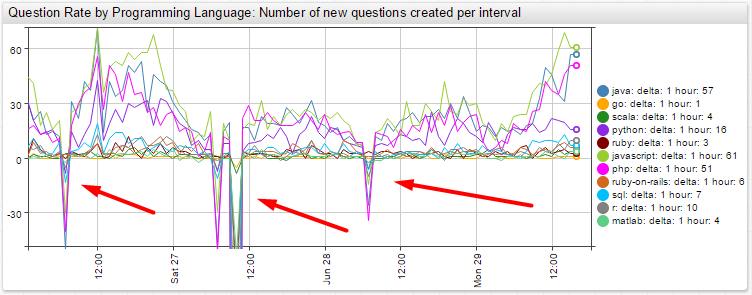

# Tracking Programming Language Popularity on Stack Overflow



[](https://apps.axibase.com/chartlab/c1acecc0)

The total number of questions asked shows that there are three programming languages far ahead of others in terms of popularity: Java, Javascript, and PHP.

## Languages

Using Stack Exchange API to collect hourly data for the following programming languages, via the respective tags:

* [Java](https://go.java/index.html)
* [Go](https://golang.org/)
* [Scala](https://www.scala-lang.org/)
* [Python](https://www.python.org/)
* [Ruby](https://www.ruby-lang.org/en/)
* [Javascript](https://www.javascript.com/)
* [PHP](https://php.net/)
* [Ruby on Rails](https://rubyonrails.org/)
* [SQL](https://en.wikipedia.org/wiki/SQL)
* [R](https://www.r-project.org/)
* [MATLAB](https://www.mathworks.com/products/matlab.html?s_tid=hp_products_matlab)

## Query

The [Stack Exchange API V2.2](https://api.stackexchange.com/docs/) allows anyone to track the number of questions asked and answered for a particular topic using tags.

The endpoint used to track programming language questions is: [/tags/{tags}/info](https://api.stackexchange.com/docs/tags-by-name)

This endpoint returns the total number of questions asked about a programming language tag. From the data, you can determine the number of new questions asked, the popularity of each language, and the growth in popularity for a particular language.

**Request**:

```sh
https://api.stackexchange.com/2.2/tags/java/info?site=stackoverflow
```

**Response**:

```json
{
    "items": [
        {
            "has_synonyms": true,
            "is_moderator_only": false,
            "is_required": false,
            "count": 880312,
            "name": "java"
        }
    ],
    "has_more": false,
    "quota_max": 300,
    "quota_remaining": 299
}
```

The retrieved data can also be found in the Stack Overflow user interface by searching for each language tag:


## Tools

[Axibase Collector](https://axibase.com/docs/axibase-collector/) is used to collect the data. A [JSON job](https://axibase.com/docs/axibase-collector/jobs/json.html) in Axibase Collector collects data for each of the programming language tags and stores it in the ATSD for [analytics](https://axibase.com/docs/atsd/rule-engine/) and [visualization](https://axibase.com/products/axibase-time-series-database/visualization/).


When viewing the portal, it is immediately noticeable that at some point in each day there is a negative change in question count.  After some investigating, it seems that this negative change is due to the cleanup of invalid or closed questions.



## Conclusion

This data is useful for many companies, programmers, and students. For example, at Axibase, we use the gathered information to help determine client library development prioritization.

The results also show the up-and-coming programming languages, which can be useful to students and programmers deciding what language specialization to pursue in their career or studies.

IDE vendors, like [JetBrains](https://www.jetbrains.com/) or [Eclipse](https://www.eclipse.org/), can find such data useful to see what new languages are gaining popularity and consider them for future products.

Authors covering programming languages can use this information when deciding what new languages to features in their works.