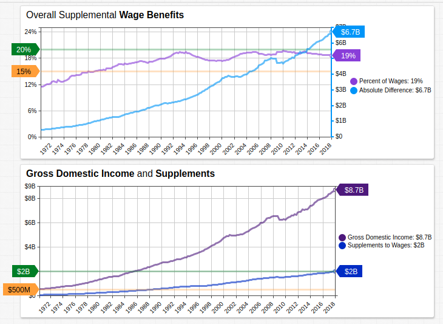
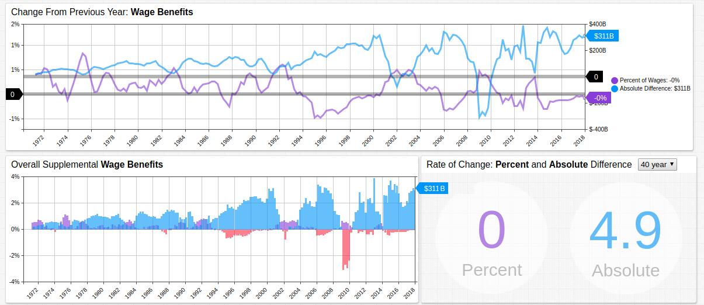
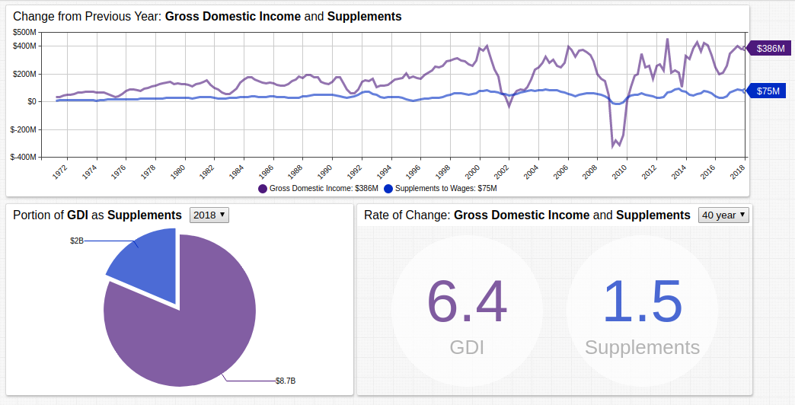

# Stag-cation: The Stagnation of Supplemental Benefits

> <i>"The most basic question is not, what is best? But rather, who shall decide what is best?"</i> Thomas Sowell

## Contents

* [Introduction: Supplemental Benefits Defined](#introduction-supplemental-benefits-defined)
* [Overview: Growth in Wages and Benefits](#overview-growth-in-wages-and-benefits)
* [Effectively Zero: Benefit Growth Does Not Exceed One Percent](#effectively-zero-benefit-growth-does-not-exceed-one-percent)
* [Measurable Differences: A Widening Gap in Wage and Benefit Growth](#measurable-differences-a-widening-gap-in-wage-and-benefit-growth)
* [Conclusion: The Benefit of Benefits](#conclusion-the-benefit-of-benefits)

### Source Data

* **Federal Reserve Economic Research**:
  * [Compensation of employees](https://fred.stlouisfed.org/series/A038RC1Q027SBEA): Supplements to wages and salaries (A038RC1Q027SBEA)
  * [Gross domestic income](https://fred.stlouisfed.org/series/A4102C1Q027SBEA): Compensation of employees, paid: Wages and salaries (A4102C1Q027SBEA)
* **World Bank**:
  * [Population](https://data.worldbank.org/indicator/SP.POP.TOTL), total
  * [GDP per capita](https://data.worldbank.org/indicator/NY.GDP.PCAP.CD) (current US$)

## Introduction: Supplemental Benefits Defined

In the course of four decades [supplemental benefits](https://fredblog.stlouisfed.org/2018/10/employer-contributions/), or non-wage compensation, paid to employees grew from 6.96% in 1950 to 17.96% in 1990. This sharp increase amounts to a 258% surge, which translates to roughly 6.5% *per annum*. Essentially, the initial rate of wage supplementation was the factor by which the value increased each year.

Examples of non-wage benefits:

* Medical and dental benefits
* Paid sick leave
* Pension plans
* Educational benefits
* Parental leave
* Paid vacation time
* Child care assistance
* Stock options

However, from 1990 to 2016 (26 years), that 17.96% increased to a final value of 18.81%, an increase of 0.85% which translates to roughly 0.03% each year. For all intents and purposes, the modern worker is receiving the same benefits as their 1990 counterpart. Moreover, when considered alongside the inflationary effects of a expanding money supply, modern workers are really receiving less.

## Overview: Growth in Wages and Benefits



[](https://apps.axibase.com/chartlab/01372a0a#fullscreen)

*Stagflation* is the economic phenomena which arises during intervals of high interest and low economic output. The result is a precarious situation where policymaker intervention can exacerbate the synchronous problem of high unemployment by any action which is pursued. *Stag-cation* (a portmanteau of stagnant and vacation) is a phenomena currently being evinced in the United States whereby the relative amount of non-wage benefits to employs is no longer growing at a meaningful rate.

Whereas wages continue to nominally rise, the percent of supplemental benefits, like those mentioned above, has reached a plateau.

## Effectively Zero: Benefit Growth Does Not Exceed One Percent



[](https://apps.axibase.com/chartlab/127f1979#fullscreen)

The advent of computing technology has eliminated literal billions of man-hours in the modern information era. Yet despite overall increases in wages, albeit mostly [commensurate with inflation](http://www.pewresearch.org/fact-tank/2018/08/07/for-most-us-workers-real-wages-have-barely-budged-for-decades/), huge leaps in time-saving technology have not created the idyllic, but evidently chimerical, [15-hour workweek](http://www.econ.yale.edu/smith/econ116a/keynes1.pdf) envisioned by Keynes in 1930.

The upper **Time Chart** shows year-on-year change for supplemental benefits as a percent of wages (lavender) and year-on-year change for the absolute growth of wages (blue). Because the two derived series are shown on independent axes, `0` is indicated for each using a `[threshold]`.

```ls
[threshold]
  value = 0
```

The lower left **Time Chart** highlights periods of negative growth for each derived metric in red and the **Text Widget** tracks the rate of the change for the defined interval.

## Measurable Differences: A Widening Gap in Wage and Benefit Growth



[](https://apps.axibase.com/chartlab/bac381bc#fullscreen)

Compare the absolute change, proportional relationship, and rate of change for wages and supplements. Although wage growth was negative numerous time throughout the observed period, the 40-year rate of change is four times that of supplemental benefits.

The drop-down list in the **Pie Chart** controls the `start-date` of the one-year aggregation period of wages compared to supplements, navigating through time demonstrates that the proportion of supplemental benefits to overall wages has changed very little in the last four decades. The drop-down list in the **Text Widget** controls the interval of aggregation to compare the rates of changes of the two metrics.

## Conclusion: The Benefit of Benefits

The table below combines data tracking [population](https://data.worldbank.org/indicator/SP.POP.TOTL), the [minimum number of vacation days](https://www.businessinsider.com/how-paid-vacation-time-is-different-around-the-world-2018-7#brazil-1) companies are required to provide for their employees, whether [parental leave](https://en.wikipedia.org/wiki/Parental_leave#Variation_in_international_law)`*` is provided by law, and [per capita GDP](https://data.worldbank.org/indicator/NY.GDP.PCAP.CD) by country.

> `*` Parental leave is defined as at least 30 days at 50% remuneration guaranteed by the employer for **either** parent.

Country | Population<br>(2017, Million) | Vacation Days | Parental Leave| Per Capita GDP<br>(2017)
--|:--:|:--:|:--:|:--:
Argentina | 44.27 | 14 | :x: | $14,401.97
Australia | 24.59 | 28 | :x: | $53,799.94
Brazil | 209.28 | 30 | :x: | $9,821.41
Canada | 36.71 | 14 | :heavy_check_mark: | $45,032.12
China | 1,386.40 | 5 | :x: | $8,826.99
Denmark | 5.76 | 25 | :heavy_check_mark: | $56,307.51
France | 67.11 | 25 | :heavy_check_mark: | $38,476.66
Japan | 126.79 | 20 | :heavy_check_mark: | $38,428.10
New Zealand | 4.79 | 28 | :heavy_check_mark: | $42,940.58
Pakistan | 197.02 | 14 | :x: | $1,547.85
Russia | 144.50 | 20 | :heavy_check_mark: | $10,743.10
Singapore | 5.61 | 14 | :x: | $57,714.30
South Africa | 56.71 | 21 | :x: | $6,160.73
Spain | 46.57  | 30 | :heavy_check_mark: | $28,156.82
Sweden | 10.07 | 25 | :heavy_check_mark: | $53,442.01
United Kingdom | 66.02 | 28 | :x: | $39,720.44
United States | 325.72 | 0 | :x: | $59,531.66

Of all countries tracked in the chart above, the United States is the only nation with neither a mandated minimum number of paid vacation days, nor a guaranteed amount of paternal leave for either parent. Despite being among the largest nations in the world and a lack of government-regulated supplementary benefits, the US emerged with the highest per capita GDP.