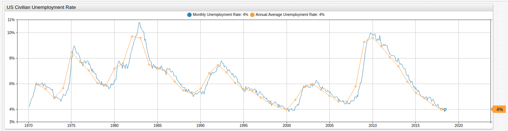
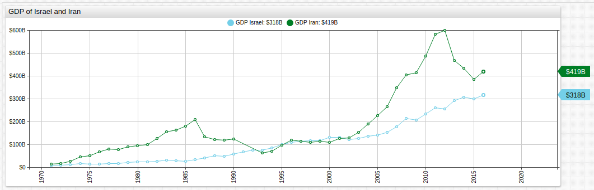
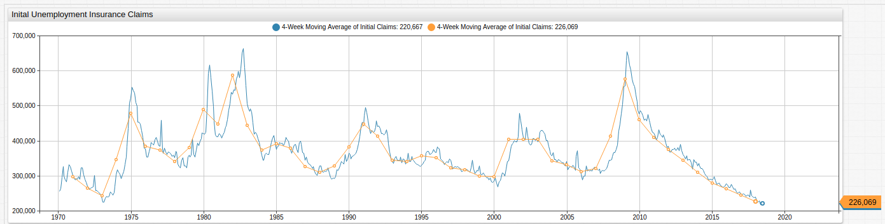
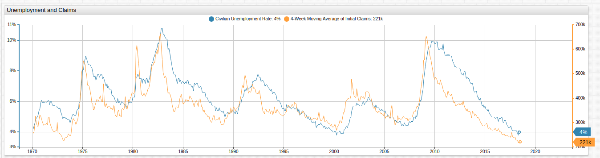
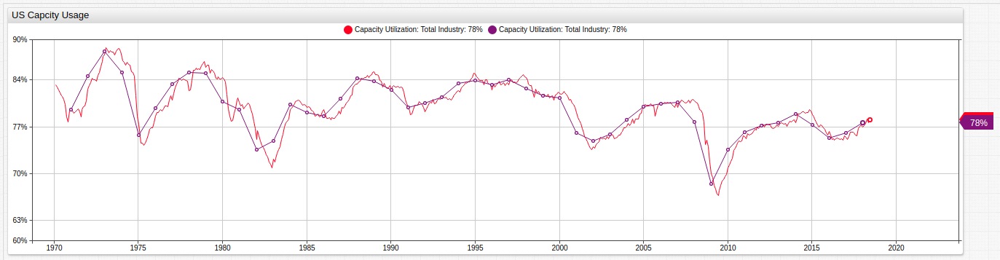
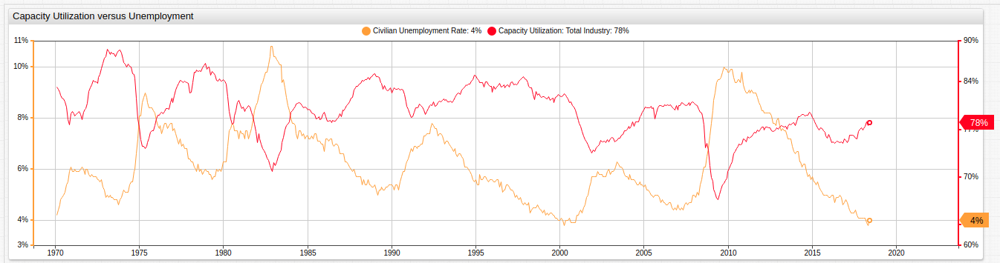
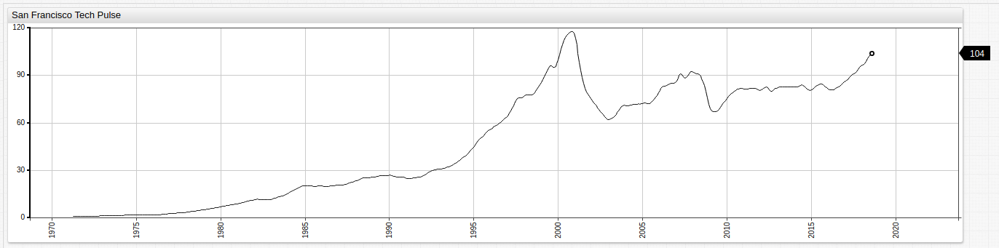
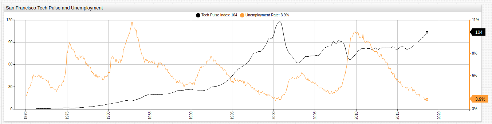
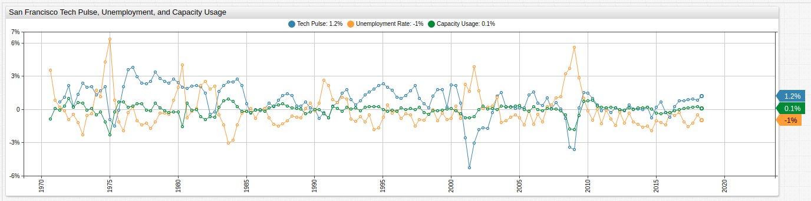

# The Lopsided Nature of US Unemployment

## Introduction

The [Civilian Unemployment Rate](https://fred.stlouisfed.org/series/UNRATE) is generally considered an important indicator of the overall health of the United States Economy, and is frequently cited by politicians seeking office or hoping to retain it.

One of the hallmarks of a competitive economy in the modern globalized world is diversity of output relative to input. This is evidenced by the modern success of countries such as Israel, a veritable sandbar in the Middle East with few natural resources which has grown at a rate approaching and sometimes surpassing its neighbor Iran; a nation with ten times the population, a multi-century head start, and vast oil reserves.

The erratic peaks and valleys of the oft-sanctioned and commodity-driven Iranian economy are shown above alongside the relatively constant growth of the more technology-centric Israeli economy.

An unintended but unavoidable side effect of any evolving economy is the inevitable obsolescence which occurs in industries outsourced by either happenstance or design. This phenomena results in an observable difference in the way economic downturn affects a society.

## Measuring Unemployment

The raw unemployment data shown above, along with all other series used for this research, are sourced from the Federal Reserve Data service [FRED](https://fred.stlouisfed.org/). The unemployment series is supplemented below by a dataset tracking the number of new Unemployment Insurance claims filed on average per month and per year.

Roughly speaking, these two datasets follow the same general course but the latter is often used as an predictor of unemployment figures in the near future, as an increase or decrease in the number of new claims is likely to foreshadow the same trend in overall unemployment.

The chart below contrasts these two series on a duel-axis and compares their relative changes.

The more-than-casual relationship between these two metrics is visible when they are compared side-by-side.

## Capacity Usage

An essential measurement of how an economic system uses what resources are available to it is called capacity utilization. In sum, this is a function of the total potential for production versus the actual production achieved.

More than a handful of economists and politicians have pointed to the overall decline of American manufacturing, in favor of outsourcing those jobs to developing countries most often.

The declining capacity usage of the United States since 1970 indicates highlights the decrease in domestic production and manufacturing, despite the relative abundance of natural resources.

Another interesting pattern is the relationship between unemployment and the production- and manufacturing-centric capacity usage series.

The visualization below places these series together in one visualization, highlighting the nature of their relationship.

As capacity utilization declines in the United States, unemployment correspondingly increases over the same time interval and vise versa. This visualization captures the dependency of a significant number of American jobs on the manufacturing and production industries. The [Capacity Utilization](https://fred.stlouisfed.org/series/TCU) FRED series is an acceptably broad dataset to ascertain the health of American manufacturing and production industries.

## San Francisco Tech Pulse

The sister San Francisco branch of the Federal Reserve St. Louis Branch maintains a limited number of public datasets, however one aggregated dataset which is made available to the public is the [San Francisco Tech Pulse](https://www.frbsf.org/economic-research/indicators-data/tech-pulse/) which is an index series that tracks the overall health of the technology industry. The index date is January 1, 2000, thus the index value is `100` on that date and all preceding and subsequent values can be judged using that benchmark.

The index is composed of a number of indicators, enumerated on the Federal Reserve website, which in total act as a reliable gauge for the health of the United States technology sector.

Although similar peaks and valleys are observable during significant movement in the unemployment series (see chart below), no reliable way to directly compare Capacity Usage and the Tech Pulse dataset is possible without some kind of data transformation.

## Comparing Dissimilar Data

ATSD offers [ad hoc data transformation](https://axibase.com/docs/charts/syntax/functions.html) features and [user-defined functions](https://axibase.com/docs/charts/syntax/udf.html) that assist in comparing this dissimilar data. Instead of contrasting raw values against one another, comparing the three central metrics: Capacity Usage, Unemployment, and the Tech Pulse Index based on percentile change is a reasonable way to circumnavigate the problem.

With the exception of the observed decline of the Tech Pulse index in 2001, which aligns with the burst of the so-called Dot Com Bubble, positive change in US Unemployment (that is, **more** unemployment) is never outstripped by an analogous decline in the Tech Pulse and conversely, percentile growth in the Tech Pulse index is never matched by an analogous decline in overall unemployment (that is, **less** unemployment).

While hardly exhaustive, using the available public data, conclusions concerning the scope and nature of United States unemployment can be drawn using otherwise dissimilar data.

## Conclusions

Not only are the manufacturing and production sectors of the American economy experiencing net negative growth, they are also more vulnerable to incidental economic downtown.

The implications of such conclusions are that sudden declines in American capacity usage, such as those caused by a decrease in the amount of imported exported goods needed for assembly or production can have unintended secondary effects in the form of increased unemployment caused by decreased production. Furthermore, such phenomena are likely to be felt significantly less in the already higher-paid technology sector, creating the potential for pressure on the middle class as the division between legacy and modern industries grows even more pronounced. Such trends are plainly visible in California already, where the income per capita in technology-oriented Cupertino is greater than $55,000 and just a hundred miles away in manufacturing and farming rich Selma, per capita income barely breaks $40,000.