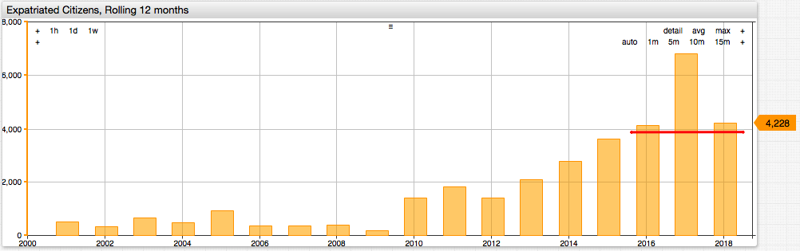

# Quarterly Expatriation Statistics - 2018 Q3

## Overview

On November 16, 2018 the IRS published a [scheduled report](https://www.federalregister.gov/documents/2018/11/19/2018-25155/quarterly-publication-of-individuals-who-have-chosen-to-expatriate-as-required-by-section-6039g) on individuals losing United States citizenship during the quarter ending September 30, 2018.

* The list contains **1,104** names.
* Annualized total is **4,228** which is **38%** lower than **6,807** reported a year ago.
* The 2018 annual run rate is in line with the pre-election levels.

## Keywords

`timezone`, `mode`, `max-range`, `period`, `statistics`, `align`, `END_TIME`, `sum`, `update-interval`

## Graphics



[](https://apps.axibase.com/chartlab/ad0f3f03/2/)

## Syntax Features

* [`align`](https://axibase.com/docs/charts/widgets/shared/#align) setting to align the year period based on the specified `end-time`.

```ls
[series]
  period = 1 year
  statistics = sum
  align = END_TIME  
```

* [`time-offset`](https://axibase.com/docs/charts/widgets/shared/#time-offset) setting to add lag to the underlying series for year-on-year comparison.

```ls
[series]  
  label-format = Year Ago
  time-offset = 1 year
  color = skyblue
```